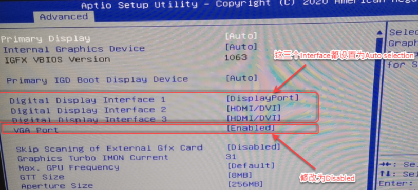

> Tags: #APC910 #显示

# A03.043-APC910同时让DP和DVI显示输出

- DP口与DVI口同时接了显示器，但只有DVI口的显示器有画面显示，默认DP没有显示。

# 解决方式

- 修改BIOS的设置
- 

# 更新日志

| 日期         | 修改人        | 修改内容 |
| :--------- | :--------- | :--- |
| 2024-03-17 | ZJF YZY | 初次创建 |
