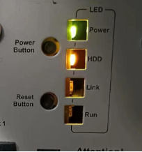

> Tags: #APC910 #CFast卡

# A03.044-ACP910运行中突然关闭且RUN灯不亮

- ACP910运行中突然就挂了，观察状态灯发现Power灯亮，run灯不亮
- 断电重启操作无效，按Reset按钮也无效。
- 

# 原因

- CFast卡坏了，用读卡器读不出来。
- 同一个读卡器读另外换一张卡是没问题的，更换CFast卡后解决此问题。

# 更新日志

| 日期                             | 修改人 | 修改内容 |
| :----------------------------- | :-- | :--- |
| 2024-03-18 | YZY | 初次创建 |
