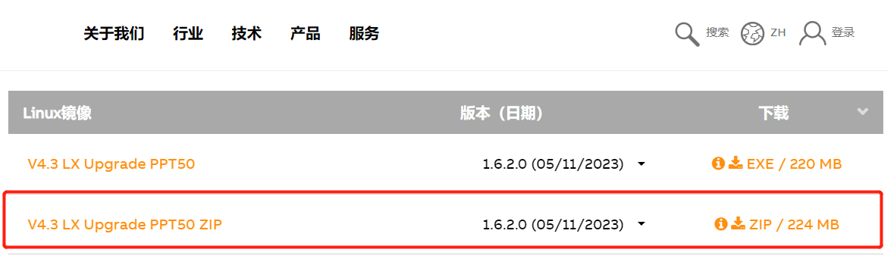
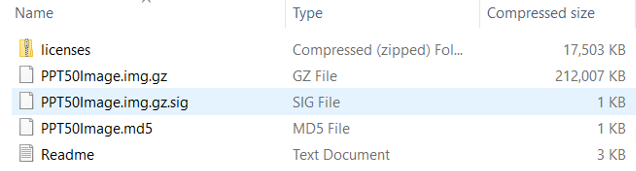
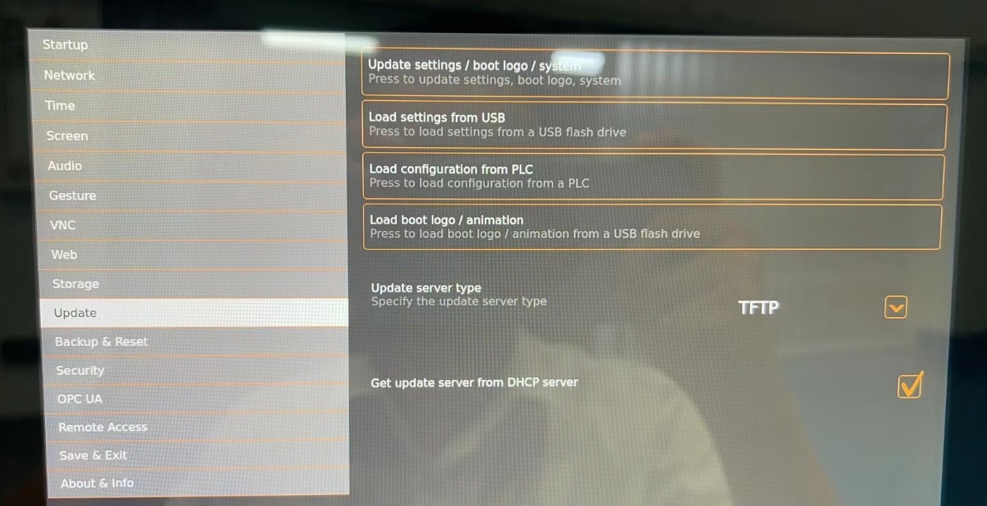
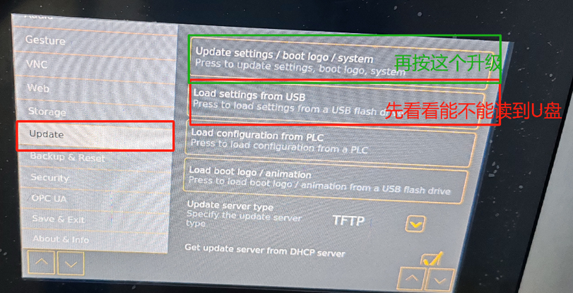
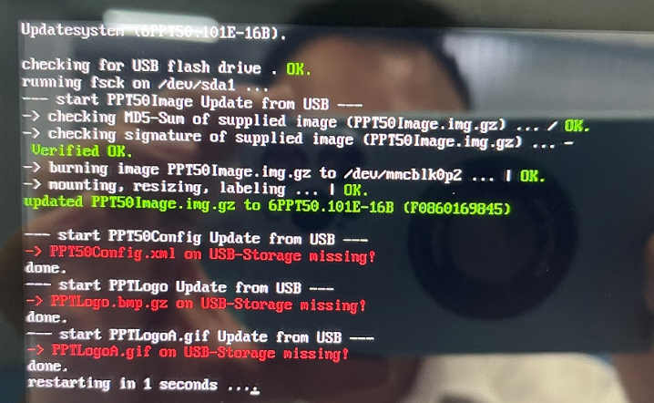
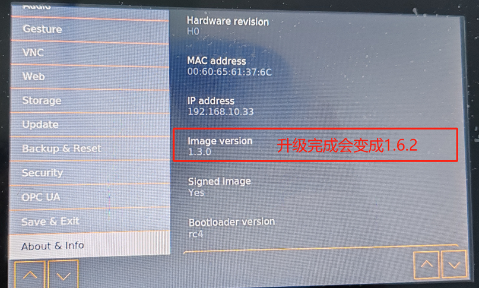
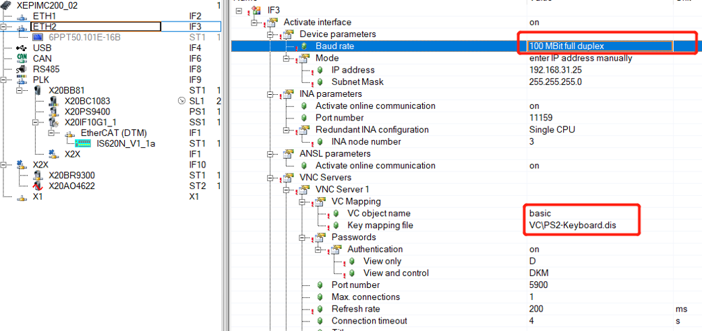

> Tags: #T50

- [1 045T50通过更新Linux镜像提高VC4画面操作响应速度](#_1-045t50%E9%80%9A%E8%BF%87%E6%9B%B4%E6%96%B0linux%E9%95%9C%E5%83%8F%E6%8F%90%E9%AB%98vc4%E7%94%BB%E9%9D%A2%E6%93%8D%E4%BD%9C%E5%93%8D%E5%BA%94%E9%80%9F%E5%BA%A6)
- [2 更新T50的Linux镜像](#_2-%E6%9B%B4%E6%96%B0t50%E7%9A%84linux%E9%95%9C%E5%83%8F)
- [3 VC4画面参数优化](#_3-vc4%E7%94%BB%E9%9D%A2%E5%8F%82%E6%95%B0%E4%BC%98%E5%8C%96)
- [4 更新日志](#_4-%E6%9B%B4%E6%96%B0%E6%97%A5%E5%BF%97)

# 1 045T50通过更新Linux镜像提高VC4画面操作响应速度

- 现象
    - CPU是X90CP174.48，屏幕是6PPT50.121E-16A。
    - 屏会卡住不动，就是跳转页面没反应，并且页面上的时间也不变了，但同一时刻，用电脑或者手机的VNC访问的话，画面操作和显示又是没问题的。

# 2 更新T50的Linux镜像

- 1___使用FAT32格式空U盘。
- 2___解压官网下载的T50 → Linux → 镜像文件到U盘上
    - 
    - U盘中放置如下文件
    - 
- 3___U盘插到T50上，进入内部设置
    - 
- 4___选择update，先用load from usb看看能否读到U盘
- 5、能读到U盘后，选择update中第一项，update → setting···
    - 
    - 
- 6___正常更新结束后，可以在T50内部设置info中看到版本号
    - 

# 3 VC4画面参数优化

- AS中正常配置ETH下的VNC，同时把Baud rate改成双工位模式，正常下载程序到PLC。
    - 
- VC4 的visual尽量不要太复杂

# 4 更新日志

| 日期         | 修改人        | 修改内容 |
| :--------- | :--------- | :--- |
| 2024-03-25 | LFW YZY | 初次创建 |
