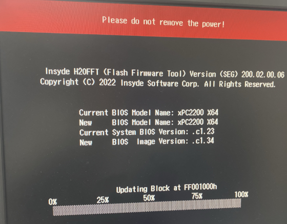

> Tags: #APC2200 #Hypervisor #故障诊断 #BIOS

- [1 A03.046-APC2200安装Hypervisor后无法启动只有POWER灯亮](#_1-a03046-apc2200%E5%AE%89%E8%A3%85hypervisor%E5%90%8E%E6%97%A0%E6%B3%95%E5%90%AF%E5%8A%A8%E5%8F%AA%E6%9C%89power%E7%81%AF%E4%BA%AE)
- [2 问题检查，发现BIOS版本偏低](#_2-%E9%97%AE%E9%A2%98%E6%A3%80%E6%9F%A5%EF%BC%8C%E5%8F%91%E7%8E%B0bios%E7%89%88%E6%9C%AC%E5%81%8F%E4%BD%8E)
- [3 解决方式：更新BIOS至最新版本](#_3-%E8%A7%A3%E5%86%B3%E6%96%B9%E5%BC%8F%EF%BC%9A%E6%9B%B4%E6%96%B0bios%E8%87%B3%E6%9C%80%E6%96%B0%E7%89%88%E6%9C%AC)
- [4 更新日志](#_4-%E6%9B%B4%E6%96%B0%E6%97%A5%E5%BF%97)

# 1 A03.046-APC2200安装Hypervisor后无法启动只有POWER灯亮

- 原本APC2200仅运行Win 10 2021 LTSC系统，正常运行。
- 安装了Hypervisor系统（AR I4.93）后，开始出现上电后只有POWER灯亮，DISK等灯从未亮过，设备一直起不来。
    - 

# 2 问题检查，发现BIOS版本偏低

- 检查 24V供电，完全正常。
- 检查BIOS版本，发现过低
    - 
    - 现在最近推出的BIOS版本为1.34
        - 

# 3 解决方式：更新BIOS至最新版本

- 
- 更新后解决，完全正常

# 4 更新日志

| 日期                             | 修改人 | 修改内容 |
| :----------------------------- | :-- | :--- |
| 2024-03-31 | YZY | 初次创建 |
