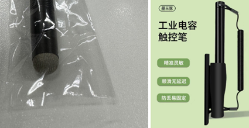

> Tags: #触控笔 #PPC

# 047贝加莱PPC屏幕适配触控笔推荐

- **需求说明**
    - 使用贝加莱的AP屏幕时，如果客户带手套无法操作需要买一只触摸笔。
- **解决方式**
    - 选择带纤维布头的触摸笔就可以比较方便的使用，而使用主动电源或者很细笔尖的电容笔，效果不是很好。
    - 
- **限制**
    - 使用纤维布头的触控笔能够很方便进行点击与选择操作，若需要进行绘画或类似操作则效果一般。

# 更新日志

| 日期         | 修改人        | 修改内容 |
| :--------- | :--------- | :--- |
| 2024-05-15 | DHZ YZY | 初次创建 |
