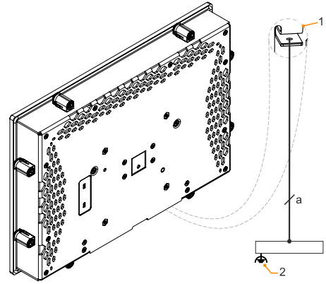

> Tags: #C80

- [1 A03.048.硬件C80使用注意事项](#_1-a03048%E7%A1%AC%E4%BB%B6c80%E4%BD%BF%E7%94%A8%E6%B3%A8%E6%84%8F%E4%BA%8B%E9%A1%B9)
- [2 硬件使用注意事项](#_2-%E7%A1%AC%E4%BB%B6%E4%BD%BF%E7%94%A8%E6%B3%A8%E6%84%8F%E4%BA%8B%E9%A1%B9)
- [3 画面设计注意事项](#_3-%E7%94%BB%E9%9D%A2%E8%AE%BE%E8%AE%A1%E6%B3%A8%E6%84%8F%E4%BA%8B%E9%A1%B9)
- [4 C80配合mappView参数设置](#_4-c80%E9%85%8D%E5%90%88mappview%E5%8F%82%E6%95%B0%E8%AE%BE%E7%BD%AE)
- [5 HV 引导启动的时候报错丢失 HV 核心](#_5-hv-%E5%BC%95%E5%AF%BC%E5%90%AF%E5%8A%A8%E7%9A%84%E6%97%B6%E5%80%99%E6%8A%A5%E9%94%99%E4%B8%A2%E5%A4%B1-hv-%E6%A0%B8%E5%BF%83)
- [6 C80配置VC4画面进不去，画面转圈圈](#_6-c80%E9%85%8D%E7%BD%AEvc4%E7%94%BB%E9%9D%A2%E8%BF%9B%E4%B8%8D%E5%8E%BB%EF%BC%8C%E7%94%BB%E9%9D%A2%E8%BD%AC%E5%9C%88%E5%9C%88)
- [7 更新日志](#_7-%E6%9B%B4%E6%96%B0%E6%97%A5%E5%BF%97)

# 1 A03.048.硬件C80使用注意事项

- [Power Panel C80 user's manual 用户手册下载链接](https://www.br-automation.com/en/downloads/industrial-pcs-and-panels/power-panel-t-c-series/power-panel-c80/power-panel-c80-users-manual/)

# 2 硬件使用注意事项

- [037C80如何恢复初始化](037C80如何恢复初始化.md)
- C80 扫描不到可以操作 reset 按钮来重置，短按+长按，进入 SERV 模式
- C80 进入 BIOS 模式的方法
    - 使用USB口连接上键盘在启动的时候点击 del 键
- C80金属外壳部分接地
    - 
    - 只有在正确接地的情况下，才允许操作该设备。
    - 若临时测试，没有接地，如果需要频繁接触 C80 后半部分的金属部件可能会被电击，外壳静电产生速度相对较快，实际使用尽可能接地放电。

# 3 画面设计注意事项

- 无论 C 或者 T 系列屏幕边缘有 0.5cm 到 1cm 的区域触摸感应不到，做画面的时候尽可能规避。

# 4 C80配合mappView参数设置

- C系列屏幕如果要显示 mappView 需要在Configuration → Terminal Configuration 进行设置
- URL of application 要写 ETHinternal 所设定的IP地址，Developer tools 要打开，具体如下图
- 

# 5 HV 引导启动的时候报错丢失 HV 核心

- 现象
    - C80无法正常启动，提示信息
        - Waiting for configuration..
        - AR status: N/A
    - 
- 可能原因与解决方式
    - reset 按钮长按时间过长导致清空了，重启进入 terminal 引导启动如果显示 AR 模式为 N/A, 就需要执行烧卡安装程序。[操作方式 → 002贝加莱PLC通过U盘更新程序](../C04_现场维运/002贝加莱PLC通过U盘更新程序.md)
    - 做好 U 盘后使用 HV 引导启动会自动安装，安装完成后会有重启步骤，如果发现不断在重启说明安装完成了，但是还没有拔出 U 盘，直接拔出 U 盘就会正常重启。

# 6 C80配置VC4画面进不去，画面转圈圈

- 现象
    - 使用硬件4PPC80.156B-11B，使用空白的程序只配置了基本的VC4画面，但C80进不去，一直如下图一样在转圈。
    - 
- 原因与解决方式
    - 需要在CPU配置中设置 Visualization → Visu mode → VNC
    - 

# 7 更新日志

| 日期         | 修改人        | 修改内容                |
| :--------- | :--------- | :------------------ |
| 2024-07-31 | QHC YZY | 初次创建                |
| 2024-11-13 | ZXT        | 更新 C80配置VC4画面显示异常效果 |
