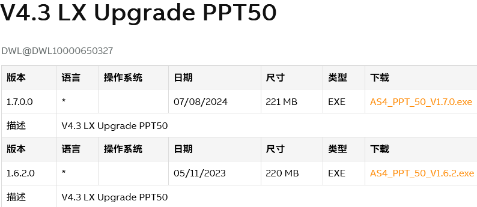

> Tags: #T50

- [1 053硬件T50版本推荐与说明](#_1-053%E7%A1%AC%E4%BB%B6t50%E7%89%88%E6%9C%AC%E6%8E%A8%E8%8D%90%E4%B8%8E%E8%AF%B4%E6%98%8E)
- [2 系统镜像资源下载](#_2-%E7%B3%BB%E7%BB%9F%E9%95%9C%E5%83%8F%E8%B5%84%E6%BA%90%E4%B8%8B%E8%BD%BD)
- [3 镜像安装方式](#_3-%E9%95%9C%E5%83%8F%E5%AE%89%E8%A3%85%E6%96%B9%E5%BC%8F)
- [4 镜像版本更新说明](#_4-%E9%95%9C%E5%83%8F%E7%89%88%E6%9C%AC%E6%9B%B4%E6%96%B0%E8%AF%B4%E6%98%8E)
- [5 更新日志](#_5-%E6%9B%B4%E6%96%B0%E6%97%A5%E5%BF%97)

# 1 053硬件T50版本推荐与说明

- 建议更新到最新版本的T50 操作系统镜像，目前 2024-09-12 的最新版本为 1.7.0.0

# 2 系统镜像资源下载

- T50的系统镜像安装路径 → [V4.3 LX Upgrade PPT50 | B&R Industrial Automation](https://www.br-automation.com/zh/downloads/software/automation-studio/automation-studio-43/v43-lx-upgrade-ppt50/)
    - 

# 3 镜像安装方式

- [045T50通过更新Linux镜像提高VC4画面操作响应速度](045T50通过更新Linux镜像提高VC4画面操作响应速度.md)

# 4 镜像版本更新说明

- [V4.3 LX Upgrade PPT50 RevInfo | B&R Industrial Automation](https://www.br-automation.com/zh/downloads/software/automation-studio/ppt-upgrades/v43-lx-upgrade-ppt50-revinfo/)
- 1.7.0.0修正BUG如下
    - VC4：设置“Auto”或“1Gbit”波特率时，T50面板（VNC客户端）上的响应较慢
    - 更新到1.6.2版本后，服务器连接存在问题
    - T50 对.html 文件的响应速度非常慢

# 5 更新日志

| 日期         | 修改人       | 修改内容 |
| :--------- | :-------- | :--- |
| 2024-09-12 | LZ YZY | 初次创建 |
