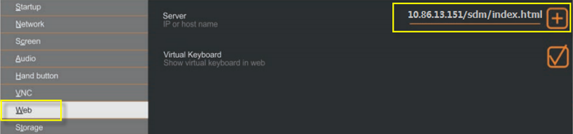

> Tags: #T30

- [1 A03.55.面板T30基本使用及更新配置方法说明](#_1-a0355%E9%9D%A2%E6%9D%BFt30%E5%9F%BA%E6%9C%AC%E4%BD%BF%E7%94%A8%E5%8F%8A%E6%9B%B4%E6%96%B0%E9%85%8D%E7%BD%AE%E6%96%B9%E6%B3%95%E8%AF%B4%E6%98%8E)
- [2 重要说明](#_2-%E9%87%8D%E8%A6%81%E8%AF%B4%E6%98%8E)
- [3 T30面板功能介绍和使用步骤](#_3-t30%E9%9D%A2%E6%9D%BF%E5%8A%9F%E8%83%BD%E4%BB%8B%E7%BB%8D%E5%92%8C%E4%BD%BF%E7%94%A8%E6%AD%A5%E9%AA%A4)
	- [3.1 作为VNC client](#_31-%E4%BD%9C%E4%B8%BAvnc-client)
		- [3.1.1 AS软件中创建项目和硬件配置](#_311-as%E8%BD%AF%E4%BB%B6%E4%B8%AD%E5%88%9B%E5%BB%BA%E9%A1%B9%E7%9B%AE%E5%92%8C%E7%A1%AC%E4%BB%B6%E9%85%8D%E7%BD%AE)
		- [3.1.2 T30面板配置](#_312-t30%E9%9D%A2%E6%9D%BF%E9%85%8D%E7%BD%AE)
			- [3.1.2.1 主菜单](#_3121-%E4%B8%BB%E8%8F%9C%E5%8D%95)
			- [3.1.2.2 配置步骤](#_3122-%E9%85%8D%E7%BD%AE%E6%AD%A5%E9%AA%A4)
	- [3.2 作为Web Browser](#_32-%E4%BD%9C%E4%B8%BAweb-browser)
- [4 更新T30面板配置](#_4-%E6%9B%B4%E6%96%B0t30%E9%9D%A2%E6%9D%BF%E9%85%8D%E7%BD%AE)
	- [4.1 使用USB更新](#_41-%E4%BD%BF%E7%94%A8usb%E6%9B%B4%E6%96%B0)
	- [4.2 在线更新 → 利用同网段PLC](#_42-%E5%9C%A8%E7%BA%BF%E6%9B%B4%E6%96%B0-%E2%86%92-%E5%88%A9%E7%94%A8%E5%90%8C%E7%BD%91%E6%AE%B5plc)
- [5 注意](#_5-%E6%B3%A8%E6%84%8F)
- [6 常见问题与问题解答(FAQ)](#_6-%E5%B8%B8%E8%A7%81%E9%97%AE%E9%A2%98%E4%B8%8E%E9%97%AE%E9%A2%98%E8%A7%A3%E7%AD%94faq)
	- [6.1 Q1：T30 使用 Automation Studio 编程吗？](#_61-q1%EF%BC%9At30-%E4%BD%BF%E7%94%A8-automation-studio-%E7%BC%96%E7%A8%8B%E5%90%97%EF%BC%9F)
	- [6.2 Q2：T30 里运行的是 Automation Runtime 吗？](#_62-q2%EF%BC%9At30-%E9%87%8C%E8%BF%90%E8%A1%8C%E7%9A%84%E6%98%AF-automation-runtime-%E5%90%97%EF%BC%9F)
	- [6.3 Q3：T30中的画面程序怎么下载？](#_63-q3%EF%BC%9At30%E4%B8%AD%E7%9A%84%E7%94%BB%E9%9D%A2%E7%A8%8B%E5%BA%8F%E6%80%8E%E4%B9%88%E4%B8%8B%E8%BD%BD%EF%BC%9F)
	- [6.4 Q4：哪个版本的 Automation Studio 支持T30？](#_64-q4%EF%BC%9A%E5%93%AA%E4%B8%AA%E7%89%88%E6%9C%AC%E7%9A%84-automation-studio-%E6%94%AF%E6%8C%81t30%EF%BC%9F)
	- [6.5 Q5：T30上的USB接口有什么用？](#_65-q5%EF%BC%9At30%E4%B8%8A%E7%9A%84usb%E6%8E%A5%E5%8F%A3%E6%9C%89%E4%BB%80%E4%B9%88%E7%94%A8%EF%BC%9F)
	- [6.6 Q6：在AS硬件配置中，下位PLC的以太网接口上能插入T30硬件，这说明T30是在运行Visual Components Terminal模式嘛？](#_66-q6%EF%BC%9A%E5%9C%A8as%E7%A1%AC%E4%BB%B6%E9%85%8D%E7%BD%AE%E4%B8%AD%EF%BC%8C%E4%B8%8B%E4%BD%8Dplc%E7%9A%84%E4%BB%A5%E5%A4%AA%E7%BD%91%E6%8E%A5%E5%8F%A3%E4%B8%8A%E8%83%BD%E6%8F%92%E5%85%A5t30%E7%A1%AC%E4%BB%B6%EF%BC%8C%E8%BF%99%E8%AF%B4%E6%98%8Et30%E6%98%AF%E5%9C%A8%E8%BF%90%E8%A1%8Cvisual-components-terminal%E6%A8%A1%E5%BC%8F%E5%98%9B%EF%BC%9F)
	- [6.7 Q7：为什么要更新T30中的PPT image固件版本？](#_67-q7%EF%BC%9A%E4%B8%BA%E4%BB%80%E4%B9%88%E8%A6%81%E6%9B%B4%E6%96%B0t30%E4%B8%AD%E7%9A%84ppt-image%E5%9B%BA%E4%BB%B6%E7%89%88%E6%9C%AC%EF%BC%9F)
	- [6.8 Q8：T30的设置页面有什么作用？](#_68-q8%EF%BC%9At30%E7%9A%84%E8%AE%BE%E7%BD%AE%E9%A1%B5%E9%9D%A2%E6%9C%89%E4%BB%80%E4%B9%88%E4%BD%9C%E7%94%A8%EF%BC%9F)
	- [6.9 Q9：T30屏幕右下角的那个按键有什么用？](#_69-q9%EF%BC%9At30%E5%B1%8F%E5%B9%95%E5%8F%B3%E4%B8%8B%E8%A7%92%E7%9A%84%E9%82%A3%E4%B8%AA%E6%8C%89%E9%94%AE%E6%9C%89%E4%BB%80%E4%B9%88%E7%94%A8%EF%BC%9F)
	- [6.10 Q10：T30如何校屏？](#_610-q10%EF%BC%9At30%E5%A6%82%E4%BD%95%E6%A0%A1%E5%B1%8F%EF%BC%9F)
- [7 更新日志](#_7-%E6%9B%B4%E6%96%B0%E6%97%A5%E5%BF%97)

# 1 A03.55.面板T30基本使用及更新配置方法说明

- 使用硬件
    - 6PPT30.101G-20W(PPT image版本：V1.0.3)
    - X20CP1382-RT(AR版本：D4.24)
    - X20CP3584(AR版本：D4.24)
- 使用软件
    - AS4.2.1.214

# 2 重要说明

  - T30面板的功能有两个
      - 一是作为VNC终端显示，即通过网线访问具有VNC sever的PLC，PLC中存有人机界面等程序，T30访问到该PLC并将人机界面显示出来。注意，T30不能作为控制器等功能使用。
      - 二是作为web browser，浏览网页。

# 3 T30面板功能介绍和使用步骤

## 3.1 作为VNC client

### 3.1.1 AS软件中创建项目和硬件配置

- 创建项目，添加硬件，在X20CP1382-RT上添加T30终端显示屏，如下图：
    - 
- 在Logical View中添加人机界面，并做界面映射，如下图
    - 
- 用网线，将电脑与X20CP1382-RT相连，将程序编译下载到CPU中

### 3.1.2 T30面板配置

- 程序下载到CPU之后，可以上电启动，面板启动后，会自动进入配置页面，如果没有进入，可点击右下角按钮，即可进入配置页面。
    - 

#### 3.1.2.1 主菜单

- 设置页面如图所示，左边是菜单，使用其 VNC 功能我们需要设置的有Startup、Network、Screen、VNC、Save & Exit 以及 About & Info。
    - 

#### 3.1.2.2 配置步骤

- 设定模式
    - 如图所示，在Startup界面，可以将模式设定为VNC，每次启动的时候，都会自动开启VNC客户端进行连接
    - 
- 网络设置Network
    - 网络设置界面如图所示，在这里可以设置 Host name， DHCP server 自动获取 IP 或者手动设置 IP 地址。将 DHCP 这里的勾去掉即可手动设置 IP 地址。请根据实际项目的需要设定 IP 地址，注意 IP 地址设定需要和下位的 PLC 控制器处于同一个网段内。
    - 
- VNC设置
    - VNC设置界面如图所示，这里可以设置 VNC server 的 IP 地址，注意一定要在地址后面加上端口号，否则会连接不上；Password 这栏可以输入 VNC 的密码。
    - 
- 保存修改及退出
    - Save & Exit界面如图所示，之前的设置更改后，一定要Save Changes使之生效，Save changes & exit会保存设置并令屏重启。
    - 

## 3.2 作为Web Browser

- T30面板可以作为Web Browser使用， 例如可以浏览PLC的SDM，了解PLC的信息；以及用来浏览mapp view等等。
- 本文将以浏览PLC的SDM为例，具体配置如下：
- 1___首先将start mode选为WEB模式，如下图：
    - 
- 2___在WEB标签页中，输入要访问的网址（T30没有域名解析功能，所以输入的网址必须是IP地址），下图以访问PLC的sdm为例
    - 🔴注意：网址要输完整，“/index.html”不能省略
        - 
- 3___保存修改及退出
    - 设置完成后，一定要Save Changes使之生效，Save changes & exit会保存设置并令屏重启。重启后就会访问到你输入的网址了。
    - 

# 4 更新T30面板配置

## 4.1 使用USB更新

- 重要说明
    - 该更新方法只能用于更新T30面板的IP地址、启动模式等设定，不是用来更新人机界面等内容的。
- 1___在AS中对T30属性进行配置
    - 打开T30的configuration，根据实际情况做相应配置，如下图
    - 
- 2___修改其他配置
    - 其他配置也可以根据需求进行修改，如下图修改Start mode为VNC，上电后会自动开启VNC客户端进行连接。
    - 
- 3___烧制更新使用的USB
    - 将更新使用的U盘插到电脑上
    - AS4.2及以下：打开Tools → Create Remote Install Structure.
        - 
    - AS4.3及以上：打开 Project → Project Installation → Generate Project Installation Package
        - 
    - 在弹出的对话框中选中T30面板，如下：
    - 
    - 在弹出的对话框中选中更新使用的U盘，点击按钮“Download to application storage”。如下：
    - 
- 4___启动T30的更新
    - 将烧制好的U盘插入T30面板的USB接口中，启动面板，如下图，在启动页面上选择Update→Load settings from USB。重启面板即可。
    - 

## 4.2 在线更新 → 利用同网段PLC

- T30除了支持USB更新配置外，也支持在线连接同网段的PLC，进行更新。步骤如下：
- 1___例如，有一台X20CP3584，在AS的硬件配置中添加了T30，如下：
    - 
    - 这样之后，可对T30进行配置，如下：
    - 
- 2___将T30与该PLC接入同网段，点击T30的标签页“Update”，选中“Load settings from PLC”，如下图
    - 
- 3___ T30会自动搜索与其同网段并在硬件配置中配有T30的PLC，如下图所示，T30搜到了上文提到的X20CP3584, 选中该CPU更新配置即可，成功后，之前在AS里对T30进行的配置就会自动下载到当前的T30中。
    - 

# 5 注意

- 更新使用的U盘存储空间最小为 256 MB。
- 如下图，屏幕右下角有个Touch button，按下后可以重启T30面板，即便在VNC界面也是如此，所以有机率会误操作，所以要注意。
    

# 6 常见问题与问题解答(FAQ)

## 6.1 Q1：T30 使用 Automation Studio 编程吗？

- A1：Automation Studio并不能对T30直接编程，在Automation Studio中新建配置并添加控制器时是无法找到T30的。

## 6.2 Q2：T30 里运行的是 Automation Runtime 吗？

- A2：不是。T30内部运行的系统并不是Automation Runtime，而是Linux内核。

## 6.3 Q3：T30中的画面程序怎么下载？

- A3：无需把画面程序下载到T30中。在VNC模式下，T30的功能类似一台安装了VNC的PC机。PLC是VNC sever端，画面是保存在PLC里的，T30作为VNC client端，通过以太网去访问VNC sever端，将PLC中保存的画面显示出来。同样的，在Web Browser模式下，PLC是Web Server，而T30作为Web Browser去访问PLC中的网页画面。

## 6.4 Q4：哪个版本的 Automation Studio 支持T30？

- A4：T30本身的使用并不依赖于Automation Studio，然而一定版本的Automation Studio支持对T30进行配置，如网络参数、VNC参数等等。具体需要参见T30用户手册2.4节。

## 6.5 Q5：T30上的USB接口有什么用？

- A5：T30上的USB接口可以用来更新固件版本和T30的配置信息（使用方法可参见本文档5.1章节），也可以用来外接键盘和鼠标等设备，但不具有保存或读取文件等功能。

## 6.6 Q6：在AS硬件配置中，下位PLC的以太网接口上能插入T30硬件，这说明T30是在运行Visual Components Terminal模式嘛？

- A6：不是。T30跟传统的Power Panel理念不同，没有所谓的终端模式，它只能作为VNC client端和web浏览器。AS的硬件配置可以配置T30，是为了能够生成T30的配置数据并通过U盘更新到T30中，省却了手动修改T30配置的工作。

## 6.7 Q7：为什么要更新T30中的PPT image固件版本？

- A7：较早一批的T30屏的PPT image版本号是0.9.62或0.9.77。这些屏在连接PLC时，屏上会显示：connecting……，但是一直连接不上。这是因为这批T30的PPT image固件版本比较低，使用USB更新PPT image固件版本到V1.0.3即可。

## 6.8 Q8：T30的设置页面有什么作用？

- A8：T30作为VNC终端显示，必然要对自身IP地址及待连接的VNCsever端的IP地址等进行配置，这些配置不能通过AS下载到T30中，其配置方法有三种：
    - ①在T30自身的设置页面中进行配置；
    - ②在AS中配置好，生成配置文件保存在U盘里，将U盘插在T30上进行自动更新（使用方法可参见本文档前面章节）；
    - ③搜到同网段的PLC，进行更新（使用方法可参见本文档5.2章节）。

## 6.9 Q9：T30屏幕右下角的那个按键有什么用？

- A9：在任何运行状态下，都会强制进入T30的设置页面。

## 6.10 Q10：T30如何校屏？

- A10：在设置页面上，点击Screen栏，选中其中的‘Calibrate touch’即可进入校屏页面，如下图：
- 

# 7 更新日志

| 日期         | 修改人 | 修改内容     |
| :--------- | :-- | :------- |
| 2022-02-07 | JX  | 文档编写     |
| 2024-10-10 | YZY | 文档更新     |
| 2024-11-05 | YZY | 更新烧卡不同按钮 |
