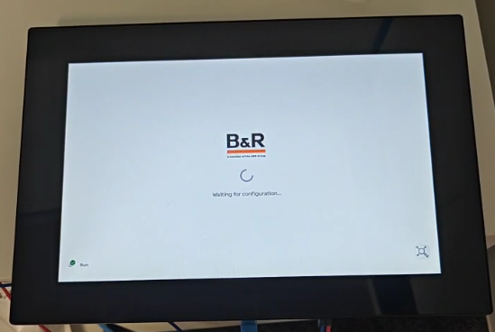
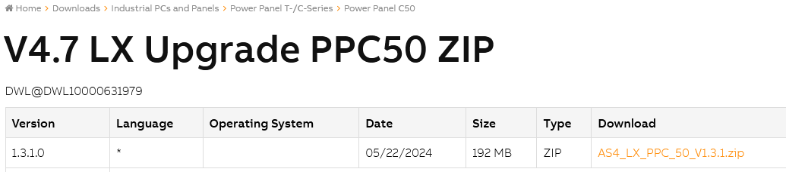
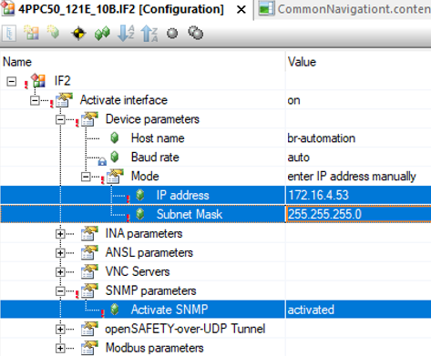
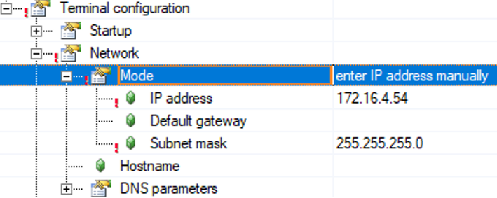
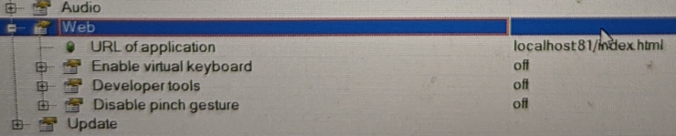

> Tags: #C50

- [1 A03.057.屏幕C50配置mappView画面注意事项](#_1-a03057%E5%B1%8F%E5%B9%95c50%E9%85%8D%E7%BD%AEmappview%E7%94%BB%E9%9D%A2%E6%B3%A8%E6%84%8F%E4%BA%8B%E9%A1%B9)
- [2 更新C50的镜像](#_2-%E6%9B%B4%E6%96%B0c50%E7%9A%84%E9%95%9C%E5%83%8F)
- [3 配置修改](#_3-%E9%85%8D%E7%BD%AE%E4%BF%AE%E6%94%B9)
- [4 更新日志](#_4-%E6%9B%B4%E6%96%B0%E6%97%A5%E5%BF%97)

# 1 A03.057.屏幕C50配置mappView画面注意事项

- 新C50硬件屏幕，配置mappView画面，发现无法显示mappView画面，偶尔mappView显示一会就断开，提示 `Connection to server is lost!`，然后就自动重连。提示 `Waiting for configuration...`
- 
- 

# 2 更新C50的镜像

- [V4.7 LX Upgrade PPC50 ZIP | B&R Industrial Automation](https://www.br-automation.com/en/downloads/industrial-pcs-and-panels/power-panel-t-c-series/power-panel-c50/v47-lx-upgrade-ppc50-zip/)
- 
- 更新方式可参考 [045T50通过更新Linux镜像提高VC4画面操作响应速度](045T50通过更新Linux镜像提高VC4画面操作响应速度.md)

# 3 配置修改

- ETH网口配置
    - C50的ETH网口配置和其他控制器相同，配置项为IP地址、子网掩码和SNMP选项，如图：
    - 
- CPU Configuration配置
    - 若要在C50上直接显示mapp View画面，则需在Physcial View → 选中C50硬件后右击 → Configuration → Terminal Configuration中进行配置。
    - 在Network选项中，将Mode设为enter IP address manually，并配置IP；
    - 注意配置IP的原则为，与C50连接的电脑网口IP、C50 ETH网口IP与Network设置中的IP均为同一网段，且不能重复！如图：
    - 
- Terminal configuration → Web处使用默认参数
    - 
- 设置完成后，将项目下载至C50硬件中，C50屏幕即可直接显示项目中的mappView画面。

# 4 更新日志

| 日期         | 修改人        | 修改内容 |
| :--------- | :--------- | :--- |
| 2024-10-17 | XZH YZY | 初次创建 |
