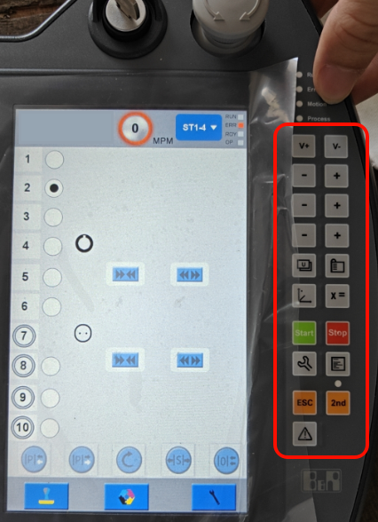
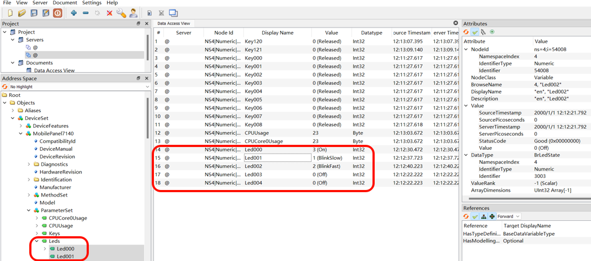
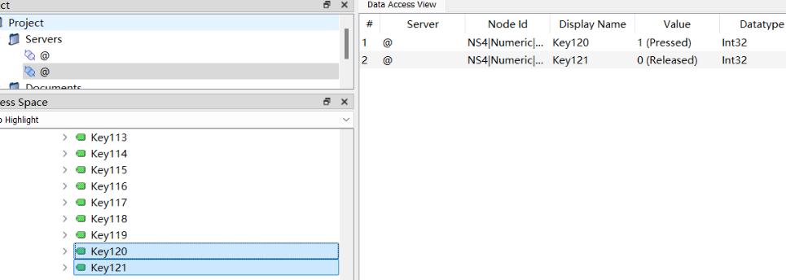

> Tags: #OPC_UA #MP7140 #mappView

- [1 A03.059.屏幕MP7140使用mappView映射按键](#_1-a03059%E5%B1%8F%E5%B9%95mp7140%E4%BD%BF%E7%94%A8mappview%E6%98%A0%E5%B0%84%E6%8C%89%E9%94%AE)
- [2 使用OPC UA通信，可读写MP7140的按钮等信息](#_2-%E4%BD%BF%E7%94%A8opc-ua%E9%80%9A%E4%BF%A1%EF%BC%8C%E5%8F%AF%E8%AF%BB%E5%86%99mp7140%E7%9A%84%E6%8C%89%E9%92%AE%E7%AD%89%E4%BF%A1%E6%81%AF)
- [3 AS项目中应用](#_3-as%E9%A1%B9%E7%9B%AE%E4%B8%AD%E5%BA%94%E7%94%A8)
	- [3.1 通信代码案例代码下载](#_31-%E9%80%9A%E4%BF%A1%E4%BB%A3%E7%A0%81%E6%A1%88%E4%BE%8B%E4%BB%A3%E7%A0%81%E4%B8%8B%E8%BD%BD)
- [4 关联文档](#_4-%E5%85%B3%E8%81%94%E6%96%87%E6%A1%A3)
- [5 更新日志](#_5-%E6%9B%B4%E6%96%B0%E6%97%A5%E5%BF%97)

# 1 A03.059.屏幕MP7140使用mappView映射按键

- MP7410系列屏幕带有按键，使用mappView画面访问，如何实现变量映射，例如钥匙开关拨到位置，能够与mappView画面做关联？
    - 若使用VC4画面方案，可尝试使用 RfbExtKeyState 实现。
- 

# 2 使用OPC UA通信，可读写MP7140的按钮等信息

- 使用笔记本的UaExpert软件，连接MP7410的ETH口，可读写测试屏幕上的按钮与钥匙等信息
    - 
- 例如：120 121代表钥匙旋钮的状态
    - 

# 3 AS项目中应用

- 使用 AsOpcUac 库进行内部OPC UA通信。
- 连接IP地址为MP7140的ETH口的IP，例如 `'opc.tcp://192.163.213.221:4840';`
- 在通信程序中对应进行绑定，例如钥匙旋钮状态

```
20:
    gUaClientCtrl2.Para.VarsReadList.NodeIDs[i].Identifier	:= '53997';//Key120 = [Enable Key Right Pos]
21:
    gUaClientCtrl2.Para.VarsReadList.NodeIDs[i].Identifier	:= '53998';//Key121 = [Enable Key Left Pos]
```

- 获取数据信息，通过任务程序进行数据处理，再通过mappView进行关联相关效果。

## 3.1 通信代码案例代码下载

- [点击下载 → 2024-10-25-CODE-OPCUAClientWithMP7140.zip](/A03_产品_PC和HMI/FILES/059屏幕MP7140使用mappView映射按键/2024-10-25-CODE-OPCUAClientWithMP7140.zip ':ignore')

# 4 关联文档

- [056基于OPC UA对T50设备进行亮度调节](056基于OPC%20UA对T50设备进行亮度调节.md)
- [Hypervisor使用助手 > 应用案例 > Hypervisor下如何读取PPC硬按键状态](https://hypervisor.brhelp.cn/faq4.html)

# 5 更新日志

| 日期         | 修改人 | 修改内容 |
| :--------- | :-- | :--- |
| 2024-10-25 | LFW | 内容编写 |
| 2024-10-28 | YZY | 文档整理 |
