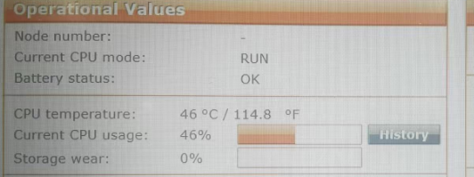
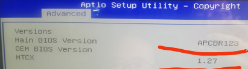

> Tags: #Hypervisor #VC4 #工控机

- [1 A03.060.工控机+Hypervisor开启VCWT后VC4画面卡顿](#_1-a03060%E5%B7%A5%E6%8E%A7%E6%9C%BAhypervisor%E5%BC%80%E5%90%AFvcwt%E5%90%8Evc4%E7%94%BB%E9%9D%A2%E5%8D%A1%E9%A1%BF)
- [2 解决方式](#_2-%E8%A7%A3%E5%86%B3%E6%96%B9%E5%BC%8F)
- [3 更新日志](#_3-%E6%9B%B4%E6%96%B0%E6%97%A5%E5%BF%97)

# 1 A03.060.工控机+Hypervisor开启VCWT后VC4画面卡顿

- 现象
    - 基于APC910的Hypervisor，Hypervisor已经启动，as连接显示run，也可以确认程序在运行。
    - VNC方式的触摸屏对操作没有任何反应。通过SDM访问PLC，发现PLC的时间卡住了，PLC的使用率也卡住了，并卡在46%。
    - 
    - 
- 版本信息
    - Automation Runtime是I4.93
    - 
- 特殊说明
    - 不使用Hypervisor方案时，则没有任何问题。

# 2 解决方式

- BIOS，MTCX, ADI 全面升级成最新的后解决。
- 建议
    - 使用AR4.93版本，建议BIOS，MCTX，ADI均使用最新版本，否则可能会出现异常。

# 3 更新日志

| 日期         | 修改人                    | 修改内容 |
| :--------- | :--------------------- | :--- |
| 2024-11-19 | XP TY ZSY YZY | 初次创建 |
