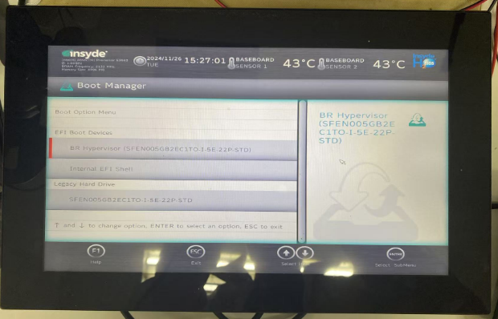
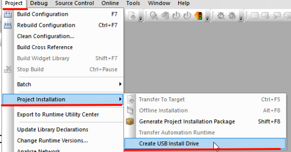
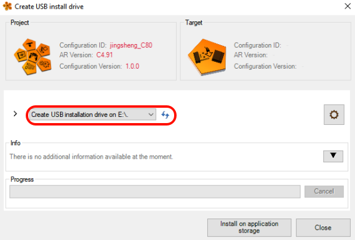
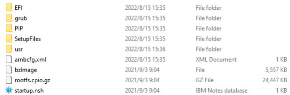
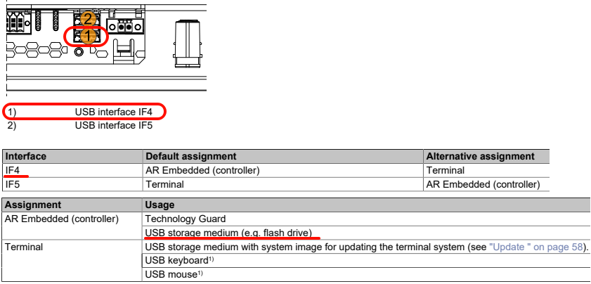
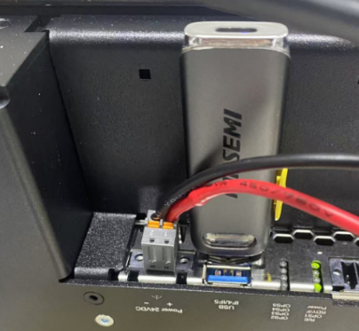
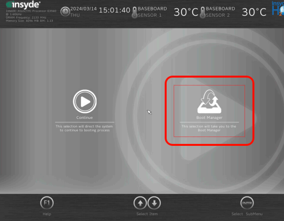
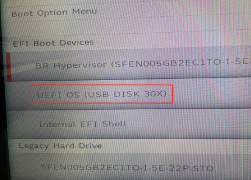
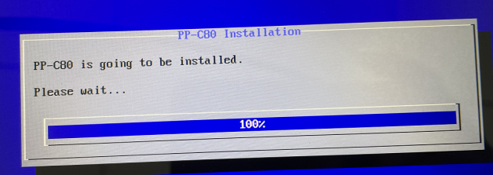

> Tags: #C80

- [1 A03.061.新硬件C80如何下载程序](#_1-a03061%E6%96%B0%E7%A1%AC%E4%BB%B6c80%E5%A6%82%E4%BD%95%E4%B8%8B%E8%BD%BD%E7%A8%8B%E5%BA%8F)
- [2 需要准备的物料](#_2-%E9%9C%80%E8%A6%81%E5%87%86%E5%A4%87%E7%9A%84%E7%89%A9%E6%96%99)
- [3 可更新程序的U盘制作](#_3-%E5%8F%AF%E6%9B%B4%E6%96%B0%E7%A8%8B%E5%BA%8F%E7%9A%84u%E7%9B%98%E5%88%B6%E4%BD%9C)
- [4 在C80上进行程序安装](#_4-%E5%9C%A8c80%E4%B8%8A%E8%BF%9B%E8%A1%8C%E7%A8%8B%E5%BA%8F%E5%AE%89%E8%A3%85)
- [5 更新日志](#_5-%E6%9B%B4%E6%96%B0%E6%97%A5%E5%BF%97)

# 1 A03.061.新硬件C80如何下载程序

- C80无外部CF/CFast卡等存储器可以直接烧卡，内置有存储设备，更新程序需要使用U盘更新。
- 若不知道硬件的IP地址，设备内部是空的，就需要用过U盘进行初始化安装。
- 

# 2 需要准备的物料

 - 一个至少大于256MB容量的U盘，建议在32GB以下，使用前将此U盘格式化为FAT32格式。

# 3 可更新程序的U盘制作

- 打开Automation Studio，编译项目。
- 插入U盘后，点击Project → Project Installation → Create USB Install Drive
    - 
- 在弹出框中选择需要更新的U盘（仔细检查，不要选错设备）
    - 
- U盘制作完成后，可见内部信息如下
    - 
- 在电脑上弹出U盘并拔出

# 4 在C80上进行程序安装

- 将U盘插在C80 的IF4口上
    - 
    - 
- 直接断电重启是不会执行任何安装的，必须在重新上电时候用键盘按F2、ESC、Del或快速点击触摸屏上边沿的部分进入BIOS
- 选择图中所示的UFEI USB DISK启动才能进行更新。
    - 
    - 
    - 

# 5 更新日志

| 日期         | 修改人 | 修改内容 |
| :--------- | :-- | :--- |
| 2022-08-26 | LZC | 初始版本 |
| 2024-11-27 | YZY | 补充文档 |
