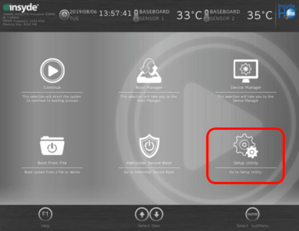
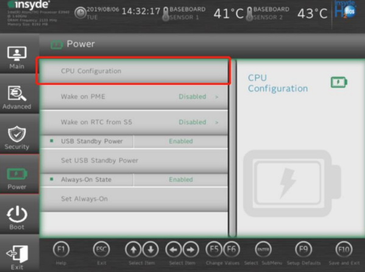

> Tags: #PPC #BIOS #低温 #蓝屏

- [1 A03.062贝加莱PPC2200在长时间断电后在低温上电启动出现蓝屏并报错27309](#_1-a03062%E8%B4%9D%E5%8A%A0%E8%8E%B1ppc2200%E5%9C%A8%E9%95%BF%E6%97%B6%E9%97%B4%E6%96%AD%E7%94%B5%E5%90%8E%E5%9C%A8%E4%BD%8E%E6%B8%A9%E4%B8%8A%E7%94%B5%E5%90%AF%E5%8A%A8%E5%87%BA%E7%8E%B0%E8%93%9D%E5%B1%8F%E5%B9%B6%E6%8A%A5%E9%94%9927309)
- [2 解决方式](#_2-%E8%A7%A3%E5%86%B3%E6%96%B9%E5%BC%8F)
	- [2.1 操作方式](#_21-%E6%93%8D%E4%BD%9C%E6%96%B9%E5%BC%8F)
- [3 更新日志](#_3-%E6%9B%B4%E6%96%B0%E6%97%A5%E5%BF%97)

# 1 A03.062贝加莱PPC2200在长时间断电后在低温上电启动出现蓝屏并报错27309

- PPC2200 在长时间断电后，在低温（大概率在 0-8℃）下上电启动，出现蓝屏现象，并自 动反复重启。
- logger 中报错代码为 27309。反复重启一定时间后，可以正常启动应用程序。

# 2 解决方式

- 在 BIOS 中将如下位置中的 Thermal Monitor 功能关闭。 Setup Utility → Power → Thermal Monitor → Disabled

## 2.1 操作方式

- PPC2200 上插入一个 USB 键盘，并在开机时按 ESC / DEL / F2 来进入 BIOS 界面
    - 
- 在该界面下选择 Setup Utility
    - 
- 点击 Power 选项，后在 Power 界面中找到 CPU Configuration，点击该选项，并在其中寻找 Thermal monitor，并将其 Disabled，修改完成后按 F10 保存并退出。
    - 

# 3 更新日志

| 日期         | 修改人 | 修改内容 |
| :--------- | :-- | :--- |
| 2021-12-21 | LWB | 初次创建 |
