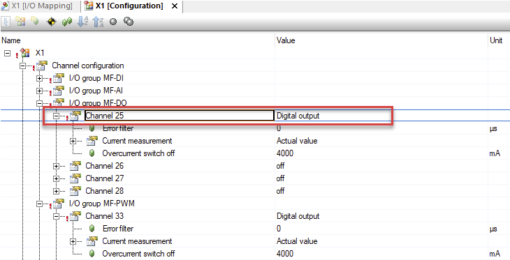
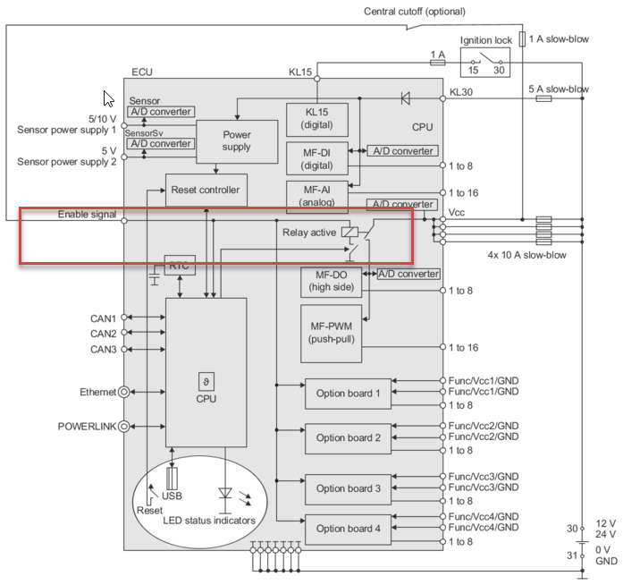

# 问题描述
- 在X1的configuration中，将I/O group MF-DO,Channel25设置成Digital output，但是在I/O Mapping中强制对应的通道却没有输出。
- 
# 解决方案
- 根据帮助中的介绍，需要将X1.A.C3进行连接，这样X1的DO和PWM功能才能生效。从电气框图也可以看到，enable signal直接控制着MF-DO和MF-PWM模块的供电。
- 

