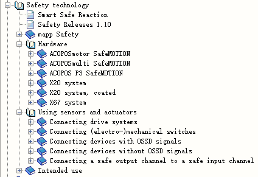
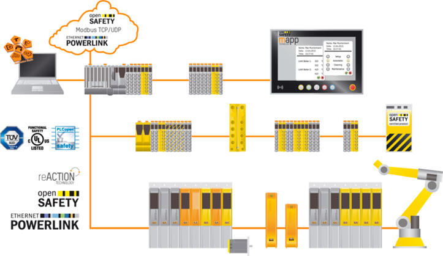

# 003贝加莱安全模块入门资料有哪些？

- 产品相关介绍：
    - https://www.br-automation.com/en/products/safety-technology/
- 入门了解：
    - [TM500 贝加莱集成安全](https://gitee.com/yzydeer/BuR_Assistant/blob/master/TM_files/TM500%20%E8%B4%9D%E5%8A%A0%E8%8E%B1%E9%9B%86%E6%88%90%E5%AE%89%E5%85%A84.3.3.pdf)
    - [TM510 使用SafeDESIGNER开发](https://gitee.com/yzydeer/BuR_Assistant/blob/master/TM_files/TM510%20%E4%BD%BF%E7%94%A8SafeDESIGNER%E5%BC%80%E5%8F%91_ZH_4.4.4.pdf)
        - 从中可以了解到例如安全输入、安全输出模块功能的使用与特点
- 深入了解
    - 可从贝加莱Automation Help中的安全章节了解更多
    - 
- 贝加莱安全拓扑结构
    - 
