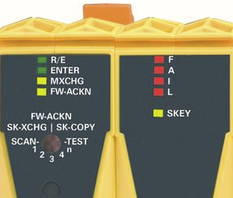

# 005安全PLC例如X20SL8100是如何通过拨码确认的？

- 如果可以，建议使用Remote Control功能进行自动拨码操作
- X20SL81xx手动拨码操作为：拨码到指定位置，按下ENTER，ENTER灯亮，等待模块扫描结束，根据某个模块灯在某个状态下单独闪烁或常亮，再进行下一步操作。
- 
- R/E灯为橙色，则代表程序没下载进去或者SafeKey。需要重新下程序。
- FW-ACKN灯常亮，直接拨FW-ACKN，如果仍旧显示FW-ACKN常亮，则拨MXCHG重新确认模块。
- MXCHG灯快闪，则拨SCAN。
- MXCHG灯慢闪，则拨1~n，有几个输入输出模块则拨相应的数字。
- FW-ACKN灯慢闪，则拨FW-ACKN。
- FAIL灯灭，正常情况下，R/E常绿。
- 如果R/E灯闪烁，MXCHG闪烁，几下代表几个模块没找到。需要检查通讯是否正常，模块是否正确安装。

