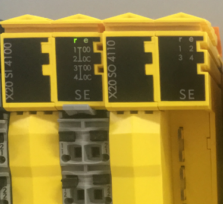
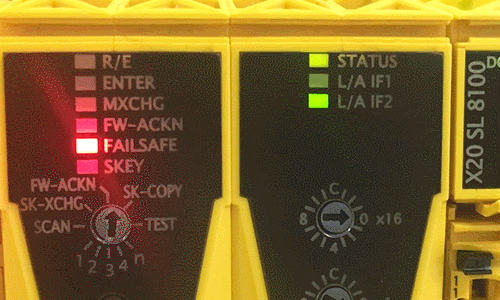
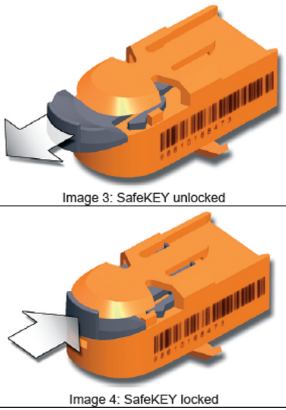
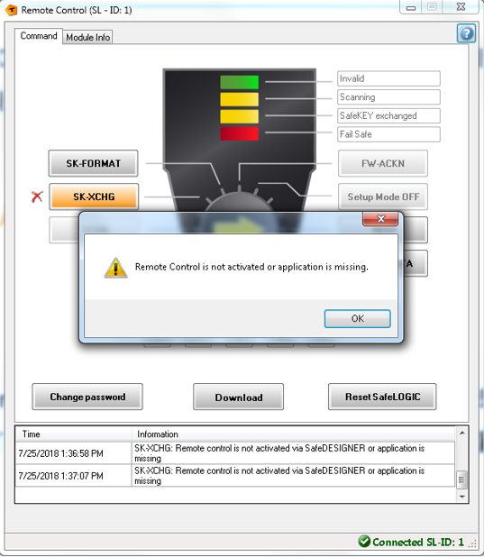
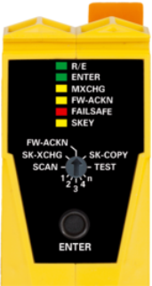
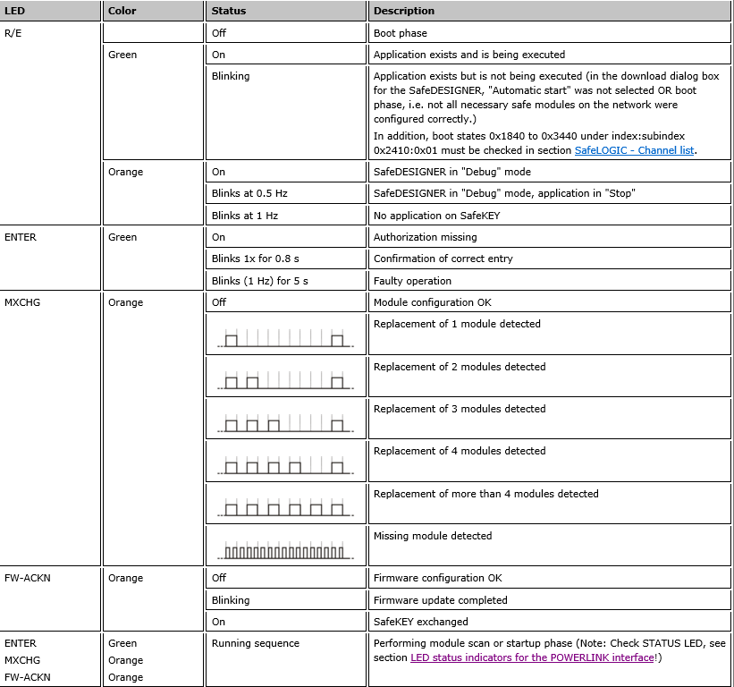
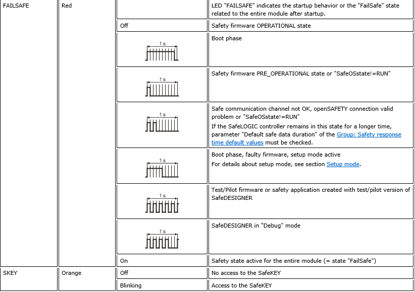
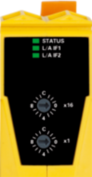
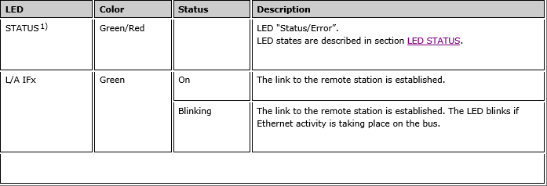

> Tags: #安全链

- [1 A05.007.X20SL81xx安全模块常见故障诊断](#_1-a05007x20sl81xx%E5%AE%89%E5%85%A8%E6%A8%A1%E5%9D%97%E5%B8%B8%E8%A7%81%E6%95%85%E9%9A%9C%E8%AF%8A%E6%96%AD)
- [2 安全PLC始终处于扫描状态](#_2-%E5%AE%89%E5%85%A8plc%E5%A7%8B%E7%BB%88%E5%A4%84%E4%BA%8E%E6%89%AB%E6%8F%8F%E7%8A%B6%E6%80%81)
	- [2.1 现象](#_21-%E7%8E%B0%E8%B1%A1)
	- [2.2 原因](#_22-%E5%8E%9F%E5%9B%A0)
	- [2.3 解决方法](#_23-%E8%A7%A3%E5%86%B3%E6%96%B9%E6%B3%95)
- [3 Safety模块丢失或损坏](#_3-safety%E6%A8%A1%E5%9D%97%E4%B8%A2%E5%A4%B1%E6%88%96%E6%8D%9F%E5%9D%8F)
	- [3.1 现象](#_31-%E7%8E%B0%E8%B1%A1)
	- [3.2 原因](#_32-%E5%8E%9F%E5%9B%A0)
	- [3.3 解决方法](#_33-%E8%A7%A3%E5%86%B3%E6%96%B9%E6%B3%95)
	- [3.4 POWERLINK 通讯中断](#_34-powerlink-%E9%80%9A%E8%AE%AF%E4%B8%AD%E6%96%AD)
	- [3.5 现象](#_35-%E7%8E%B0%E8%B1%A1)
	- [3.6 原因](#_36-%E5%8E%9F%E5%9B%A0)
	- [3.7 解决方法](#_37-%E8%A7%A3%E5%86%B3%E6%96%B9%E6%B3%95)
- [4 SafetyKey丢失](#_4-safetykey%E4%B8%A2%E5%A4%B1)
	- [4.1 现象](#_41-%E7%8E%B0%E8%B1%A1)
	- [4.2 原因](#_42-%E5%8E%9F%E5%9B%A0)
	- [4.3 解决方法](#_43-%E8%A7%A3%E5%86%B3%E6%96%B9%E6%B3%95)
- [5 下载程序时Remote 报错](#_5-%E4%B8%8B%E8%BD%BD%E7%A8%8B%E5%BA%8F%E6%97%B6remote-%E6%8A%A5%E9%94%99)
	- [5.1 现象](#_51-%E7%8E%B0%E8%B1%A1)
	- [5.2 原因](#_52-%E5%8E%9F%E5%9B%A0)
	- [5.3 解决方法](#_53-%E8%A7%A3%E5%86%B3%E6%96%B9%E6%B3%95)
- [6 X20SL81xx模块LED闪烁说明](#_6-x20sl81xx%E6%A8%A1%E5%9D%97led%E9%97%AA%E7%83%81%E8%AF%B4%E6%98%8E)

# 1 A05.007.X20SL81xx安全模块常见故障诊断

# 2 安全PLC始终处于扫描状态

## 2.1 现象

- .gif)
- 左侧：R/E灯绿色单闪，其他ENTER,MXCHG,FW-ACKN三个灯循环闪烁, FAILSAFE灯红色闪烁。
- 右侧：相应的Powerlink通道灯亮，其余不亮

## 2.2 原因

- Powerlink节点号拨错，例子中应为1，实际拨到3上，这会导致安全PLC始终处于扫描状态，不能正常工作。如果其他Powerlink站也拨到2，则其他站也不能正常工作。

## 2.3 解决方法

- 检查所有Powerlink节点的拨码，确保拨码都正确，并重启整个主控系统。

# 3 Safety模块丢失或损坏

## 3.1 现象

- .gif)
- 左侧：R/E灯绿色常亮，MXCHG闪烁（大约每秒两次），FAILSAFE双闪。
- 右侧：status灯绿色常亮，相应的Powerlink通道灯亮。

## 3.2 原因

- 模块丢失：某个powerlink站的安全模块全部为红灯，一般是由于所在的Powerlink站点工作不正常引起。
- 解决方法：请检查相应的站点拨码、接线等。
- 模块虚接或损坏：只有出问题的模块亮红灯，其余模块处于正常状态。

## 3.3 解决方法

- 需要检查模块之间的连接，或直接更换模块。（下图亮红灯的模块为虚接，重新安装后恢复正常）
- 

## 3.4 POWERLINK 通讯中断

## 3.5 现象

- .gif)
- 左侧：R/E灯绿色常亮，MXCHG闪烁（大约每秒两次），FAILSAFE双闪。
- 右侧：status灯绿色和红色交替闪烁，其余灯不亮。

## 3.6 原因

- Powerlink通讯中断。如果通讯正常，相应的Powerlink通道灯会绿色闪烁，status灯常绿。

## 3.7 解决方法

- 检查Powerlink线，网口等是否损坏；若有损坏，更换相应设备。

# 4 SafetyKey丢失

## 4.1 现象

- 
- 左侧：所有灯不亮,FAILSAFE常亮。
- 右侧：status灯绿色常亮，相应的Powerlink通道灯亮。

## 4.2 原因

- safetyKey丢失。

## 4.3 解决方法

- 检查safetyKey是否损坏，是否安装正确；若有损坏，更换新的Key。
- 注意：拆卸和安装safetyKey时，先要将锁扣解开，下面是解锁和锁定的方法：
- 

# 5 下载程序时Remote 报错

## 5.1 现象

- 

## 5.2 原因

- 安全PLC未连接CPU

## 5.3 解决方法

- 确认连线

# 6 X20SL81xx模块LED闪烁说明

> [点击查看 LED闪烁说明情况 → 贝加莱X20系列指示灯接线说明 > CPU > X20(c)SLXxxx 与 X20(c)SLXx1x > LED指示灯状态说明](https://x20.brhelp.cn/led4.html)

- 
- 
- 
- 
- 
