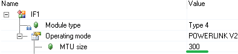
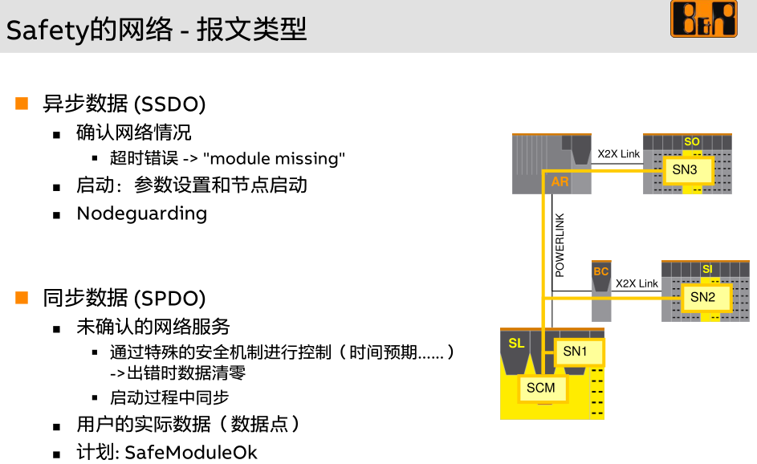
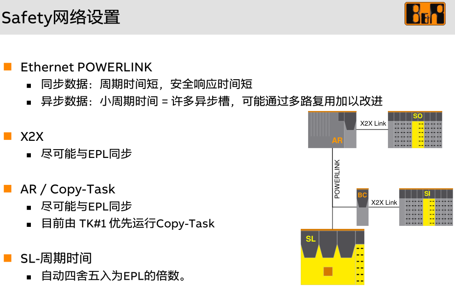

## 现象
- 现场使用了复杂的 PLK 网络拓扑结构，且 PLK 线缆质量一般。
- 在更新程序后，有一定概率导致安全 SI/SO 模块在安全链系统中找不到，其中 ModuleOK 为 TRUE，但安全链确认时找不到此模块。
- 出现问题时，SI/SO 出现的位置随机。

## 问题排查
- 原先此 PLK 网络的主站设置中，MTU Size 为 1500，出现安全模块丢失概率高
- 
- 将此 MTU Size 调整为 300 后，基本不在出现此问题

## 原因
- 可见以下章节中 Asynchronous MTU size 的设置与影响
- [041POWERLINK常见参数设置与说明](../B08_技术_通信/041POWERLINK常见参数设置与说明.md)
- 安全模块的启动流程与识别，是在异步段中执行的，而异步段的长度是通过 MTU Size 设置的，如果网络情况复杂且干扰大，易丢包，则 MTU Size 越大，丢包几率越大。这也是为什么 MTU Size 设小，出现安全模块丢失的几率低的多。
- 
- 

