- [014安全控制器 X20SL8000使用说明](#014%E5%AE%89%E5%85%A8%E6%8E%A7%E5%88%B6%E5%99%A8%20X20SL8000%E4%BD%BF%E7%94%A8%E8%AF%B4%E6%98%8E)
- [一、安全系统介绍](#%E4%B8%80%E3%80%81%E5%AE%89%E5%85%A8%E7%B3%BB%E7%BB%9F%E4%BB%8B%E7%BB%8D)
	- [A.安全 PLC](#A.%E5%AE%89%E5%85%A8%20PLC)
	- [B.安全输入模块](#B.%E5%AE%89%E5%85%A8%E8%BE%93%E5%85%A5%E6%A8%A1%E5%9D%97)
	- [C.安全输出模块](#C.%E5%AE%89%E5%85%A8%E8%BE%93%E5%87%BA%E6%A8%A1%E5%9D%97)
- [二、安全程序的下载及确认](#%E4%BA%8C%E3%80%81%E5%AE%89%E5%85%A8%E7%A8%8B%E5%BA%8F%E7%9A%84%E4%B8%8B%E8%BD%BD%E5%8F%8A%E7%A1%AE%E8%AE%A4)
	- [A. SafetyDesigner 与安全 PLC 连接](#A.%20SafetyDesigner%20%E4%B8%8E%E5%AE%89%E5%85%A8%20PLC%20%E8%BF%9E%E6%8E%A5)
		- [（1）通过贝加莱主控 PLC 与安全 PLC 连接](#%EF%BC%881%EF%BC%89%E9%80%9A%E8%BF%87%E8%B4%9D%E5%8A%A0%E8%8E%B1%E4%B8%BB%E6%8E%A7%20PLC%20%E4%B8%8E%E5%AE%89%E5%85%A8%20PLC%20%E8%BF%9E%E6%8E%A5)
		- [（2）直接与安全 PLC 连接](#%EF%BC%882%EF%BC%89%E7%9B%B4%E6%8E%A5%E4%B8%8E%E5%AE%89%E5%85%A8%20PLC%20%E8%BF%9E%E6%8E%A5)
	- [B.编译安全链程序](#B.%E7%BC%96%E8%AF%91%E5%AE%89%E5%85%A8%E9%93%BE%E7%A8%8B%E5%BA%8F)
	- [C. 安全程序下载](#C.%20%E5%AE%89%E5%85%A8%E7%A8%8B%E5%BA%8F%E4%B8%8B%E8%BD%BD)
	- [D. 安全程序拨码确认](#D.%20%E5%AE%89%E5%85%A8%E7%A8%8B%E5%BA%8F%E6%8B%A8%E7%A0%81%E7%A1%AE%E8%AE%A4)
- [三、安全系统的常见故障及处理方法](#%E4%B8%89%E3%80%81%E5%AE%89%E5%85%A8%E7%B3%BB%E7%BB%9F%E7%9A%84%E5%B8%B8%E8%A7%81%E6%95%85%E9%9A%9C%E5%8F%8A%E5%A4%84%E7%90%86%E6%96%B9%E6%B3%95)
	- [1.安全 PLC 始终处于扫描状态](#1.%E5%AE%89%E5%85%A8%20PLC%20%E5%A7%8B%E7%BB%88%E5%A4%84%E4%BA%8E%E6%89%AB%E6%8F%8F%E7%8A%B6%E6%80%81)
	- [2.安全模块丢失或损坏](#2.%E5%AE%89%E5%85%A8%E6%A8%A1%E5%9D%97%E4%B8%A2%E5%A4%B1%E6%88%96%E6%8D%9F%E5%9D%8F)
	- [3.POWERLINK 通讯中断](#3.POWERLINK%20%E9%80%9A%E8%AE%AF%E4%B8%AD%E6%96%AD)
	- [4.safetyKey 丢失](#4.safetyKey%20%E4%B8%A2%E5%A4%B1)
	- [5.安全链程序丢失或不匹配](#5.%E5%AE%89%E5%85%A8%E9%93%BE%E7%A8%8B%E5%BA%8F%E4%B8%A2%E5%A4%B1%E6%88%96%E4%B8%8D%E5%8C%B9%E9%85%8D)

# 014安全控制器 X20SL8000使用说明

# 一、安全系统介绍

## A.安全 PLC

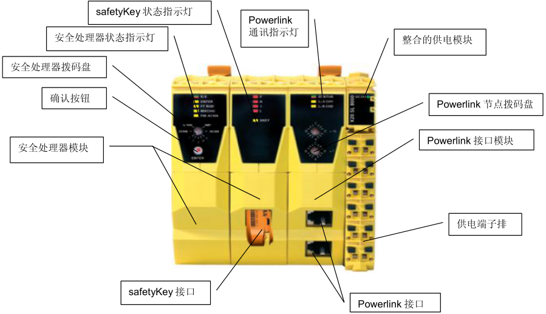

- 安全 PLC（上图以 SL8000 为例）可分为三部分：安全处理器模块、Powerlink 通讯模块、整合的供电模块。
- 安全处理器模块分两部分，左边的模块上有状态指示灯，拨码盘和确认按钮；右边部分为 safetyKey 状态指示灯和 safetyKey 的接口，安全程序就是储存在 safetyKey 中的。
- Powerlink 通讯模块是用来和 Powerlink 其他站点通讯的，上方是通讯指示灯，中间是节点号的拨码盘，下方是两个 Powerlink V2 的 Hub 接口。
- 供电模块在最右边，其上方是供电指示灯，下方为供电端子排

## B.安全输入模块

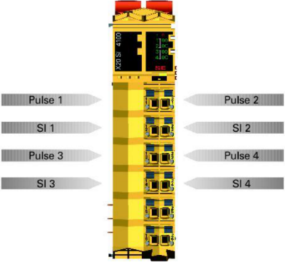

- 安全数字量输入模块（以 SI4100 为例），提供 4 路数字量失效保护的输入接口，接线如上图。
- 注：安全输入模块是正常 DI 模块的两倍宽，拆装时应小心。

## C.安全输出模块

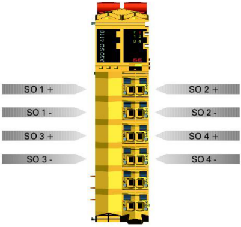

- 安全数字量输出模块（以 SO4110 为例），提供 4 路数字量失效保护的输出接口，接线如上图。
- 注：安全输出模块是正常 DO 模块的两倍宽，拆装时应小心。

# 二、安全程序的下载及确认

## A. SafetyDesigner 与安全 PLC 连接

安全程序的下载需要先进入安全程序的开发环境 safeDESIGNER 中，safeDESIGNER 可以通过贝加莱主控 PLC 将个人电脑和安全 PLC 相连接，也可以直接连接安全 PLC。下面将两种连接方法一一介绍。

### （1）通过贝加莱主控 PLC 与安全 PLC 连接

将个人电脑的以太网口和能够连接贝加莱 PLC 的交换机连接，并将电脑的 IP 地址改为和主控 PLC 处于同一网段的地址。例如 PLC 的地址是 172.160.1.12 ，网段为 255.255.0.0 ，共有120 台设备，则个人电脑可设如下 IP，以防地址冲突：

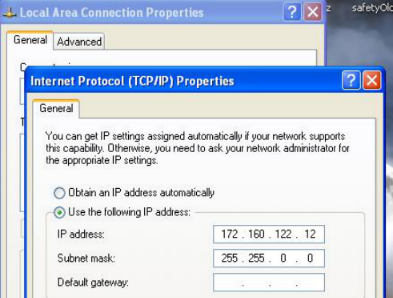

打开 AS 软件，在 online - setting 中搜索要连接的 PLC 的 IP 地址（例子中是 112 号设备），并点右键单击 connect

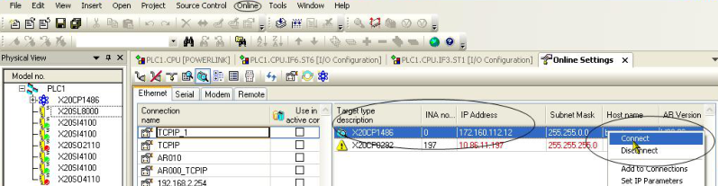

连接成功后，AS 软件下方会有相应提示状态为 RUN（画椭圆处）

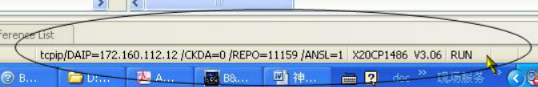

然后在 windows 的命令对话框中输入 cmd：

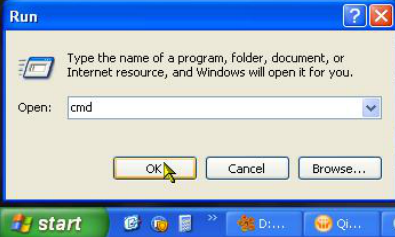

在命令行中输入：route add 192.168.101.0 mask 255.255.255.0 172.160.1.12（这个 IP 地址应该为 PLC 的地址），并按回车。

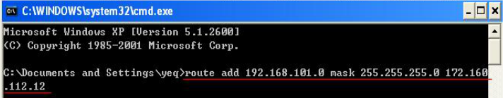

当没有出现报错，则说明 route 成功，可以关闭对话框了

打开 AS 软件，在左侧硬件树中右击 SL8000，选择 Open safeDESIGNER

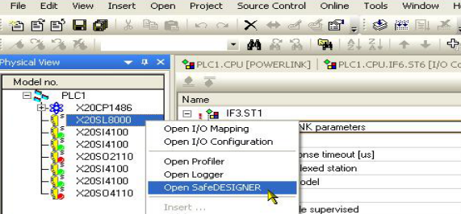

进入 safeDESIGNER 界面后，会弹出对话框 Project log on，选择 maintenance 后，点 OK

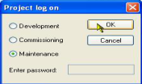

在 safeDESIGNER 界面中上方菜单中打开 online—TCPIP communication setting，进入通讯设置界面

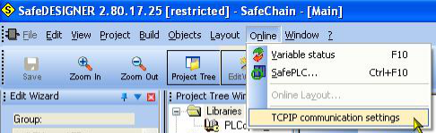

在通讯设置界面中，将连接方式设为 Manual configuration，port number 设为 50000，IP 地址设为 192.168.101.1，timeout 时间设为 5000ms，并点 OK

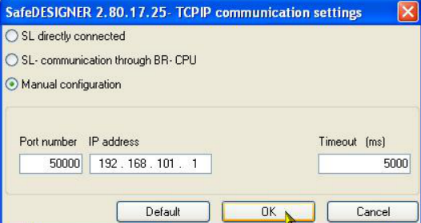

设置完成后，单击界面上方的 SafePLC 按钮，系统会连接到安全 PLC：

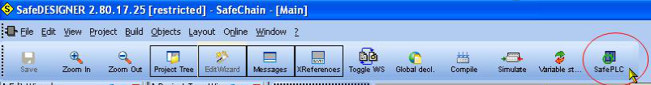

若此程序和安全 PLC 中的程序不一致，会弹出对话框提示，点击 Yes：

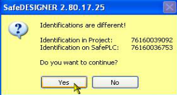

提示输入登录密码(一般为 123456 或 111111)：

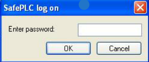

若密码输入正确，会弹出操作对话框，且右下角会有黄颜色提示已经成功登录：

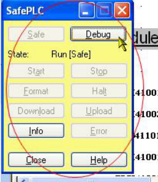

若未连接成功，会弹出提示框，请检查之前的配置和设置值是否正确：

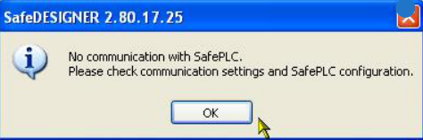

### （2）直接与安全 PLC 连接

将个人电脑的网口和安全 PLC 的 Powerlink 网口连接，并确保 Powerlink 的指示灯全部为绿色（若三个灯中有红灯亮，重启安全 PLC）。设置电脑的 IP 地址，使之与安全 PLC 处于同一网段，地址为 192.168.100.（2-255 均可），网关为 255.255.255.0，例如：

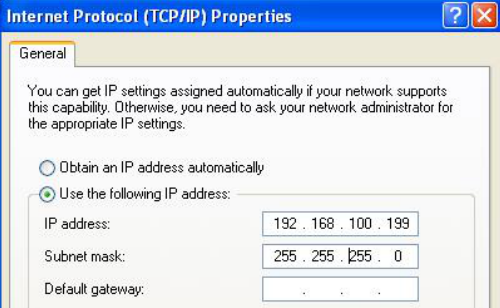

在 AS 中打开 safeDESIGNER：

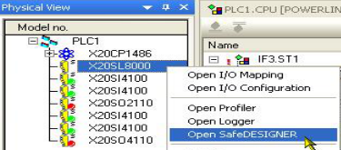

选择 Maintenance 模式

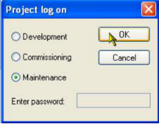

进入设定连接方式的对话框

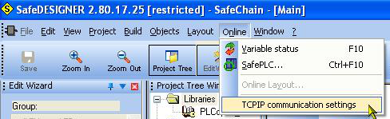

选择 SL directly connected 方式，将 POWERLINK address 设为安全 PLC 的节点号（即码盘上的拨码，例子中为 1），timeout 时间设为 5000ms

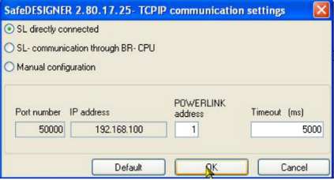

设置完成后，单击界面上方的 SafePLC 按钮，系统会连接到安全 PLC：

若此程序和安全 PLC 中的程序不一致，会弹出对话框提示，点击 Yes：

提示输入登录密码(一般为 123456 或 111111)：

若密码输入正确，会弹出操作对话框，且右下角会有黄颜色提示已经成功登录：

若未连接成功，会弹出提示框，请检查之前的配置和设置值是否正确：

## B.编译安全链程序

> 在安全程序下载之前，请先编译此安全程序

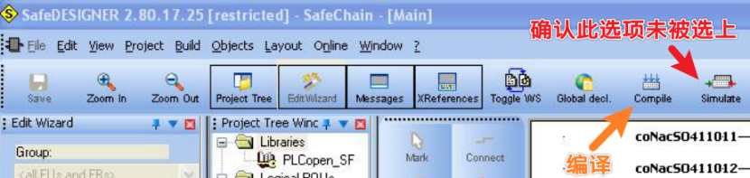

## C. 安全程序下载

成功连接到安全 PLC 后，在操作对话框中单击 Debug 按钮

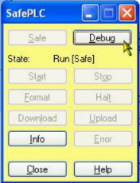

弹出对话框提示是否进入 debug 模式，点击 Yes

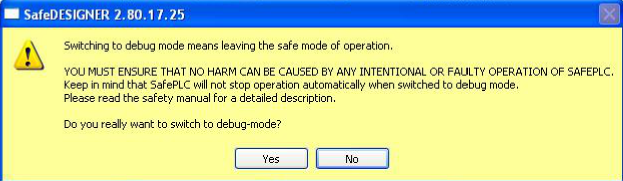

进入 debug 模式后，操作框背景变为红色，单击 stop 按钮：

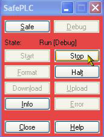

再点击 Format 按钮

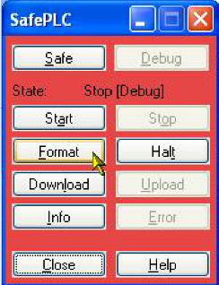

弹出提示框，点击 Yes

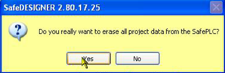

Format 成功后，弹出提示框：

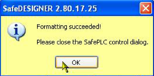

单击操作框中的 Download 按钮：

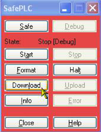

弹出下载选项对话框，选择 Auto restart 模式，并点击 OK

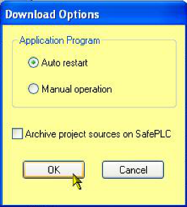

下载程序开始，下方进度条会显示下载进度：

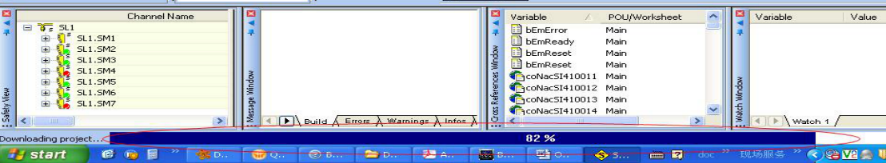

程序下载成功，弹出提示框。注：(第一次下载程序时，有可能出现下载超时的情况，需再次点击 Download 按钮下载一次)

## D. 安全程序拨码确认

安全程序下载完毕后，需要四步确认，用 2.4mm 左右宽度的小一字螺丝刀拨动码盘，并点击 enter 按钮。

（1） R/E 灯绿色闪烁，FW-ACKN 灯橙色常亮，拨码置 SK-XCNG 并按下 ENTER；此时安全 CPU 将会重启；

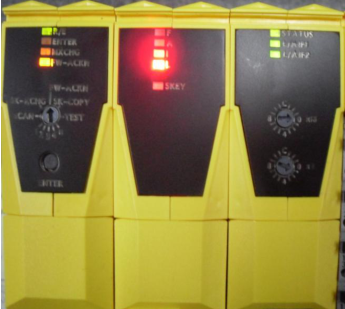

（2） MXCHG 灯闪烁拨码置 SCAN 并按下 ENTER；扫描完成后 MXCHG 灯将会由快闪变成慢闪；

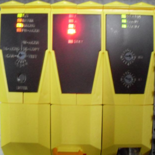

（3） 拨码置 n 并按下确认；FW-ACKN 灯闪烁

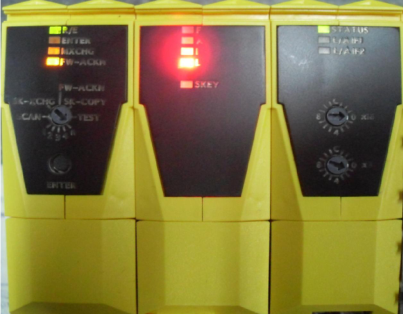

（4） 拨码置 FW-ACKN 并按下 ENTER；安全 CPU 重启并运行正常；

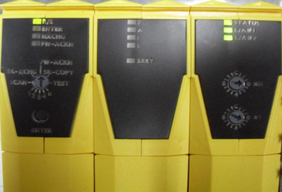

# 三、安全系统的常见故障及处理方法

## 1.安全 PLC 始终处于扫描状态

- **现象**
- 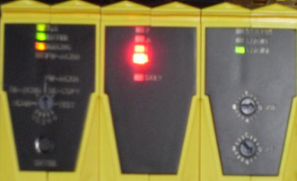
    - 左侧：R/E 灯绿色单闪，其他三个灯循环闪烁。
    - 中间：L 灯红色常亮，其他灯不亮。
    - 右侧：相应的 Powerlink 通道灯亮，其余不亮
- **原因**
    - Powerlink 节点号拨错，例子中应为 1，实际拨到 2 上，这会导致安全 PLC 始终处于扫描状态，不能正常工作。如果其他 Powerlink 站也拨到 2，则其他站也不能正常工作。
- **解决方法**
    - 检查所有 Powerlink 节点的拨码，确保拨码都正确，并重启整个主控系统。

## 2.安全模块丢失或损坏

- **现象**
    - 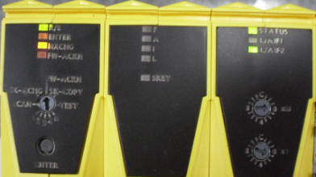
    - 左侧：R/E 灯绿色常亮，MXCHG 闪烁（大约每秒两次）。
    - 中间：所有灯不亮。
    - 右侧：status 灯绿色常亮，相应的 POWERLINK 通道灯亮。
- **原因1. 模块丢失**：某个 POWERLINK 站的安全模块全部为红灯，一般是由于所在的 POWERLINK 站点工作不正常引起。
- 解决方法：请检查相应的站点拨码、接线等。
- **原因2. 模块虚接或损坏**：只有出问题的模块亮红灯，其余模块处于正常状态。
- 解决方法：需要检查模块之间的连接，或直接更换模块。（下图亮红灯的模块为虚接，重新安装后恢复正常）
    - 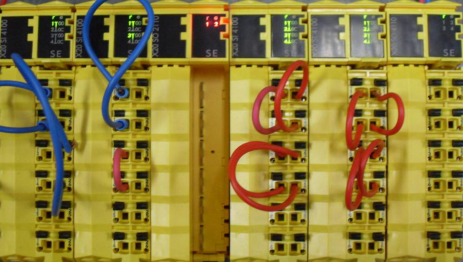

## 3.POWERLINK 通讯中断

- **现象**
    - 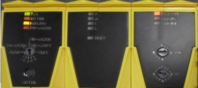
    - 左侧：R/E 灯绿色常亮，MXCHG 闪烁（大约每秒两次）。
    - 中间：所有灯不亮。
    - 右侧：status 灯绿色和红色交替闪烁，其余灯不亮。
- **原因**
    - Powerlink 通讯中断。如果通讯正常，相应的 Powerlink 通道灯会绿色闪烁，status灯常绿。
- **解决方法**
    - 检查 POWERLINK 线，网口等是否损坏；若有损坏，更换相应设备。

## 4.safetyKey 丢失

- **现象**
    - 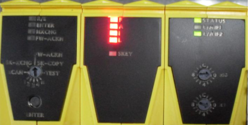
    - 左侧：所有灯不亮。
    - 中间：F、A、I、L 四个灯红色常亮。
    - 右侧：status 灯绿色常亮，相应的 Powerlink 通道灯亮。
- **原因**：safetyKey 丢失。
- **解决方法**：检查 safetyKey 是否损坏，是否安装正确；若有损坏，更换新的 Key。
- 注意：拆卸和安装 safetyKey 时，先要将锁扣解开，下面是解锁和锁定的方法：
- 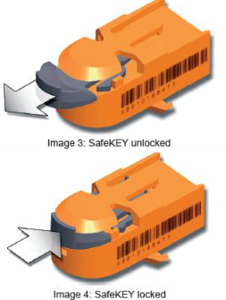

## 5.安全链程序丢失或不匹配

- **现象**
    - 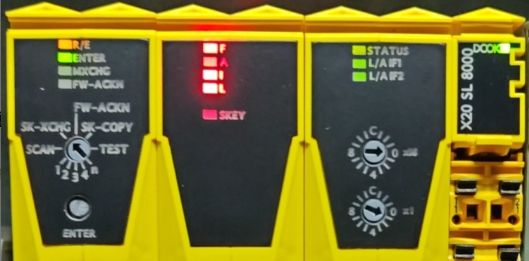
- **原因**
    - R/E 灯橙灯表示 SL 8000 中没有运行程序或者系统 Safety Release 版本与 CPU 设定不一致（CPU 低于安全 PLC（X20SL8000））
- **可能原因1：SL8000没有程序无法下载程序**
    - 安全程序没有编译
    - **解决方式**
        - 点击 SafeDesigner 软件上方 complie，编译后重新下载
- **可能原因2：Safety Release 版本不一致**
    - 在 AS 项目中，点击菜单栏 `Project - Change Runtime Version` 即可见以下条目
    - 
    - 安全链程序存储在 SafeKey 中，当单独更新安全链程序时，安全链程序会自动检查当前运行的主控程序的 Safe Release 版本，如果不一致则不能正常更新。一般建议更新安全链程序，如果Safe Release会发生改变，则建议先更新主控程序，再更新安全链程序。
    - AS 项目中的 Safety Release 版本与安全链程序有对应关系，如果 PLC 中的 Safety Release 版本为1.5，而安全链中运行的安全链程序为1.6，则可能会出现如上图的 SafeLogic 模块闪烁状态。
    - **解决方法**：
        - 更新调整 AS 项目程序，使 Safety Release 版本一致
