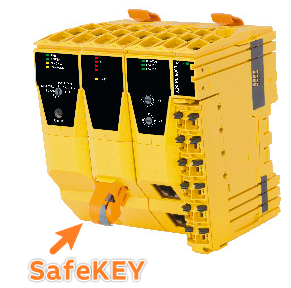
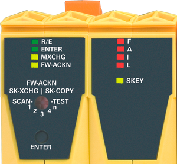

- [015在 X20SL8000硬件上备份 SafeKEY](#015%E5%9C%A8%20X20SL8000%E7%A1%AC%E4%BB%B6%E4%B8%8A%E5%A4%87%E4%BB%BD%20SafeKEY)
- [需求](#%E9%9C%80%E6%B1%82)
- [实现方式](#%E5%AE%9E%E7%8E%B0%E6%96%B9%E5%BC%8F)
	- [注意事项](#%E6%B3%A8%E6%84%8F%E4%BA%8B%E9%A1%B9)

# 015在 X20SL8000硬件上备份 SafeKEY

# 需求

- 对于 `X20SL8000` 安全控制器，所有配置数据、应用程序数据和参数都存储在 SafeKEY 中。
- 
- 在更换或更新安全链程序时，可以将存储在 SafeKEY 中的安全链程序转移到一个全新的 SafeKEY 中作为备份。

# 实现方式

- 
- 1. 将拨码拨至 "SK-COPY " 位置，并确保原可用 SafeKEY 已连接安全控制器 `X20SL8000`。
- 2. 按下 Enter（确认）按钮，此时 LED "ENTER"（确认）会亮。
    - SafeKEY 中的安全链程序与配置信息将保存在 SafeLOGIC 控制器的 RAM 上。每次访问时 LED "SKEY "闪烁。
    - 复制过程结束后，"FW-ACKN" LED 将闪烁。
        - 此过程最多持续 30 秒。20 秒后，"FW-ACKN "LED 闪烁频率增加，表示交换阶段结束。
- 3. 移除旧的 SafeKEY，插入新的 SafeKEY。
- 4. 再次按下 ENTER （确认）按钮。
    - 安全控制器 RAM 中临时保存的安全链程序与配置数据将传输至新的 SafeKEY 上。然后自动复位。
- 5. 将拨码拨至 "SK-XCHG "设置处 ( 若 FW-ACKN LED 灯亮)
    - 复位后，必须确认 SafeKEY 的交换。
    - FW-ACKN LED 灯常亮表示更换了 SafeKEY，必须通过确认 "SK-XCHG "进行确认。
- 6. 按下 ENTER ( 确认 )按钮，LED 指示灯 "ENTER "将亮，确认操作。
- 7. 执行完整的安全功能测试。

## 注意事项

- 如果新的 SafeKEY 在 30 秒后仍未被确认，则功能结束。
    - 这意味着，如果该功能被意外触发，复制功能将在 30 秒后自动结束。如果 30 秒后仍未插入新的 SafeKEY，SafeLOGIC 将切换到 BOOT 状态（字母 LED "F"、"I "和 "L "亮起）。
- 此步骤将激活存储在 SafeKEY 中的安全应用程序。请务必检查项目 CRC 和安全应用项目在 SafeKEY 上的有效日期。
- 必须始终验证安全功能是否符合预期
