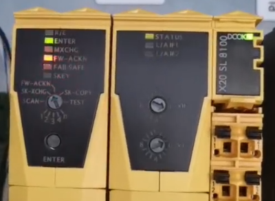
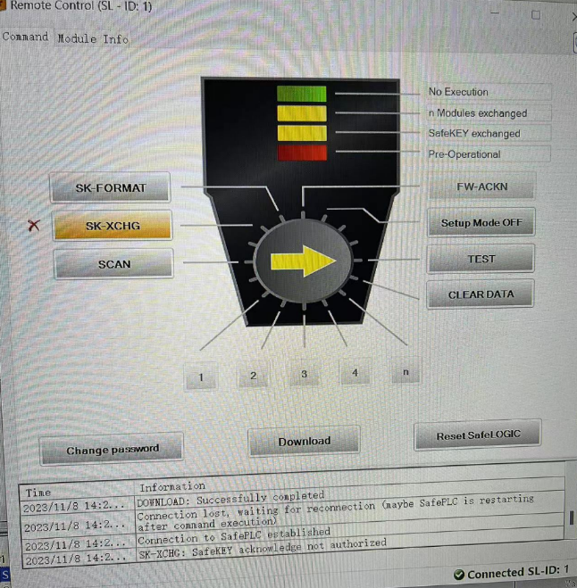

> 016SafeDesigner 更新程序后安全链无法启动

- [1 使用硬件与软件](#1%20%E4%BD%BF%E7%94%A8%E7%A1%AC%E4%BB%B6%E4%B8%8E%E8%BD%AF%E4%BB%B6)
- [2 现象](#2%20%E7%8E%B0%E8%B1%A1)
	- [2.1 安全 PLC LED 情况](#2.1%20%E5%AE%89%E5%85%A8%20PLC%20LED%20%E6%83%85%E5%86%B5)
	- [2.2 Remote Control 提示 acknowledge not authorized](#2.2%20Remote%20Control%20%E6%8F%90%E7%A4%BA%20acknowledge%20not%20authorized)
- [3 原因](#3%20%E5%8E%9F%E5%9B%A0)
- [4 解决方式](#4%20%E8%A7%A3%E5%86%B3%E6%96%B9%E5%BC%8F)

# 1 使用硬件与软件

- Safety Designer
- Safety Release
- X20SL8100

# 2 现象

- 设备之前在终端正常运行，配置有安全控制器和 Safety IO、安全 multi 伺服，SafeKEY 型号是 OK 的。
- 最近客户增加了 AC133编码器仿真模块，然后把原来的 AS4.0 + SD 3.3 程序更新为 AS4.8 + SD4.4。
- 显示丢失的模块都是伺服站点，但前面两个伺服站点又显示正常，下图站点1和2是安全伺服，后面显示丢失的是其他伺服。安全 IO 显示正常
- 

## 2.1 安全 PLC LED 情况

- 

## 2.2 Remote Control 提示 acknowledge not authorized

- 只有修改密码，下载程序和重启有效，其他那些拨码功能操作时打❌，不能操作
- 确认模块时提示 SK-XCHG: SafetyKEY acknowledge not authorized
- 
- Remote Control 确认安全模块变化数量提示 N UDIDs ackn: UDID acknowledge not authorized
- 

# 3 原因

- 安全链 Safety Technology Guarding 检查不通过，实际使用的硬件信息与在 SafetyKEY 中存储的授权信息对不上。
- 此项目中使用了 SafeMotion，但 SafeKEY 中没有相关的授权。
- 详情请查阅 [017安全链授权信息](017安全链授权信息.md)

# 4 解决方式

- 1. 重新订购 SafeKEY
- 2. 更换或者升级软件至 mappSafety 5.12及以上
