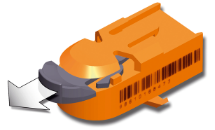

- [1 Safety Release](#1%20Safety%20Release)
	- [1.1 X20SL80xx](#1.1%20X20SL80xx)
	- [1.2 X20SL81xx](#1.2%20X20SL81xx)
	- [1.3 **安全技术保护 Safety Technology Guarding**](#1.3%20**%E5%AE%89%E5%85%A8%E6%8A%80%E6%9C%AF%E4%BF%9D%E6%8A%A4%20Safety%20Technology%20Guarding**)
		- [1.3.1 Base data](#1.3.1%20Base%20data)
		- [1.3.2 SafeMOTION](#1.3.2%20SafeMOTION)
		- [1.3.3 Application technologies 2](#1.3.3%20Application%20technologies%202)
		- [1.3.4 Application technologies 1](#1.3.4%20Application%20technologies%201)
	- [1.4 X20SLXx1x，X20SLXxxx](#1.4%20X20SLXx1x%EF%BC%8CX20SLXxxx)
	- [1.5 如何检查 SafetyKEY 中有什么授权](#1.5%20%E5%A6%82%E4%BD%95%E6%A3%80%E6%9F%A5%20SafetyKEY%20%E4%B8%AD%E6%9C%89%E4%BB%80%E4%B9%88%E6%8E%88%E6%9D%83)
	- [1.6 如何检查当前 SafeDesigner配置实际所需的授权信息](#1.6%20%E5%A6%82%E4%BD%95%E6%A3%80%E6%9F%A5%E5%BD%93%E5%89%8D%20SafeDesigner%E9%85%8D%E7%BD%AE%E5%AE%9E%E9%99%85%E6%89%80%E9%9C%80%E7%9A%84%E6%8E%88%E6%9D%83%E4%BF%A1%E6%81%AF)
	- [1.7 若缺少授权，会提示什么报错](#1.7%20%E8%8B%A5%E7%BC%BA%E5%B0%91%E6%8E%88%E6%9D%83%EF%BC%8C%E4%BC%9A%E6%8F%90%E7%A4%BA%E4%BB%80%E4%B9%88%E6%8A%A5%E9%94%99)
- [2 mappSafety < 5.12](#2%20mappSafety%20%3C%205.12)
	- [2.1 X20SL81xx](#2.1%20X20SL81xx)
	- [2.2 Component-based licensing model](#2.2%20Component-based%20licensing%20model)
		- [2.2.1 mapp Safety " Basic"](#2.2.1%20mapp%20Safety%20%22%20Basic%22)
		- [2.2.2 mapp Safety "Advanced"](#2.2.2%20mapp%20Safety%20%22Advanced%22)
- [3 mappSafety >= 5.12](#3%20mappSafety%20%3E=%205.12)
	- [3.1 Package-based licensing model](#3.1%20Package-based%20licensing%20model)

# 1 Safety Release

- 授权信息存储在 SafetyKEY 中，在订货后，相关的授权信息存储在 SafeKEY 中
- 每套解决方案 X20MKXXXX.XXX.XXX都是由 SafeKEY 和所选技术功能的激活许可证组成。

## 1.1 X20SL80xx

- X20SL8000、X20SL8001、X20SL8010、X20SL8011
    - 对应的 SafeKEY 型号：X20MK0201（2MB 大小）、X20MK0203（8MB 大小）
    - 

## 1.2 X20SL81xx

- X20(c)SL8100,X20(c)SL8101,X20SL8110
    - 对应的 SafeKEY 型号: X20MK0211（2MB 大小）, X20(c)MK0213（8MB 大小）
        - 
        - 完整型号 X20MKXXXX.XXX.XXX
        - X20 SafeKEY，适用于 X20SL81xx 系列，用于 Legacy Safety (Safety Release) 和 mapp Safety。
        - 可用功能范围由 "**安全技术保护 Safety Technology Guarding** "定义。
        - 许可证存储在 SafeKEY 加密狗中。
        - 应用所需的功能范围必须通过在 X20MK 配置器中选择可用的技术功能来编制。每套解决方案都是由 SafeKEY 和所选技术功能的激活许可证组成。

## 1.3 **安全技术保护 Safety Technology Guarding**

- "安全技术保护 "定义了使用 X20SL81xx- 或 X20cSL81xx- 系列 SafeLOGIC 控制器的应用程序的可用功能范围。许可证存储在 SafeKEY 加密狗中。应用所需的功能必须在 X20MK 配置器中通过选择具有足够内存量的 SafeKEY、涂层/非涂层变体和必要的技术功能组合在一起。
- 每个解决方案都以套装（X20MKXXXX. XXX. XXX）的形式交付，包括安全钥匙和所选技术功能的激活许可证。
- 

### 1.3.1 Base data

### 1.3.2 SafeMOTION

### 1.3.3 Application technologies 2

### 1.3.4 Application technologies 1

## 1.4 X20SLXx1x，X20SLXxxx

- 不检查授权

## 1.5 如何检查 SafetyKEY 中有什么授权

- 访问贝加莱官网 www.br-automation.com
- 登录
- 输入 SafetyKEY 的序列号，即可见有什么授权信息在此 KEY 上

## 1.6 如何检查当前 SafeDesigner配置实际所需的授权信息

- 使用 Automation Studio，打开 SafeDESIGNER 软件，在线连上安全 PLC
- 右键 SL，选择“Local Configuration on target”
- 会显示一个 License 页，显示哪些授权在当前的 SafetyKEY 上，并且实际当前安全链配置需要哪些授权。

## 1.7 若缺少授权，会提示什么报错

### 1.7.1 X20SL81xx 不能确认

### 1.7.2 Remote Control 无法确认，提示acknowledge not authorized

- 

### 1.7.3 Logger 中记录报错号 114831、122910

- 
- 

# 2 mappSafety < 5.12

- 授权是必要的
- 授权要么是通过存储在 SafeKEY 中的信息获取
- 或者通过 Technology Guarding 硬件狗授权

## 2.1 X20SL81xx

- X20MK0223
    - 用于 mapp Safety，许可功能范围通过基于软件包的许可模式或 AR 的 Technical Guarding 来确定

## 2.2 Component-based licensing model

### 2.2.1 mapp Safety " Basic"

- 基本许可证支持以下内容：
    - 多达 20 个 SafeNODE 的安全应用
    - 通过基于网络的 mapp View 人机界面解决方案，可轻松调试
    - Automation Studio（SafeDESIGNER）中用于安全配置和编程的扩展功能
    - 广泛的功能库和经过认证的功能块，可轻松实现安全功能

> 每个运行目标系统需要一个许可证，与 SafeDOMAIN 实例的数量无关

|名称|Technology Guarding / License name|描述|依赖|
|---|:--|---|---|
|mapp Safety: Basic Package|1TGMPSAFE-01|mapp Safety 将 B&R 的集成安全技术与 mapp Technology 的便捷软件解决方案相结合。  mapp Safety 包括可通过 mapp View 基于 Web 的 HMI 解决方案轻松设置的即用型部件、Automation Studio 中用于安全配置和编程的扩展，以及包含认证功能块的广泛功能库，可轻松实现安全功能。  无论 SafeDOMAIN 实例数量多少，每个 Automation Runtime 目标都需要一个许可证。|-|

### 2.2.2 mapp Safety "Advanced"

mapp Safety "Advanced" 软件包允许使用额外的安全功能

> Advanced 的 mappSafety 授权都依赖 Basic 授权：1TGMPSAFE-01 (mapp Safety: Basic Package)

| Name                                    | Technology Guarding / License name |Description|
| --------------------------------------- | :--------------------------------- | ------------------------------------------------------------ |
| TG 100 SN Extension                     | 1TGMPSF100SN-01                    | 100 SN Extension "软件包允许使用多达 100 个 SafeNODE 实施安全应用。   每个 SafeLOGIC 控制器需要一个许可证。 |
| TG 280 SN Extension                     | 1TGMPSF280SN-01                    | 280 SN Extension "软件包允许使用多达 280 个 SafeNODE 实施安全应用。   该软件包还支持 POWERLINK 的 "多轮询响应"（MPRES）功能。这允许安全控制器利用多个网络帧，在每个数据方向上提供 4 x 1490 字节的带宽。只有 SafeLOGIC 控制器 X20SL8101 支持 MPRES。   每个 SafeLOGIC 控制器需要一个许可证。 |
| TG SafeMOTION: ACOPOSmulti, ACOPOSmotor | 1TGMPSFMOTIO-01                    | 软件包 "SafeMOTION: ACOPOSmulti, -motor "包含 ACOPOSmulti 和 ACOPOSmotor 驱动系统的大量安全功能。通过该软件包，可以使用所有 SafeMOTION 功能，包括 "安全限速"、"安全限增量"、"安全限扭矩"、"安全限位置"、"安全旋转方向 "和 "安全操作停止"。   每个 SafeLOGIC 控制器需要一个许可证，与 SafeMOTION 轴的数量无关。  许可证仅适用于 ACOPOSmulti 和 ACOPOSmotor 驱动系统。 |
| TG SafeROBOTICS                         | 1TGMPSFROBOT-01                    | SafeROBOTICS "软件包包含机器人和数控机床等运动结构的安全功能。这样就可以轻松实现需要人类和机器人在共享工作空间中协作的应用。  功能包括 "安全限制机器人速度"、"工具安装法兰的安全方向 "和 "安全工作区"。  运动结构的默认配置在 SafeDESIGNER 安全编辑器中定义。在调试过程中，可通过 SafeOPTION 界面对这些数据进行修改。   每个 SafeLOGIC 控制器需要一个许可证，与 SafeROBOTICS 实例的数量无关。 |
| TG Safety Utilities                     | 1TGMPSFUTIL-01                     | 安全实用程序 "软件包包括以下功能：   在安全控制器的 SafeKEY 上安全保存数据     用于压力机应用的块     用于定点计算的数学库     用于在安全应用中使用标准信号的 DATA 至 SafeDATA 函数     每个 SafeLOGIC 控制器需要一个许可证。 |
| TG PROFIsafe Device Interface           | 1TGMPSFPROFI-01                    | PROFIsafe Device Interface "软件包为 PROFIsafe 应用程序提供了一个基于网络的接口。它可用于将 B&R 应用程序集成到使用 PROFIsafe 技术的生产线中。  这些功能在每个数据方向上支持 32 个安全 BOOL 通道和一个安全 INT 通道的数据交换。每个 SafeLOGIC 控制器最多可实例化一个 PROFIsafe 设备功能块。  每个 SafeLOGIC 控制器需要一个许可证。 |

# 3 mappSafety >= 5.12

- 基于 TC License，在商务上，下订单时需要订购授权。
- 在实际的硬件与软件使用过程中不会进行授权功能检查。

## 3.1 Package-based licensing model

|License package|License name|Scope|
|---|---|---|
|mapp Safety "Starter"|N/A|mapp Safety "入门 "软件包支持具有 SafeMOTION 基本功能的小型应用的所有基本功能：   支持 1 个 SafeDOMAIN 和最多 5 个 SafeNODE（例如 SafeLOGIC 控制器、SafeIO 模块、SafeMOTION 轴、openSAFETY 第三方设备）     SafeMOTION 的选定安全功能：STO、SS1、SBC     在这些限制范围内包含所有基本技术库和功能。 只有 mapp Safety "Ultimate" 中专门列出的功能未包含在内。 必须遵守因一般系统限制（如所使用产品的网络或 CPU 性能）而造成的限制。|
|mapp Safety "Premium"|1TCMPSAFETY-01|mapp Safety "高级 "软件包支持所有基本功能，且不限制大小或 SafeMOTION 功能范围：   支持多个 SafeDOMAINs   每个 SafeDOMAIN 最多 280 个 SafeNODE（例如 SafeLOGIC 控制器、SafeIO 模块、SafeMOTION 轴、openSAFETY 第三方设备）     完整的 SafeMOTION 功能范围     包含所有基本技术库和功能。 仅不包括 mapp Safety "Ultimate" 中专门列出的功能。 必须遵守因一般系统限制（如所使用产品的网络或 CPU 性能）而造成的限制。|
|mapp Safety "Ultimate"|1TCMPSAFETY-01|使用 mapp Safety "终极 "软件包，可以不受限制地使用全部 mapp Safety 功能，即除了 mapp Safety "高级 "软件包的功能外，还可使用以下终极专属功能：  SafeROBOTICS 功能   PROFIsafe 网关功能   SafeDESIGNER C 编程扩展     必须遵守一般系统限制，例如所使用产品的网络或 CPU 性能限制。|
