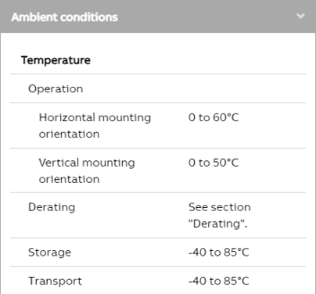
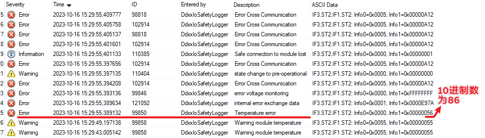
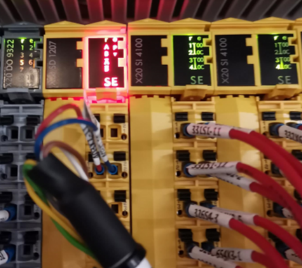
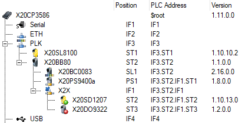
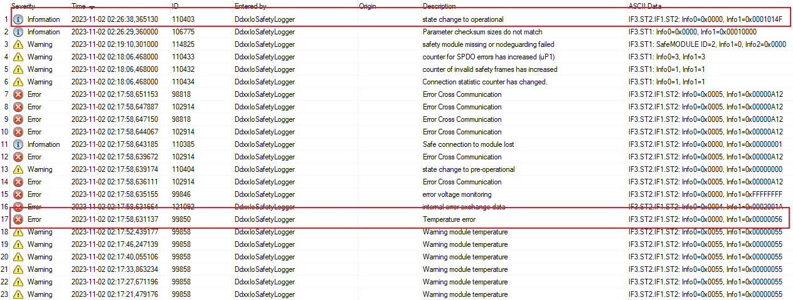

> 018安全模块强制复位方式
- #X20SD1207
- #安全链
- [1 需求说明](#1%20%E9%9C%80%E6%B1%82%E8%AF%B4%E6%98%8E)
- [2 实现方式](#2%20%E5%AE%9E%E7%8E%B0%E6%96%B9%E5%BC%8F)
	- [2.1 🛑注意事项](#2.1%20%F0%9F%9B%91%E6%B3%A8%E6%84%8F%E4%BA%8B%E9%A1%B9)
	- [2.2 ✔️适用场景](#2.2%20%E2%9C%94%EF%B8%8F%E9%80%82%E7%94%A8%E5%9C%BA%E6%99%AF)
- [3 测试代码](#3%20%E6%B5%8B%E8%AF%95%E4%BB%A3%E7%A0%81)
	- [3.1 测试硬件版本信息](#3.1%20%E6%B5%8B%E8%AF%95%E7%A1%AC%E4%BB%B6%E7%89%88%E6%9C%AC%E4%BF%A1%E6%81%AF)
	- [3.2 验证流程](#3.2%20%E9%AA%8C%E8%AF%81%E6%B5%81%E7%A8%8B)

# 1 需求说明

- 贝加莱安全模块运行过程中触发了自检异常，会导致模块进入 FAILSAFE 状态，并无法直接通过安全链确认复位，必须断电重启后安全链硬件才能重新确认安全链。
- 例如：
- 贝加莱安全模块例如 X20SD1207，可运行的温度为0~60℃
    - [X20SD1207 | B&R Industrial Automation (br-automation.com)](https://www.br-automation.com/en/products/safety-technology/x20-system/counter-and-positioning-modules/x20sd1207/)
    - 
- 若环境温度远超允许运行的环境温度，例如86℃，则模块会提示超温报警，在 Logger 日志中记下如下条目。
    - 
- 在这种情况下，X20SD1207模块进入了 FAILSAFE 状态，即便环境温度恢复正常，仍无法通过安全链确认来恢复功能正常。
- 模块大致的 LED 情况如下图所示
- 

> ⭐需求：在一些特殊场景，需要贝加莱安全模块在进入异常后，能够强制复位

# 2 实现方式

- 新出的安全模块固件（2020年后），可以通过远程复位的方式重置安全模块的状态，使模块从 FAILSAFE 状态恢复正常。
- FAILSAFE（故障保护状态）的确认，通过在程序中使用 AsIOAcc 函数异步访问 X2X 总线上的模块寄存器来实现。
- 这将使安全模块恢复正常，并使安全链程序恢复至处于运行状态（operating state）（无需确认）

## 2.1 🛑注意事项

- 如果由于安全模块内置计数器溢出而导致故障保护功能失效，则故障保护的外部确认是合理的。
- 无法确认其他原因导致的失败状态。
- 存在硬件错误将由远程复位确认的风险，并导致安全故障在不同的状态下累积。

## 2.2 ✔️适用场景

- 安全模块报错信息为：
    - "Cross communication error"
    - "Temperature error"
- 安全模块断电上电后恢复正常运行，模块硬件层面上没有损坏。

# 3 测试代码

> 使用 StructureText 代码编写

硬件拓扑



```
PROGRAM _CYCLIC
	(*----------------------- 触发复位程序 -----------------------*)
	IF bTest THEN
		bTest := FALSE;
		uStep := 1;
	END_IF
	(*----------------------- 指定需要复位的安全模块位置 ---------*)
	sDeviceName := 'IF3.ST2.IF1.ST2';
	(*----------------------- 安全链复位状态机 -------------------*)
	CASE uStep OF
		1: (*-- 通过AsIOAccWrite函数，先给0x1341,0x1343寄存器写16#55 --*)
			AsIOAccWrite_0(enable := TRUE, pDeviceName := ADR(sDeviceName), pChannelName :=ADR('0x1341') , value := 16#55);
			IF AsIOAccWrite_0.status<> 65535 THEN
				IF   AsIOAccWrite_0.status = 0 THEN
					STATUS1 :=TRUE;
				END_IF;
			END_IF;
			AsIOAccWrite_1(enable := TRUE, pDeviceName := ADR(sDeviceName), pChannelName :=ADR('0x1343')  , value := 16#55 );
			IF AsIOAccWrite_1.status<> 65535 THEN
				IF   AsIOAccWrite_1.status = 0 THEN
					STATUS2 :=TRUE;
				END_IF;
			END_IF;	
			IF (STATUS1 = TRUE) AND (STATUS2 = TRUE) THEN
				STATUS1 :=FALSE;
				STATUS2 :=FALSE;
				uStep := 2;
			END_IF
		2:(*-- 通过AsIOAccWrite函数，再给0x1341,0x1343寄存器写16#AA --*)
			AsIOAccWrite_0(enable := TRUE, pDeviceName := ADR(sDeviceName), pChannelName :=ADR('0x1341') , value := 16#AA);
			IF AsIOAccWrite_0.status<> 65535 THEN
				IF   AsIOAccWrite_0.status = 0 THEN
					STATUS1 :=TRUE;
				END_IF;
			END_IF;
			AsIOAccWrite_1(enable := TRUE, pDeviceName := ADR(sDeviceName), pChannelName :=ADR('0x1343')  , value := 16#AA );
			IF AsIOAccWrite_1.status<> 65535 THEN
				IF   AsIOAccWrite_1.status = 0 THEN
					STATUS2 :=TRUE;
				END_IF;
			END_IF;	
			IF (STATUS1 = TRUE) AND (STATUS2 = TRUE) THEN
				STATUS1 :=FALSE;
				STATUS2 :=FALSE;
				uStep := 0;
			END_IF
	END_CASE
END_PROGRAM
```

## 3.1 测试硬件版本信息

- Automation Studio version ：AS4.7
- Automation Runtime version：H4.73
- Hardware Firmware version：X20SD1207 1.10.14.1

## 3.2 验证流程

- 加热 X20SD1207 模块的环境温度到86度
- X20SD1207模块进行入 FailSafe 状态
- 等待环境温度降到60℃以下，此时 X20SD1207仍处于 FailSafe 状态
- 执行测试代码，给 bTest 变量设置为1，触发功能执行
- X20SD1207被复位
- 日志内容，可以看到模块故障后，执行功能，模块最后进入到 operation 状态，安全链恢复正常
- 
