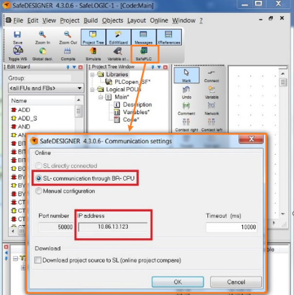
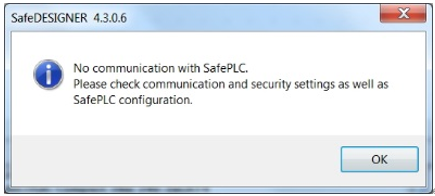
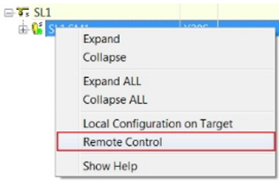

> 019如何与 SLXx1x 安全模块建立链接
> #安全链 #X20SLXx1x #SafeDesigner

- [1 问题](#1%20%E9%97%AE%E9%A2%98)
- [2 解决方式：使用 RemoteControl](#2%20%E8%A7%A3%E5%86%B3%E6%96%B9%E5%BC%8F%EF%BC%9A%E4%BD%BF%E7%94%A8%20RemoteControl)

# 1 问题

- 在使用 X20SLX 时，出现 X20CPU 的 IP 地址与 SafeDESGINER 中设置的一致，但是无法像使用 X20SL8xxx 系列安全逻辑一样通过 SafePLC 按钮，与安全 PLC（SLX）建立连接
- 
- 

# 2 解决方式：使用 RemoteControl

- X20SLXx1x 系列安全逻辑与 X20SL8xxx 系列安全逻辑不同，首次连接或格式化之后，只能通过 Remote Control 命令与其建立连接。
- 由于没有硬件拨码和确认按钮，只能通过 Remote Control 界面完成下载，格式化及确认等操作。
- 
- 
