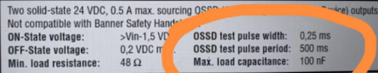
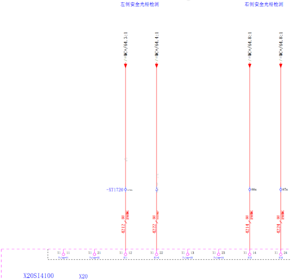
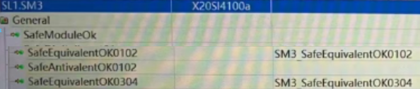
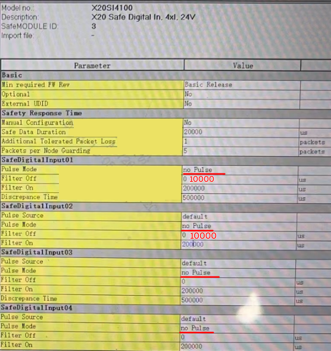
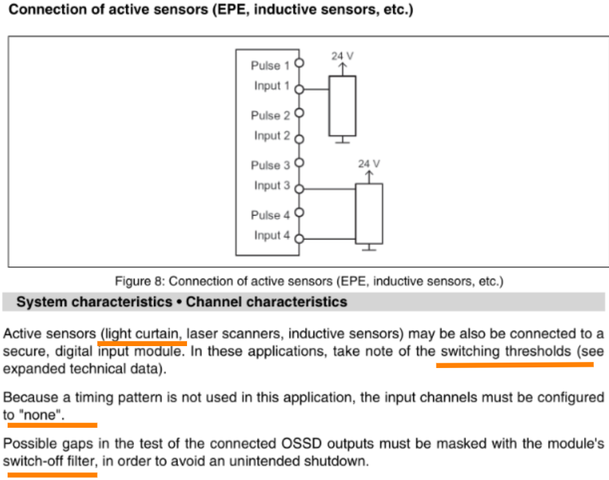

> Tags: #安全链 #X20SI4100 #光栅 #OSSD

- [1 使用版本](#1%20%E4%BD%BF%E7%94%A8%E7%89%88%E6%9C%AC)
- [2 光栅信号](#2%20%E5%85%89%E6%A0%85%E4%BF%A1%E5%8F%B7)
- [3 安全链程序配置](#3%20%E5%AE%89%E5%85%A8%E9%93%BE%E7%A8%8B%E5%BA%8F%E9%85%8D%E7%BD%AE)
- [4 更新日志](#4%20%E6%9B%B4%E6%96%B0%E6%97%A5%E5%BF%97)

# A05.021-安全输入模块X20SI4100接有源双通道光栅

# 1 使用版本

- Safety Release 1.10
- SafeDESIGNER 4.4.1.0
- 使用CPU模块为X20SLX410

# 2 光栅信号

- 参数
    - 
- 接线方式
    - 

# 3 安全链程序配置

- 程序通道
    - 
- 参数配置
    - 因为是有源外部 OSSD 信号（常 TRUE）
        - OSSD test pulse width 0.25ms
        - OSSD test pulse period 500ms
    - 因此安全链正常状态下，SI信号都为TRUE，且每500ms，会有0.25ms有一个下降跌落
    - Filter Off需要设置超过0.25ms，需要大于250 μs，避免误判，错误触发安全链断开
    - 
- 参考信息
    - 

# 4 更新日志

| 日期         | 修改人 | 修改内容 |
| :--------- | :-- | :--- |
| 2023-12-28 | YZY | 初次创建 |
