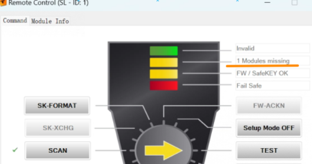
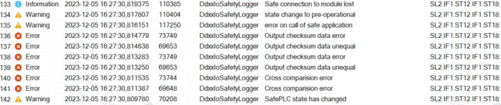
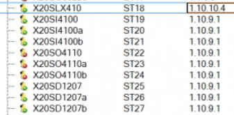
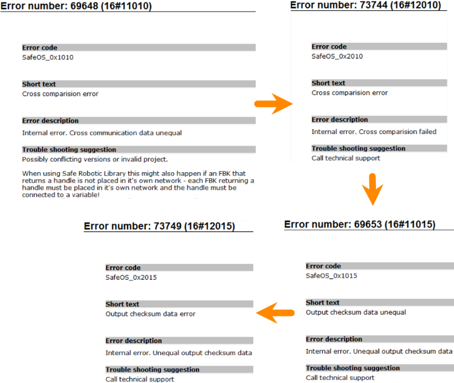
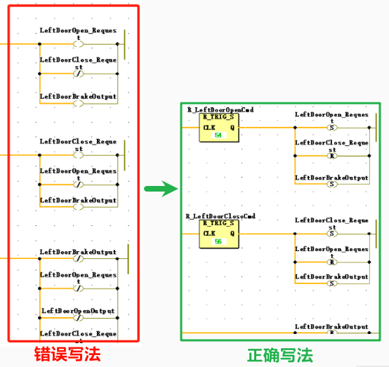

> Tags: #安全链 #X20SLXx1x

- [1 使用版本](#1%20%E4%BD%BF%E7%94%A8%E7%89%88%E6%9C%AC)
- [2 现象](#2%20%E7%8E%B0%E8%B1%A1)
- [3 原因](#3%20%E5%8E%9F%E5%9B%A0)
- [4 解决方式](#4%20%E8%A7%A3%E5%86%B3%E6%96%B9%E5%BC%8F)
- [5 更新日志](#5%20%E6%9B%B4%E6%96%B0%E6%97%A5%E5%BF%97)

# A05 .022-安全链程序无法确认，提示SLX模块丢失

# 1 使用版本

- Safety Release 1.10
- SafeDESIGNER 4.4.1.0
- 使用CPU模块为X20SLX410

# 2 现象

- 通过Remote Control下载完成安全链程序后进行安全链确认，SCAN后提示 1 Modules missing
- 
- Logger中查看报错，可见提示的是X20SLX410模块丢失
    - 
    - 
- 查看报警号变化，时序为 69648 → 73744 → 69653 → 73749
- 

# 3 原因

- 安全链内部程序异常，有部分写法错误，虽能够通过编译，但运行过程中会导致报错 69648 → 73744 → 69653 → 73749

# 4 解决方式

- 修正程序后解决
- 

# 5 更新日志

| 日期         | 修改人 | 修改内容 |
| :--------- | :-- | :--- |
| 2023-12-28 | YZY | 初次创建 |
