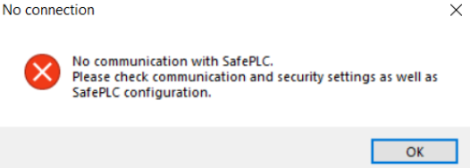
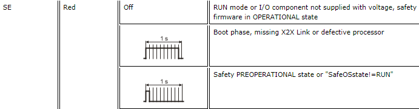
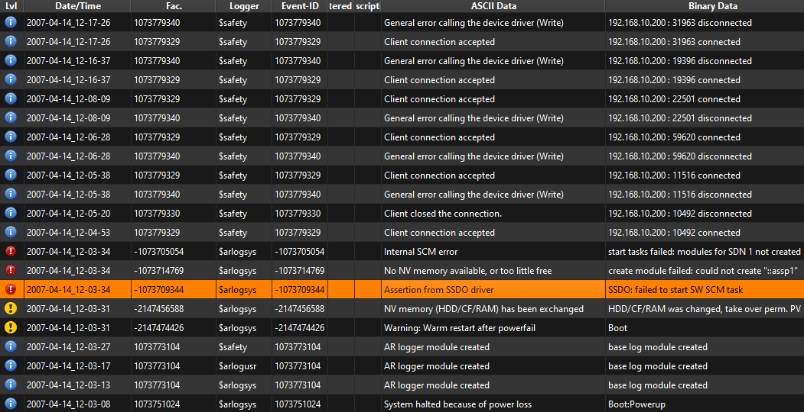
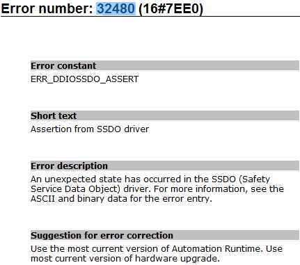
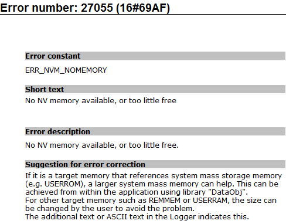
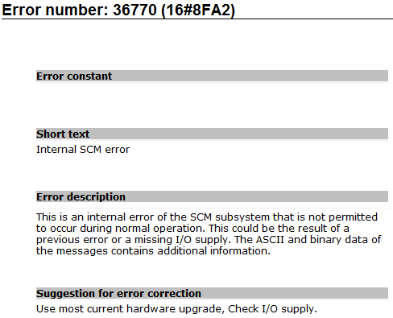
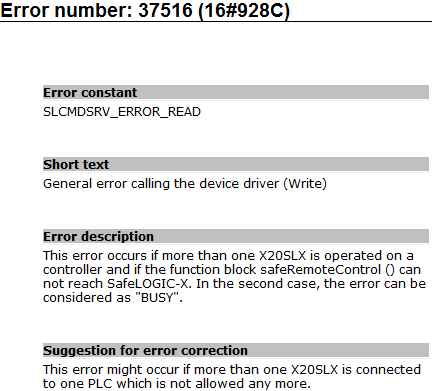

> Tags: #X20SLXx1x #安全链 #RemoteControl

# 023SLX安全链模块通过RemoteControl无法连接上

- 原本正常运行的项目，使用了X20SLX210，模块接在了X20CP3586的IF6口上（X2X总线）。
- 进行了一次烧卡之后，PLC的VC4画面以及任务正常运行，能通过Automation Studio正常链接上PLC，但打开SafeDESIGNER软件，点击RemoteControl，希望链接X20SL210进行安全链下载与确认时，提示 No communication with SafePLC。
    - 
- X20SL210模块状态为：r常绿，e不亮，SE单闪，其他常红
    - 
- 查看Logger信息
    - 主要相关报错条目为：-1073709344（32480），-1073714769（27055），-1073705054（36770），1073779340（37516）
    - 
    - -1073709344 即为 32480
        - Assertion from SSDO driver，SSDO:failed to start SWSCM task
        - 
    - -1073714769 即为 27055
        - No NV memory available, ortoo little free，start tasks failed: modules for SDN 1 not created
        - 
    - -1073705054 即为 36770
        - nternal SCM error, start tasks failed: modules for SDN 1 not created
        - 
    - 1073779340 即为 37516
        - General error calling the device driver (Write), 192.168.10.200 : 22501 disconnected
        - 

# 解决方式

- 更换一张CF卡，重新烧卡，即可通过RemoteControl正常连接X20SL210。

# 更新日志

| 日期     | 修改人     | 修改内容     |
|:-----|:-----|:-----|
| 2024-03-10     | YuanZhiyi     | 初次创建     |
