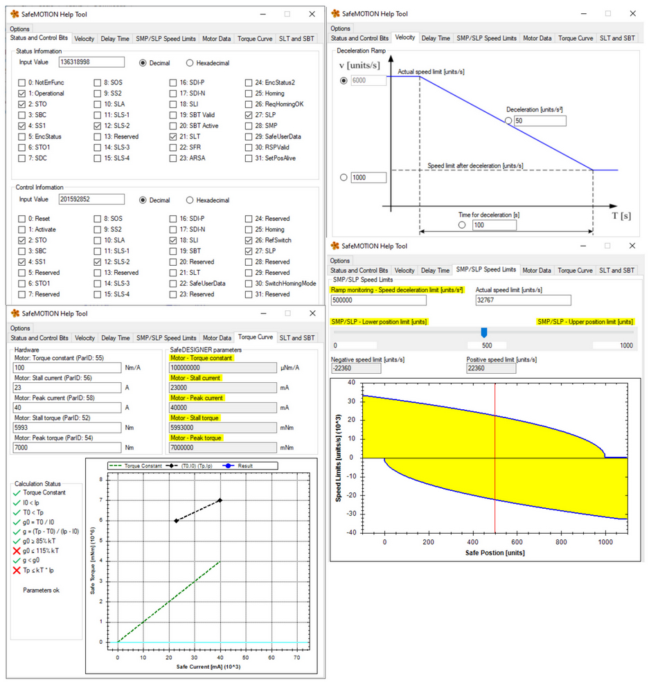

> Tags: #安全链 #SafeMOTION

# A05.025-SafeMOTION帮助工具

- SafeMOTION Help Tool贝加莱官网下载链接
    - [SafeMOTION Help Tool | B&R Industrial Automation (br-automation.com)](https://www.br-automation.com/zh/downloads/motion-control/drive-systems/safemotion-help-tool/)
- 使用此工具可帮助进行SafeMOTION参数核对

> ⚠️ SafeMOTION 帮助工具并非根据安全标准设计的，仅提供对要设置值的计算支持。必须检查计算和结果！

# 更新日志

| 日期                             | 修改人 | 修改内容 |
| :----------------------------- | :-- | :--- |
| 2024-06-03 | YZY | 初次创建 |
