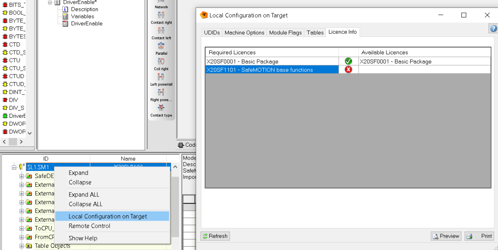

> Tags: #SafeMOTION #安全链

# A05.026-安全KEY例如X20MK0213授权信息检查

- **现象**
    - 安全链使用模块 X20SL8100+X20MK0213，由于不知道原来订货套装号。当加上SafeMotion之后，SL8100就一直启动不起来。
- **解决方式**
    - 我们可以使用如下操作来获得授权信息，在SafeDesigner里，点击SL1.SM1右键LocalConfiguration on Target → Licence Info 
    - 查看授权信息，如图显示X20MK0213只有X20SF0001的授权，没用X20SF1101授权，所以SafeMotion无法使用。

# 更新日志

| 日期         | 修改人 | 修改内容 |
| :--------- | :-- | :--- |
| 2024-06-03 | LFW | 初次创建 |
