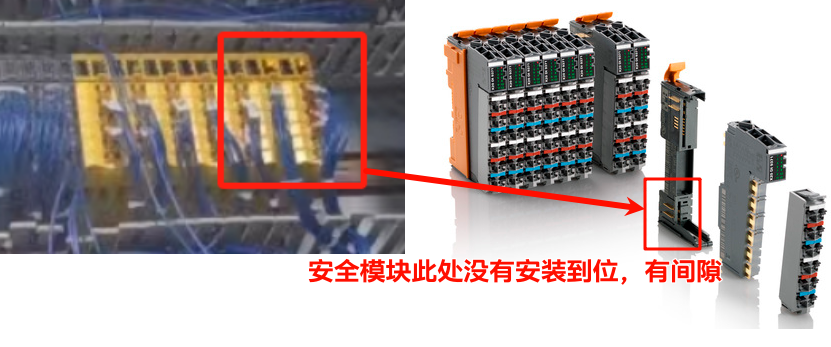

> Tags: #安全链

- [1 A05-027-安全链无法确认提示ModuleMissing报114825错误号](#_1-a05-027-%E5%AE%89%E5%85%A8%E9%93%BE%E6%97%A0%E6%B3%95%E7%A1%AE%E8%AE%A4%E6%8F%90%E7%A4%BAmodulemissing%E6%8A%A5114825%E9%94%99%E8%AF%AF%E5%8F%B7)
- [2 原因](#_2-%E5%8E%9F%E5%9B%A0)
- [3 解决方式](#_3-%E8%A7%A3%E5%86%B3%E6%96%B9%E5%BC%8F)
- [4 更新日志](#_4-%E6%9B%B4%E6%96%B0%E6%97%A5%E5%BF%97)

# 1 A05-027-安全链无法确认提示ModuleMissing报114825错误号

- 使用X20SL410 + 9块安全模块，发现在使用Remote Control确认安全链时，总是提示有4块模块丢失，无法确认。
    - 
- 观察ModuleInfo发现这几个模块提示Module Missing
    - 
- 这4块模块的ModuleOK都为TRUE，说明AS是识别到的，但安全链没有识别到
    - 
    - 若这几块安全链模块不在安全链程序中绑定变量，即不使用这4块安全链模块的IO通道，则安全链能够正常确认，并安全链程序正常使用。
- 查看Logger，可见一直报出114825错误号
    - 

# 2 原因

- 安全模块的底座没有安装到位，有错位，导致通信异常
- 

# 3 解决方式

- 重新拆下来安装一下模块，确保模块与模块插紧没有错位，即能正常使用。

# 4 更新日志

| 日期         | 修改人       | 修改内容 |
| :--------- | :-------- | :--- |
| 2024-06-19 | CH YZY | 初次创建 |
