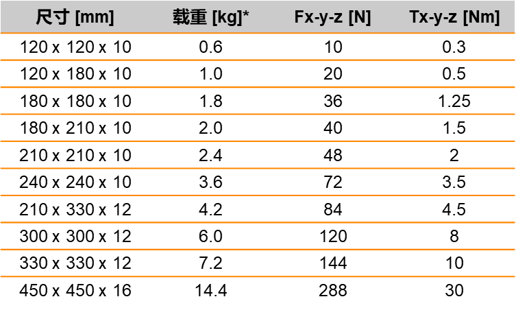

> Tags: #柔性传输系统 #ACOPOS_6D

# A06 .003-ACOPOS_6D是什么

# 1 贝加莱官网说明

- [ACOPOS 6D | B&R Industrial Automation (br-automation.com)](https://www.br-automation.com/zh/products/mechatronic-systems/acopos-6d/)

# 2 简介

- ACOPOS 6D是基于磁悬浮原理：带有集成永磁体的动子托盘悬浮在电磁电机定子模组表面上。模块化的电机定子模组尺寸为240 x 240毫米，可自由布置为任意形状。各种尺寸的动子托盘负载能力从0.6至14千克，速度最高可达2米/秒。它们可以在二维空间内自由地移动，沿三个轴进行旋转和倾斜，并能对悬浮高度实现精确控制。总而言之，它们被赋予了六个运动控制自由度。

## 2.1 ACOPOS 6D多动子配合

<video muted autoplay="autoplay" loop="loop" width="320" height="240" controls>
  <source src="/A06_产品_柔性传输系统/FILES/003ACOPOS_6D是什么/1.mp4" type="video/mp4">
  Your browser does not support the video tag.
</video>

## 2.2 ACOPOS 6D转角与倾斜运动

<video muted autoplay="autoplay" loop="loop" width="320" height="240" controls>
  <source src="/A06_产品_柔性传输系统/FILES/003ACOPOS_6D是什么/2.mp4" type="video/mp4">
  Your browser does not support the video tag.
</video>

# 3 动子特性介绍

## 3.1 动子参数信息

| 类别  | 参数  |
|---|---|
|速度|2m/s|
|加速度|20m/s²|
|重复精度|+/- 5µm|
|提升高度|0,5 – 4 mm|
|转角 X, Y|< 20mrad|
|转角 Z|< 20°|

## 3.2 动子尺寸可选

# 4 更新日志

| 日期         | 修改人 | 修改内容 |
| :--------- | :-- | :--- |
| 2023-12-15 | YZY | 初次创建 |
