> Tags: #ACOPOS_6D

- [1 A06.006ACOPOS_6D_使用必读_安全注意事项](#_1-a06006acopos_6d_%E4%BD%BF%E7%94%A8%E5%BF%85%E8%AF%BB_%E5%AE%89%E5%85%A8%E6%B3%A8%E6%84%8F%E4%BA%8B%E9%A1%B9)
- [2 🧲注意强磁！](#_2-%E6%B3%A8%E6%84%8F%E5%BC%BA%E7%A3%81)
- [3 🩸当心夹手！](#_3-%E5%BD%93%E5%BF%83%E5%A4%B9%E6%89%8B)
- [4 🧲托盘强磁！保持距离](#_4-%E6%89%98%E7%9B%98%E5%BC%BA%E7%A3%81%E4%BF%9D%E6%8C%81%E8%B7%9D%E7%A6%BB)
- [5 托盘存储方式](#_5-%E6%89%98%E7%9B%98%E5%AD%98%E5%82%A8%E6%96%B9%E5%BC%8F)
- [6 定子电机使用注意事项](#_6-%E5%AE%9A%E5%AD%90%E7%94%B5%E6%9C%BA%E4%BD%BF%E7%94%A8%E6%B3%A8%E6%84%8F%E4%BA%8B%E9%A1%B9)
- [7 更新日志](#_7-%E6%9B%B4%E6%96%B0%E6%97%A5%E5%BF%97)

# 1 A06.006ACOPOS_6D_使用必读_安全注意事项

- 🔴 在阅读完毕此文档前，请勿操作与接触 ACOPOS 6D 相关的产品！
- 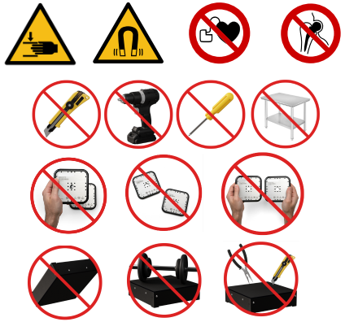

# 2 🧲注意强磁！

- 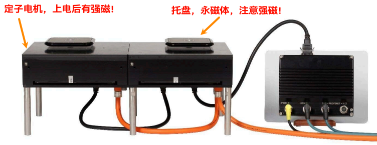
- 所有都必须采取一切必要的 磁铁 相关预防措施,以降低受伤风险。
- ⚠️注意减少受伤的危险。在任何情况下, B&R 对 ACOPOS 6D 的 **强磁铁** 造成的任何伤害或损坏概不负责。
- ACOPOS 6D产品不具有故障保护功能。机器制造商和自动化系统集成商机器制造商和自动化系统集成商最终有责任确保含有电机定子与动子托盘产品的机器或系统产品的机器或系统达到安全状态。
- 🧲 托盘是永磁体，具有强磁性！内含强力磁铁，因此有受伤的危险。
- 🔴上电后，动子托盘附近的**电机定子模组**具有强磁性！
    - 🈲 禁止带有金属物品的人/物靠近处于上电状态的ACOPOS 6D产品（例如**手表**、**戒指**、**项链**等金属首饰）
    - 🈲 ☠️ 严禁安装有 **心脏起搏器**、**打过骨折钢钉** 等人员靠近处于上电状态的ACOPOS 6D产品
    - 🈲 ☠️ 对 **仍连接电源** 的 ACOPOS 6D 系统进行维护工作，可能会导致人员伤亡！
- 请勿让电机定子与动子托盘接触含铁物体，注意强磁!!！

# 3 🩸当心夹手！

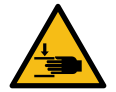

- 托盘是永磁体，具有强磁性！
- 两个托盘之间、托盘与其他具有铁磁性的材料之间有挤压危险！可能会导致手部受伤！
- 建议从侧面抓住托盘。

# 4 🧲托盘强磁！保持距离

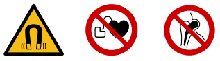

- 托盘产生的磁场可能危害起搏器佩戴者的健康。托盘与植入位置之间的距离应至少保持 31 厘米。
- 托盘内的永磁体具有很强的磁场。
- 从 ACOPOS 6D 系统中取出托盘时，请将托盘放入指定的存储盒中，以避免铁磁/磁性材料和托盘之间发生不必要的相互作用。
- 产生的磁场会使铁磁材料和磁性材料运动，从而产生潜在的抛射物或夹点。各种电子设备或磁性数据存储介质也可能受到这些磁场的影响。
- 即便是120mm x 120mm 最小尺寸的托盘，也有较强的磁场范围
- 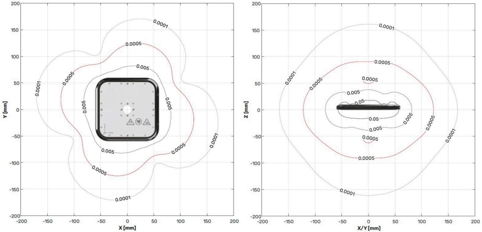

| 托盘顶部 有各种安装孔                                                  | 托盘底部 是一个光滑的表面，没有任何安装孔。                                          |
| --------------------------------------------------------------- | ------------------------------------------------------------------ |
| ⚠️XBot顶部的磁场强度较弱，但对于心脏起搏器使用者来说仍然很危险。                             | ⚠️托盘底部的磁场强度非常强。即使距离很远，它也会吸引铁磁性材料。这种吸引力足以造成严重伤害。请勿在托盘底部或其附近使用铁磁性工具。 |
| 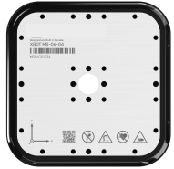 | 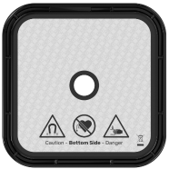    |

- ⚠️请勿在托盘底部或附近使用含有铁磁材料的工具。此类工具可能会突然被托盘吸引，从而造成损坏或伤害。
    - 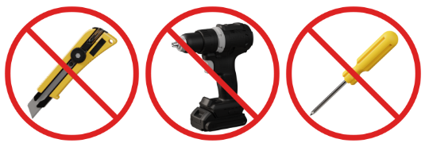
- ⚠️请勿将托盘放置在任何含有铁磁性材料的家具附近，例如钢桌。托盘可能会突然被此类家具吸引，从而造成伤害。
    - 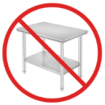
- 托盘必须顶部朝上放置在定子电机上。
    - ⚠️请勿将托盘底部朝上放置在定子电机上。底部的强磁场可能会意外吸引组件。
    - ⚠️请勿将托盘底部朝上放置在任何地方。
    - 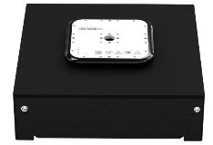
- 始终用双手手持移动托盘。
    - ⚠️不要只用一只手握住托盘。这可能会导致托盘无意中掉落到铁磁物体上，或以其他方式使其与铁磁物体接触。
    - 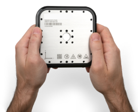
- ⚠️一个用户不应该同时握住两个托盘。托盘可能会相互吸引并伤害用户的手。
    - ⚠️不要只用一只手握住托盘。这可能会导致托盘不小心掉落到铁磁物体上。
    - 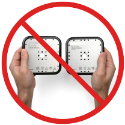
- 切勿将一个托盘移到另一个托盘上。托盘可能会突然相互吸引，导致手指或手受伤。
    - 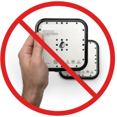

# 5 托盘存储方式

- 不使用时，请始终将托盘顶部朝上放入储物盒中。
    - 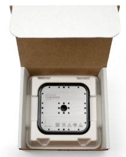
    - 若没找到储物盒，可如下在托盘底部垫入非磁性材料，包装完毕并标记提醒注意强磁
    - 
- 当托盘不在定子电机上时，切勿将托盘放在存储箱外。未经培训的用户可能会拿起托盘或在托盘附近放置铁磁物体。
    - 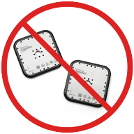

# 6 定子电机使用注意事项

- 警告！定子电机的顶面由软铜制成，表面覆盖有玻璃纤维。请遵守以下操作注意事项，以免损坏定子电机！

| 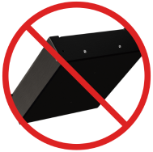 | 切勿将定子电机倒放，底部朝下！                       |
| --------------------------------------------------------------- | ------------------------------------- |
| 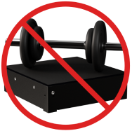 | 切勿在定子电机顶部放置重物！                        |
| 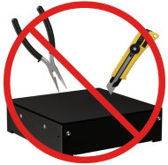 | 切勿用任何工具撞击定子电机的顶面或边缘。请勿将尖锐物品靠近定子电机的顶面！ |

# 7 更新日志

| 日期         | 修改人        | 修改内容 |
| :--------- | :--------- | :--- |
| 2024-06-24 | YZY QHC | 初次创建 |
