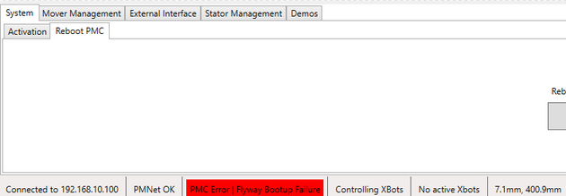
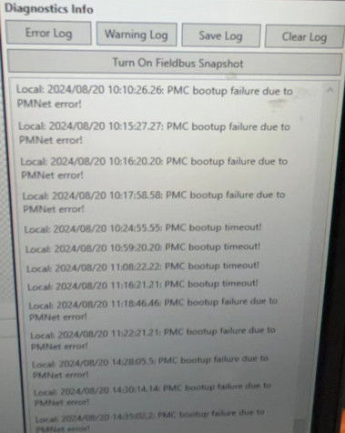
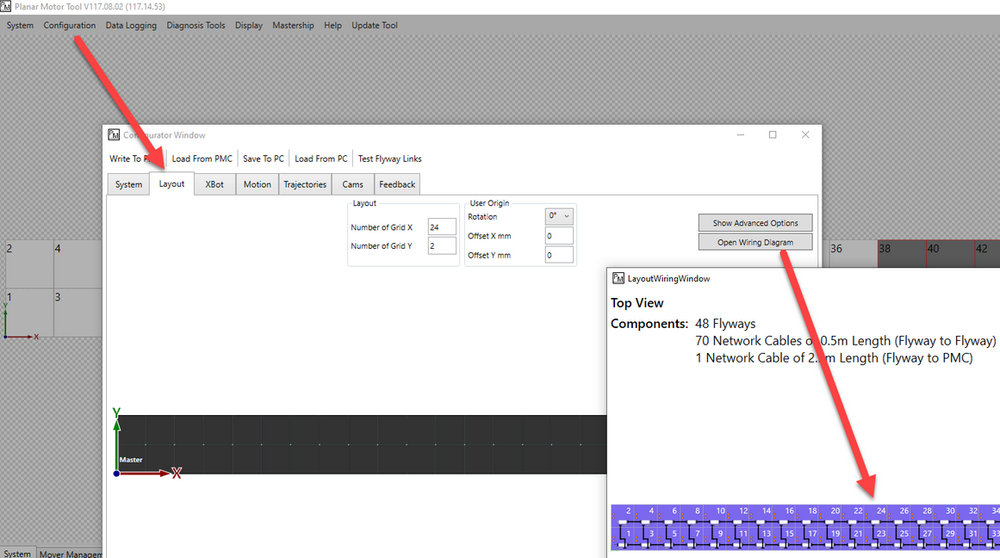
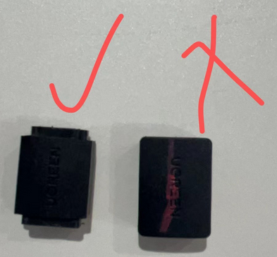
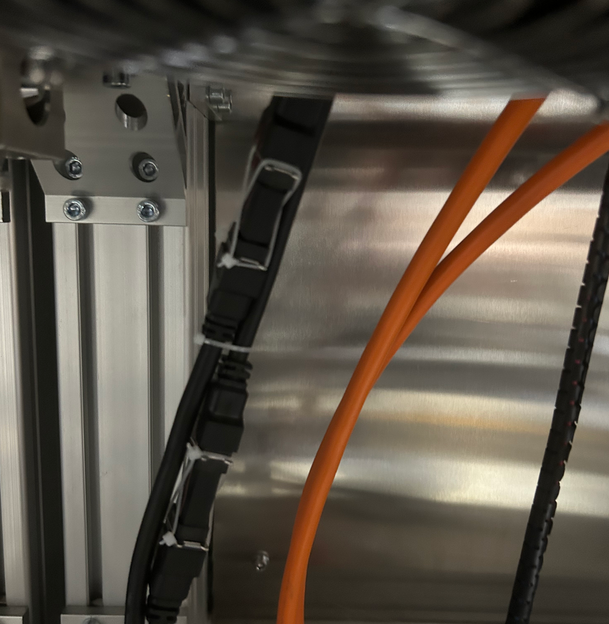
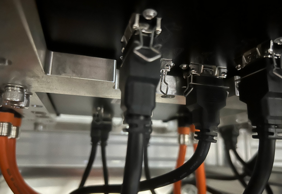

> Tags: #ACOPOS_6D

- [1 A06.010.6D接线问题排查方式](#_1-a060106d%E6%8E%A5%E7%BA%BF%E9%97%AE%E9%A2%98%E6%8E%92%E6%9F%A5%E6%96%B9%E5%BC%8F)
- [2 现象](#_2-%E7%8E%B0%E8%B1%A1)
- [3 排查步骤](#_3-%E6%8E%92%E6%9F%A5%E6%AD%A5%E9%AA%A4)
	- [3.1 接线顺序错误：可根据PMC中的接线拓扑图进行接线检查](#_31-%E6%8E%A5%E7%BA%BF%E9%A1%BA%E5%BA%8F%E9%94%99%E8%AF%AF%EF%BC%9A%E5%8F%AF%E6%A0%B9%E6%8D%AEpmc%E4%B8%AD%E7%9A%84%E6%8E%A5%E7%BA%BF%E6%8B%93%E6%89%91%E5%9B%BE%E8%BF%9B%E8%A1%8C%E6%8E%A5%E7%BA%BF%E6%A3%80%E6%9F%A5)
	- [3.2 选择合适的转接头（若非从BR处购买转接头）](#_32-%E9%80%89%E6%8B%A9%E5%90%88%E9%80%82%E7%9A%84%E8%BD%AC%E6%8E%A5%E5%A4%B4%EF%BC%88%E8%8B%A5%E9%9D%9E%E4%BB%8Ebr%E5%A4%84%E8%B4%AD%E4%B9%B0%E8%BD%AC%E6%8E%A5%E5%A4%B4%EF%BC%89)
	- [3.3 排查电源接线](#_33-%E6%8E%92%E6%9F%A5%E7%94%B5%E6%BA%90%E6%8E%A5%E7%BA%BF)
	- [3.4 确认定子间转接头卡扣卡紧](#_34-%E7%A1%AE%E8%AE%A4%E5%AE%9A%E5%AD%90%E9%97%B4%E8%BD%AC%E6%8E%A5%E5%A4%B4%E5%8D%A1%E6%89%A3%E5%8D%A1%E7%B4%A7)
	- [3.5 确认HDMI接头卡紧](#_35-%E7%A1%AE%E8%AE%A4hdmi%E6%8E%A5%E5%A4%B4%E5%8D%A1%E7%B4%A7)
- [4 注意事项](#_4-%E6%B3%A8%E6%84%8F%E4%BA%8B%E9%A1%B9)
- [5 更新日志](#_5-%E6%9B%B4%E6%96%B0%E6%97%A5%E5%BF%97)

# 1 A06.010.6D接线问题排查方式

# 2 现象

- 使用PMC软件进行6D接线检查时，若出现以下情况，则需要进行现场接线排查，以下是一些现场碰到的情况，可供检查参考。
- PMC 软件中提示 `PMC Error | Flyway Bootup Failure`
    - 
- PMC软件对应的log记录并不能完全体现问题具体原因
    - 提示信息 `PMCbootup failure due to PMNet error!` 与 `PMC bootup timeout!`
    - 

# 3 排查步骤

## 3.1 接线顺序错误：可根据PMC中的接线拓扑图进行接线检查

- 

## 3.2 选择合适的转接头（若非从BR处购买转接头）

- 如果不是从贝加莱官方购买的接头，需注意客户自己购买的转接头是否合适，如图中所示，需将转接头进行处理，才能紧密连接；
- 

## 3.3 排查电源接线

- 检查6D控制器电源接线是否存在问题（分别从电器柜内部和定子电源接头进行排查）

## 3.4 确认定子间转接头卡扣卡紧

- 检查定子与定子间转接头的卡扣是否卡紧
- 

## 3.5 确认HDMI接头卡紧

- 检查定子下面与HDMI线的接头是否卡紧
- 

# 4 注意事项

- **每次下载配置，都需要重新上电才能使新配置成功生效**
- **每次对定子重新接线或者重新供电后，需重新上电**

# 5 更新日志

| 日期         | 修改人 | 修改内容 |
| :--------- | :-- | :--- |
| 2024-08-21 | CZP | 初次创建 |
