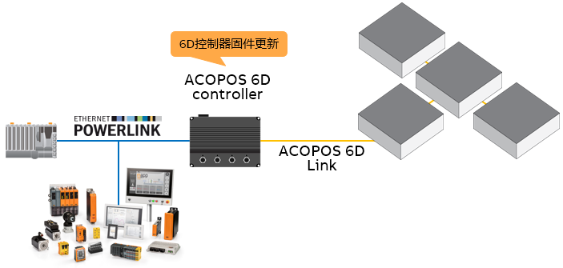
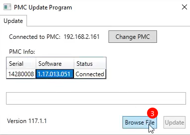
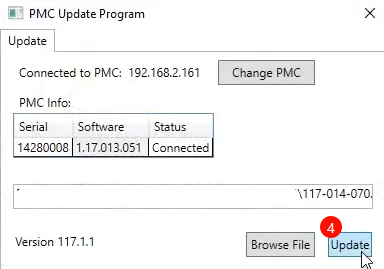
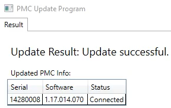

> Tags: #ACOPOS_6D

- [1 A06.011.贝加莱6D控制器固件更新](#_1-a06011%E8%B4%9D%E5%8A%A0%E8%8E%B16d%E6%8E%A7%E5%88%B6%E5%99%A8%E5%9B%BA%E4%BB%B6%E6%9B%B4%E6%96%B0)
- [2 依赖资源](#_2-%E4%BE%9D%E8%B5%96%E8%B5%84%E6%BA%90)
- [3 更新步骤](#_3-%E6%9B%B4%E6%96%B0%E6%AD%A5%E9%AA%A4)
- [4 操作过程视频](#_4-%E6%93%8D%E4%BD%9C%E8%BF%87%E7%A8%8B%E8%A7%86%E9%A2%91)
- [5 更新日志](#_5-%E6%9B%B4%E6%96%B0%E6%97%A5%E5%BF%97)

# 1 A06.011.贝加莱6D控制器固件更新

- ACOPOS 6D控制器的固件对控制6D运动效果有较大影响，建议使用合适的组合搭配并尽量保持更新。
- 可见下图，更新的固件范围为黑色的6D控制器。
- 

# 2 依赖资源

- 软件
    - Planar Motor Tool（PMT）
- 升级固件文件
    - puim文件，例如117-014-070.pmiu

# 3 更新步骤

- 前提：笔记本通过ETH网线连接ACOPOS 6D控制器，使用PMT软件能够正常链接。
- 
- 
- 
- 
- 操作完成后，需要整体断电上电。

# 4 操作过程视频

- 点击视频，全屏显示。

<video muted autoplay="autoplay" loop="loop" width="640" height="360" controls>
  <source src="/A06_产品_柔性传输系统/FILES/0116D控制器固件更新/2024-11-04-Update-PMC.mp4" type="video/mp4">
  Your browser does not support the video tag.
</video>

# 5 更新日志

| 日期         | 修改人        | 修改内容 |
| :--------- | :--------- | :--- |
| 2024-11-05 | QHC YZY | 初次创建 |
