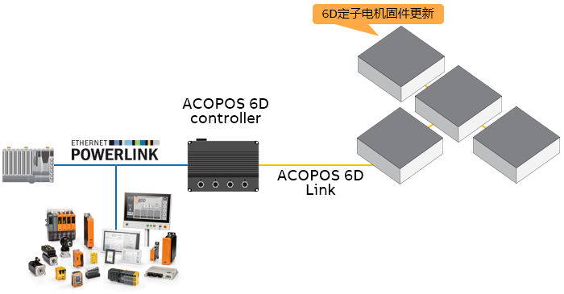
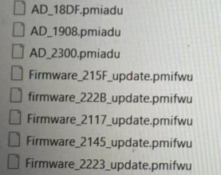
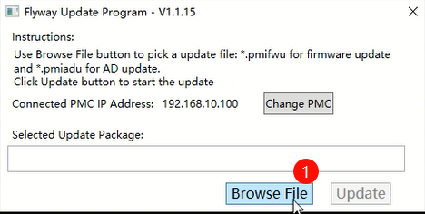
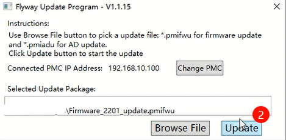
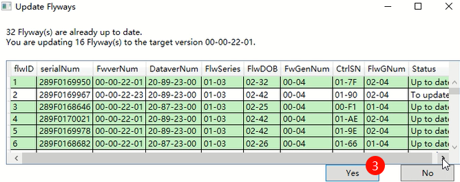
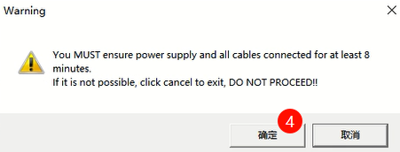
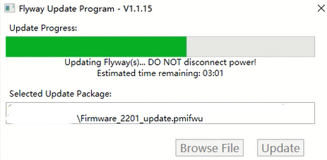
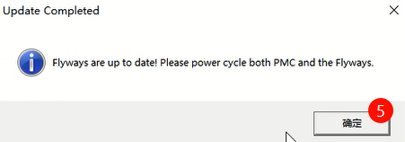
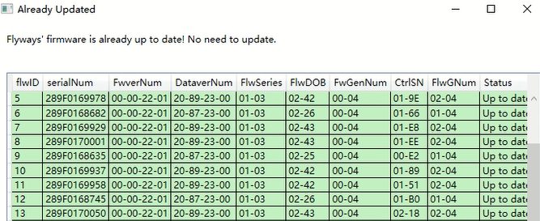
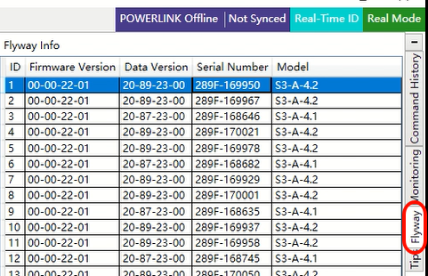

> Tags: #ACOPOS_6D

- [1 A06.012.贝加莱6D定子电机固件更新](#_1-a06012%E8%B4%9D%E5%8A%A0%E8%8E%B16d%E5%AE%9A%E5%AD%90%E7%94%B5%E6%9C%BA%E5%9B%BA%E4%BB%B6%E6%9B%B4%E6%96%B0)
- [2 依赖资源](#_2-%E4%BE%9D%E8%B5%96%E8%B5%84%E6%BA%90)
- [3 更新步骤（先选择pmifwu，再选择pmiadu）](#_3-%E6%9B%B4%E6%96%B0%E6%AD%A5%E9%AA%A4%EF%BC%88%E5%85%88%E9%80%89%E6%8B%A9pmifwu%EF%BC%8C%E5%86%8D%E9%80%89%E6%8B%A9pmiadu%EF%BC%89)
- [4 在PMT软件中查看定子固件与数据模型版本方式](#_4-%E5%9C%A8pmt%E8%BD%AF%E4%BB%B6%E4%B8%AD%E6%9F%A5%E7%9C%8B%E5%AE%9A%E5%AD%90%E5%9B%BA%E4%BB%B6%E4%B8%8E%E6%95%B0%E6%8D%AE%E6%A8%A1%E5%9E%8B%E7%89%88%E6%9C%AC%E6%96%B9%E5%BC%8F)
- [5 更新日志](#_5-%E6%9B%B4%E6%96%B0%E6%97%A5%E5%BF%97)

# 1 A06.012.贝加莱6D定子电机固件更新

- 每一块定子电机都有固件，一般新项目开始，需要更新定子电机的固件版本。
- 

# 2 依赖资源

- 更新软件
    - FlywayUpdateTool软件
    - 
- 更新固件
    - `*.pmifwu` 文件，例如Firmware_2201_update.pmifwu
- 更新固件对应的数据模型
    - `*.pmiadu` 文件，例如AD_1908.pmiadu
- 固件版本建议
    - 有最新选最新，根据modified date，或者文件名判断，22-2B比22-23新
    - 

# 3 更新步骤（先选择pmifwu，再选择pmiadu）

- 固件与数据模型文件的更新方式完全一致。
- 
- 选择完成对应的固件后，即可点击Update按钮。
- 
- 可见下图中列出了所需更新的固件数量以及对应的版本。
- 
- 
- 更新时间可能较长，若失败可尝试重复几次或者查看 [6D常见报错处理 → Flyway Update](005ACOPOS%206D常见报错处理.md#Flyway%20Update)
- 
- 
- 更新完成后可通过FlywayUpdateTool软件进行固件版本检查。
- 
- 🔴注意！有些定子电机的批次可能有所不同，则可更新的固件版本号会不同，需要使用FlywayUpdateTool再选择对应的版本，再更新一次。
- FlywayUpdateTool会根据每个定子电机可更新的最高版本进行选择更新。

# 4 在PMT软件中查看定子固件与数据模型版本方式

- 

# 5 更新日志

| 日期         | 修改人        | 修改内容 |
| :--------- | :--------- | :--- |
| 2024-11-05 | QCH YZY | 初次创建 |
