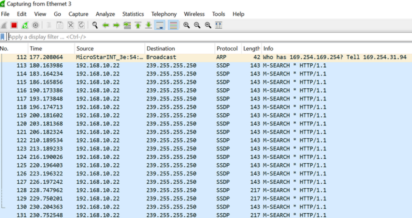
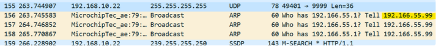

> Tags: #ACOPOS_6D

- [1 A06.014.不知道PMC控制器IP地址与拨码的解决方式](#_1-a06014%E4%B8%8D%E7%9F%A5%E9%81%93pmc%E6%8E%A7%E5%88%B6%E5%99%A8ip%E5%9C%B0%E5%9D%80%E4%B8%8E%E6%8B%A8%E7%A0%81%E7%9A%84%E8%A7%A3%E5%86%B3%E6%96%B9%E5%BC%8F)
- [2 所需工具 Wireshark](#_2-%E6%89%80%E9%9C%80%E5%B7%A5%E5%85%B7-wireshark)
- [3 操作方式](#_3-%E6%93%8D%E4%BD%9C%E6%96%B9%E5%BC%8F)
- [4 更新日志](#_4-%E6%9B%B4%E6%96%B0%E6%97%A5%E5%BF%97)

# 1 A06.014.不知道PMC控制器IP地址与拨码的解决方式

- 查找具有未知IP地址的PMC

# 2 所需工具 Wireshark

- [Wireshark · Download](https://www.wireshark.org/download.html)

# 3 操作方式

- 1___ 将笔记本接入有PMC硬件的网络中，或者通过网线直连PMC硬件
- 2___ 打开Wireshark软件，开始监控连接到PMC的LAN适配器
    - 
- 3___ 运行 PMTool，尝试检测PMC，没有检测到 PMC是正常的。
- 4___ 查看 Wireshark 中的广播消息.
    - 
- 5___ 上图中高亮的IP地址即为 PMC 的IP地址

# 4 更新日志

| 日期         | 修改人        | 修改内容             |
| :--------- | :--------- | :--------------- |
| 2024-12-24 | DHZ YZY | DHZ提供文档，在此基础上更新。 |
