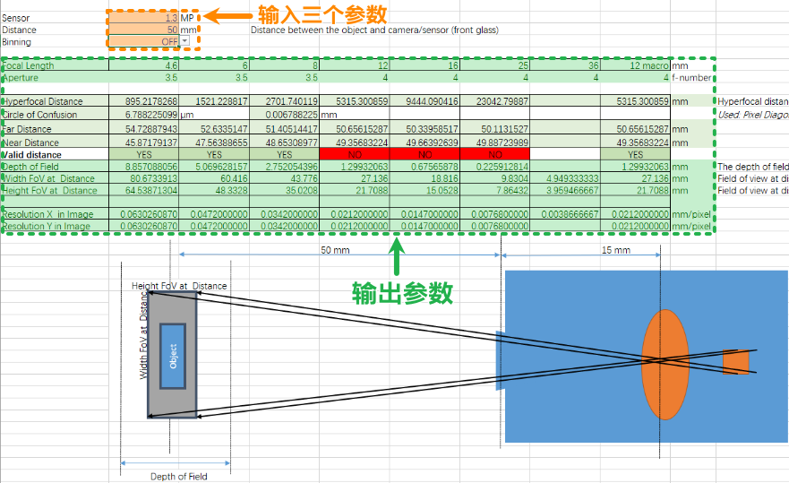

> Tags: #Vision #选型

- [1 001BR相机选型参数计算表](#1%20001BR%E7%9B%B8%E6%9C%BA%E9%80%89%E5%9E%8B%E5%8F%82%E6%95%B0%E8%AE%A1%E7%AE%97%E8%A1%A8)
- [2 计算表下载](#2%20%E8%AE%A1%E7%AE%97%E8%A1%A8%E4%B8%8B%E8%BD%BD)
- [3 验证传感器/相机参数概念介绍](#3%20%E9%AA%8C%E8%AF%81%E4%BC%A0%E6%84%9F%E5%99%A8/%E7%9B%B8%E6%9C%BA%E5%8F%82%E6%95%B0%E6%A6%82%E5%BF%B5%E4%BB%8B%E7%BB%8D)
- [4 使用示例](#4%20%E4%BD%BF%E7%94%A8%E7%A4%BA%E4%BE%8B)
- [5 更新日志](#5%20%E6%9B%B4%E6%96%B0%E6%97%A5%E5%BF%97)

# 1 001BR相机选型参数计算表

- 📥**输入**相机像素、和镜头到被拍摄物的距离，和是否需要像素合并。
- 📤**输出**的是不同焦距的镜头对应景深、视野范围和分辨率。
- 以此来选择哪款镜头合适。

# 2 计算表下载

- [⭐📩点击下载EXCEL文件](/A07_产品_视觉/FILES/001BR相机选型参数计算表/CheckRequirement-2024-01-22.xlsx ':ignore')
- 

# 3 验证传感器/相机参数概念介绍

- 在选择贝加莱智能传感器（Smart Sensor）或智能摄像机（Smart Camera）的第一阶段，有必要验证场景的基本参数是否符合要求，以及传感器或摄像机是否适用于该应用。
- 重要的硬件参数有
    - 使用的镜头（放大率和光圈）
    - 传感器
    - 物体与传感器/摄像头（VSS/VSC）之间的距离 - 可在机器上使用时更改
    - HW 滤波器（偏振、扩散、准直……）
- 上述参数将影响生成图像的参数：
    - VSS/VSC 之间的最小/最大距离
    - 景深（Depth of Field）
    - 视野（Field of View）
    - 分辨率 [mm/px]
- 然后就可以使用 CheckRequirement这个excel 文件根据场景标准选择正确的 VSS/VSC
- 客户的基本要求是
    - VSS/VSC 与目标之间的距离范围，摄像机必须位于该范围内
    - 扫描区域的尺寸
    - 分辨率应该是多少
    - 如果需要以 "一定角度 "拍摄，或者要求镜头不能重新对焦，景深也很重要。

# 4 使用示例

- VF Code Reader
    - 一位客户说他想读取条形码/QR 码。需客户回答的问题：
    - 扫描区域应多大？500 x 500 毫米
    - 是否有测试代码样本？有
    - 与 VSS 之间的距离重要吗？不重要
- 因此，必须使用实际硬件或离线人机界面（如果有测试图像）进行测试
    - 安装 VSS，找到合适的焦距和曝光时间。
    - 拍摄了一张测试图像，并寻找可以读取码的最大距离。
    - 将这一距离输入 excel 中的 "距离 "字段。还需要设置正确的传感器。
    - 根据 VSS 上的镜头，选择与之相关的数据列，并找到可读取代码的最大分辨率。
    - 如果有不止一种码，则需要对所有代码都进行此测试（或只选择打印最精细的最小代码）。
    - 这样，我就能找到所有样本中最小值和最大值。
    - 如果给定立柱中的感测区域（FoV）大于客户的感测区域要求，可以降低 VSS，直到达到客户的要求
        - 这可以确保更稳健的感测和评估。
    - 如果客户在意 VSS 与拍摄对象之间的距离，我可以选择焦距更宽的镜头，这样我就可以把 VSS 放得更低，反之亦然。如果客户不在意距离，那么最好选择较低的高度，这样可以减少环境光对场景的影响。

# 5 更新日志

| 日期         | 修改人        | 修改内容 |
| :--------- | :--------- | :--- |
| 2024-01-23 | QZY YZY | 初次创建 |
