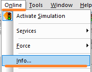
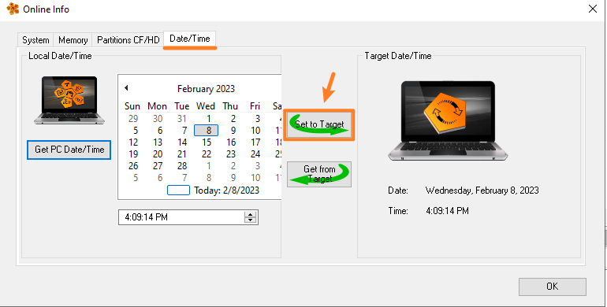

> 004如何将PLC内部时钟设置为当前标准时间
#对时 #PLC

- 1. 通过 Automation Studio（AS），确保 PLC 与 PC 通过以太网正常连接。
    - 在 AS 软件状态栏，可见连接到的 PLC 的信息
    - 
- 2. 在 Automation Studio（AS）工具栏中，依次点击 online→Info→Date/Time→Set to Target 即可
    - 
    - 
