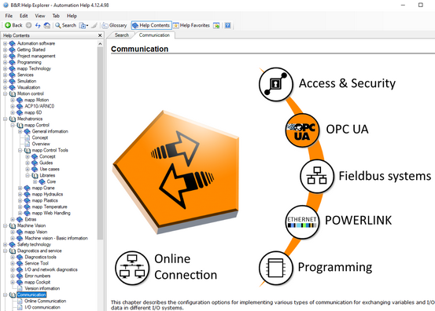
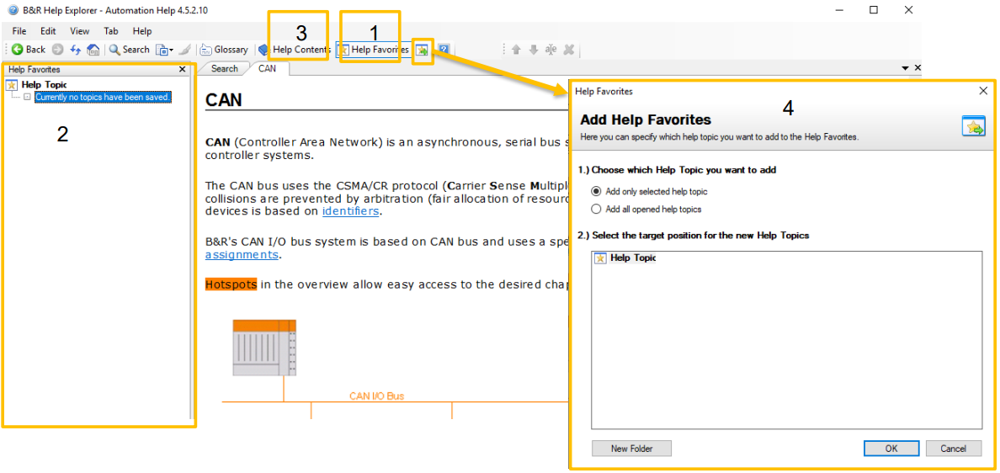
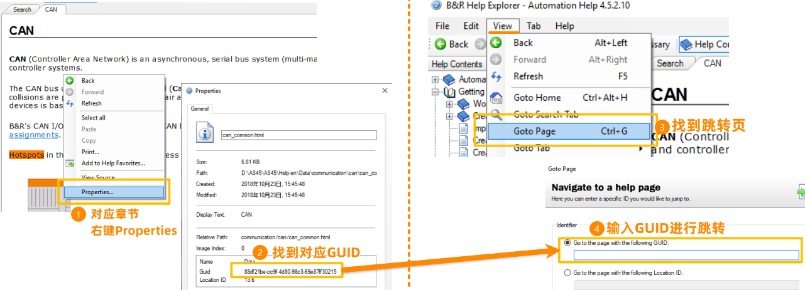
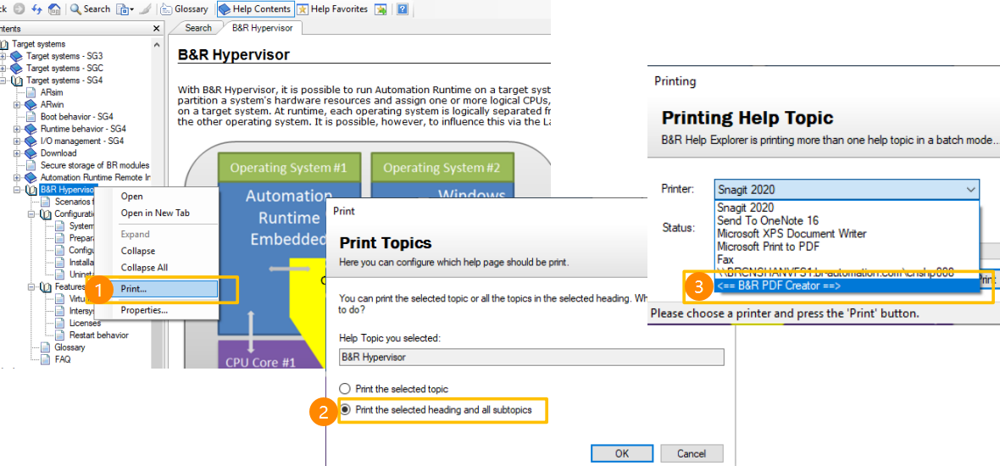
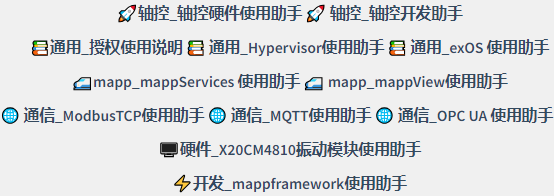

> 014如何单独安装Automation Studio的帮助？

> Tags： #AS #AS帮助

- [1 贝加莱帮助简介](#1%20%E8%B4%9D%E5%8A%A0%E8%8E%B1%E5%B8%AE%E5%8A%A9%E7%AE%80%E4%BB%8B)
- [2 贝加莱Automation Help下载](#2%20%E8%B4%9D%E5%8A%A0%E8%8E%B1Automation%20Help%E4%B8%8B%E8%BD%BD)
- [3 Automation Help使用小技巧](#3%20Automation%20Help%E4%BD%BF%E7%94%A8%E5%B0%8F%E6%8A%80%E5%B7%A7)
	- [3.1 使用工具，自动翻译本地的Automation Help](#3.1%20%E4%BD%BF%E7%94%A8%E5%B7%A5%E5%85%B7%EF%BC%8C%E8%87%AA%E5%8A%A8%E7%BF%BB%E8%AF%91%E6%9C%AC%E5%9C%B0%E7%9A%84Automation%20Help)
	- [3.2 管理收藏夹](#3.2%20%E7%AE%A1%E7%90%86%E6%94%B6%E8%97%8F%E5%A4%B9)
	- [3.3 使用GUID快速定位](#3.3%20%E4%BD%BF%E7%94%A8GUID%E5%BF%AB%E9%80%9F%E5%AE%9A%E4%BD%8D)
	- [3.4 导出某个章节到PDF](#3.4%20%E5%AF%BC%E5%87%BA%E6%9F%90%E4%B8%AA%E7%AB%A0%E8%8A%82%E5%88%B0PDF)
- [4 Automation Help在线帮助](#4%20Automation%20Help%E5%9C%A8%E7%BA%BF%E5%B8%AE%E5%8A%A9)
	- [4.1 贝加莱官方在线Automation Help](#4.1%20%E8%B4%9D%E5%8A%A0%E8%8E%B1%E5%AE%98%E6%96%B9%E5%9C%A8%E7%BA%BFAutomation%20Help)
	- [4.2 贝加莱中文帮助](#4.2%20%E8%B4%9D%E5%8A%A0%E8%8E%B1%E4%B8%AD%E6%96%87%E5%B8%AE%E5%8A%A9)

# 1 贝加莱帮助简介

- 贝加莱帮助系统是伴随着Automation Studio 软件安装时默认安装的帮助系统
- 有以下特点
    - 内容详尽丰富，从产品技术说明到底层原理说明，到例程使用，均有详细的说明
    - 跟随着新硬件，新的技术包安装，自动补全的帮助系统
    - 全离线文件
    - 在AS软件使用时，遇到问题，按 `F1`，自动识别并跳转
- 

# 2 贝加莱Automation Help下载

- 可前往贝加莱官网，进行最新的Automation Help下载
- 此Automation Help软件可单独安装使用
- 
- [V4.12 Help Upgrade (V4.12_Help_English) RevInfo | B&R Industrial Automation (br-automation.com)](https://www.br-automation.com/en/downloads/software/automation-studio/automation-studio-412/v412-help-upgrade-v412-help-english-revinfo/)

# 3 Automation Help使用小技巧

## 3.1 使用工具，自动翻译本地的Automation Help

- [012贝加莱帮助自动翻译工具](/C07_工具/012贝加莱帮助自动翻译工具.md)

## 3.2 管理收藏夹

- 经常查阅的文件，可以整理到收藏夹中，便于后续快速查阅
- 操作步骤
    - 1 打开收藏夹
    - 2 收藏夹目录
    - 3 返回Help目录
    - 4 添加到收藏夹
- 

## 3.3 使用GUID快速定位

- 为让对方能快速定位到您所说的内容，或者指定的章节，可以通过GUID 实现
- 步骤：获取 GUID → 发送 GUID → 根据 GUID精确定位到指定章节
- 

## 3.4 导出某个章节到PDF

- 当客户没有本地安装AS Help时，由于网络问题没有办法，可以将AS Help中的相关内容以PDF的形式，提供给客户
- 

# 4 Automation Help在线帮助

## 4.1 贝加莱官方在线Automation Help

- [🌐B&R Online Help (br-automation.com)](https://help.br-automation.com/#/en/4)
- 通过此链接，您可以在线直接访问最新的贝加莱帮助，无需下载安装相关的软件在本地
- 注意，此网站所有信息均为英文版，若有中文需要，可以使用浏览器自带的翻译功能实现中文翻译
- 

## 4.2 贝加莱中文帮助

- 贝加莱中国团队，为了更好服务中国用户使用贝加莱产品，对使用频率相对较高的技术章节，进行了汉化，并生成中文帮助信息
- 可在贝加莱中文帮助网站首页查看
- [🌐BR中文帮助 (brhelp.cn)](https://www.brhelp.cn/#/)
- 
