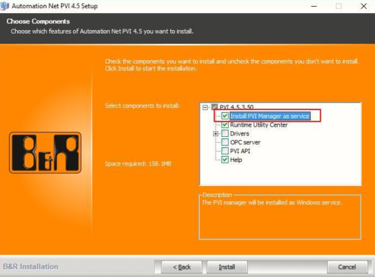

> Tags: #AS #连接

> 🔔 此条目信息建议查看 [023AS软件无法扫描到实际的PLC](023AS软件无法扫描到实际的PLC.md)

- [1 建议链接](#1%20%E5%BB%BA%E8%AE%AE%E9%93%BE%E6%8E%A5)
- [2 原因分析](#2%20%E5%8E%9F%E5%9B%A0%E5%88%86%E6%9E%90)
- [3 解决方案](#3%20%E8%A7%A3%E5%86%B3%E6%96%B9%E6%A1%88)
	- [3.1 安装时需要](#3.1%20%E5%AE%89%E8%A3%85%E6%97%B6%E9%9C%80%E8%A6%81)

# B01.015.部分客户第一次安装AS软件，电脑能够ping通PLC但无法通过AS扫描到

# 1 建议链接

- [023AS软件无法扫描到实际的PLC](023AS软件无法扫描到实际的PLC.md)

# 2 原因分析

- 无法扫描到PLC是因为Windows系统的Pcap驱动没有正常工作导致的。

# 3 解决方案

- Win7系统需要重新安装WinPcap驱动，可以上网 https://www.winpcap.org 下载后直接安装；
- Win10系统需要重新安装PVI,可在贝加菜官网
- https://www.br-automation.com/zh/downloads#categories=Software/Automation+NET%2FPVI

## 3.1 安装时需要

- 1.确保已有的PVI没有启动(关掉AS即可)，
- 2.勾选下图中红框标记Install PVI Manager as service
    - 
