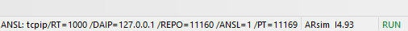
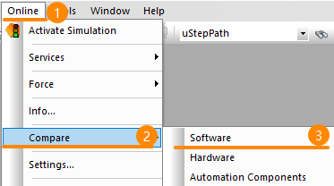
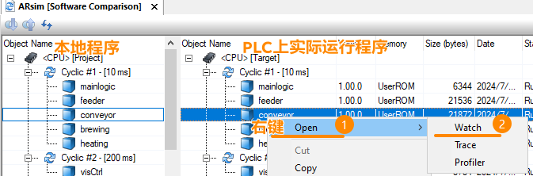

> Tags: #AS

- [1 B01.018.没有源程序可以Watch与Trace变量吗？](#_1-b01018%E6%B2%A1%E6%9C%89%E6%BA%90%E7%A8%8B%E5%BA%8F%E5%8F%AF%E4%BB%A5watch%E4%B8%8Etrace%E5%8F%98%E9%87%8F%E5%90%97%EF%BC%9F)
- [2 有AS软件](#_2-%E6%9C%89as%E8%BD%AF%E4%BB%B6)
- [3 没有安装AS软件](#_3-%E6%B2%A1%E6%9C%89%E5%AE%89%E8%A3%85as%E8%BD%AF%E4%BB%B6)

# 1 B01.018.没有源程序可以Watch与Trace变量吗？

- 可以

# 2 有AS软件

- 没有源程序，但也是可以的。
- 1___首先确认AS软件已连接PLC
    - 
- 2___点击菜单栏 Online → Compare → Software
    - 
- 3___选择需要Watch的任务，右键 → Open → Watch
    - 

# 3 没有安装AS软件

- 可参考以下文档，了解如何在没有AS软件的情况下获取PLC中变量数据，进行Trace与Watch。
- [013在线控制PLC与采集变量软件brwatch](/C07_工具/013在线控制PLC与采集变量软件brwatch.md)
