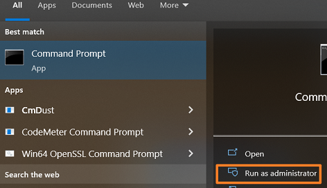
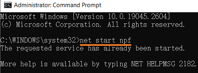

> 023AS软件无法扫描到实际的PLC

> Tags: #AS #PLC #通信

- [1 问题描述](#1%20%E9%97%AE%E9%A2%98%E6%8F%8F%E8%BF%B0)
- [2 问题原因一：使用高版本的AR，SNMP服务默认关闭](#2%20%E9%97%AE%E9%A2%98%E5%8E%9F%E5%9B%A0%E4%B8%80%EF%BC%9A%E4%BD%BF%E7%94%A8%E9%AB%98%E7%89%88%E6%9C%AC%E7%9A%84AR%EF%BC%8CSNMP%E6%9C%8D%E5%8A%A1%E9%BB%98%E8%AE%A4%E5%85%B3%E9%97%AD)
	- [3 解决方式](#3%20%E8%A7%A3%E5%86%B3%E6%96%B9%E5%BC%8F)
		- [3.1 如果无法获得项目的源代码](#3.1%20%E5%A6%82%E6%9E%9C%E6%97%A0%E6%B3%95%E8%8E%B7%E5%BE%97%E9%A1%B9%E7%9B%AE%E7%9A%84%E6%BA%90%E4%BB%A3%E7%A0%81)
		- [3.2 如果有项目的源代码](#3.2%20%E5%A6%82%E6%9E%9C%E6%9C%89%E9%A1%B9%E7%9B%AE%E7%9A%84%E6%BA%90%E4%BB%A3%E7%A0%81)
			- [3.2.1 方式一: 设置PLC的固定IP地址](#3.2.1%20%E6%96%B9%E5%BC%8F%E4%B8%80:%20%E8%AE%BE%E7%BD%AEPLC%E7%9A%84%E5%9B%BA%E5%AE%9AIP%E5%9C%B0%E5%9D%80)
			- [3.2.2 方式二：调整SNMP服务为激活状态](#3.2.2%20%E6%96%B9%E5%BC%8F%E4%BA%8C%EF%BC%9A%E8%B0%83%E6%95%B4SNMP%E6%9C%8D%E5%8A%A1%E4%B8%BA%E6%BF%80%E6%B4%BB%E7%8A%B6%E6%80%81)
- [4 问题原因二：Windows系统的Pcap 驱动没有正常工作导致的](#4%20%E9%97%AE%E9%A2%98%E5%8E%9F%E5%9B%A0%E4%BA%8C%EF%BC%9AWindows%E7%B3%BB%E7%BB%9F%E7%9A%84Pcap%20%E9%A9%B1%E5%8A%A8%E6%B2%A1%E6%9C%89%E6%AD%A3%E5%B8%B8%E5%B7%A5%E4%BD%9C%E5%AF%BC%E8%87%B4%E7%9A%84)
	- [4.1 问题描述](#4.1%20%E9%97%AE%E9%A2%98%E6%8F%8F%E8%BF%B0)
	- [4.2 问题原因](#4.2%20%E9%97%AE%E9%A2%98%E5%8E%9F%E5%9B%A0)
	- [4.3 解决方式](#4.3%20%E8%A7%A3%E5%86%B3%E6%96%B9%E5%BC%8F)
- [5 问题原因三：WinPcag的驱动npf没有正常启动](#5%20%E9%97%AE%E9%A2%98%E5%8E%9F%E5%9B%A0%E4%B8%89%EF%BC%9AWinPcag%E7%9A%84%E9%A9%B1%E5%8A%A8npf%E6%B2%A1%E6%9C%89%E6%AD%A3%E5%B8%B8%E5%90%AF%E5%8A%A8)
	- [5.1 解决方式](#5.1%20%E8%A7%A3%E5%86%B3%E6%96%B9%E5%BC%8F)

# 1 问题描述

- X20CP1382的plc通过以太网连接，但是在AS中的Online-Setting中搜索，无法找到设备。
- 但此PLC能够被CMD ping通
- 

# 2 问题原因一：使用高版本的AR，SNMP服务默认关闭

贝加莱PLC是通过SNMP服务提供被扫描到IP的功能的。

- 此项功能在AR4.7以下是默认开启的，如下图所示
- 

但出于网络安全的考虑，贝加莱PLC中运行的操作系统版本在4.8及以上，此设置默认关闭的，如果不通过额外设置，则通过AS软件无法扫描到IP地址。

## 3 解决方式

### 3.1 如果无法获得项目的源代码

- 1. 向相关人员了解到此PLC的实际IP地址
- 2. 通过手动输入IP的方式，通过AS软件连接
- 

### 3.2 如果有项目的源代码

#### 3.2.1 方式一: 设置PLC的固定IP地址

#### 3.2.2 方式二：调整SNMP服务为激活状态

- 通过U盘更新的方式对PLC进行软件安装
    - 将U盘插入笔记本电脑上，进行创建项目安装包
    - 
    - 
    - 将U盘插入到PLC上，将PLC进行断电上电。

# 4 问题原因二：Windows系统的Pcap 驱动没有正常工作导致的

## 4.1 问题描述

部分客户第一次安装使用Automation Studio时，在电脑能够与CPU ping 通的情况下发生Online->Settings中点击Browse后扫描不到CPU的现象。

## 4.2 问题原因

- 无法扫描到PLC是因为Windows系统的Pcap 驱动没有正常工作导致的

## 4.3 解决方式

- Win7系统需要重新安装WinPcap 驱动，可以上网
    - https://www.winpcap.org/ 下载后直接安装；
- Win10系统需要重新安装PVI，可在贝加莱官网 https://www.br-automation.com/zh/downloads/#categories=Software/Automation+NET%2FPVI 下载
    - 安装时需要
        - 1. 确保已有的PVI没有启动（关掉AS即可）
        - 2. 勾选下图中红框标记Install PVI Manager as service。
        - 

# 5 问题原因三：WinPcag的驱动npf没有正常启动

## 5.1 解决方式

- 使用管理员权限打开CMD
- 
- 输入net start npf
    - 如果提示服务名无效则安装WinPcag（安装Wireshark软件时会自动安装）
- 再在cmd下输入 net start npf
- 如果npf服务正常启动了，则会提示如下信息
    - 
