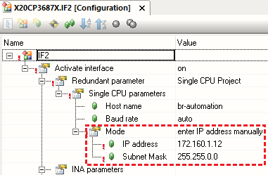

# 023AS软件无法扫描到实际的PLC
## 问题描述

- X20CP1382的plc通过以太网连接，但是在AS中的Online-Setting中搜索，无法找到设备。
- 

## 问题原因一：使用高版本的AR，SNMP服务默认关闭
贝加莱PLC是通过SNMP服务提供被扫描到IP的功能的。

- 此项功能在AR4.7以下是默认开启的，如下图所示
- 

但出于网络安全的考虑，贝加莱PLC中运行的操作系统版本在4.8及以上，此设置默认关闭的，如果不通过额外设置，则通过AS软件无法扫描到IP地址。

### 解决方式
#### 如果无法获得项目的源代码

- 1. 向相关人员了解到此PLC的实际IP地址
- 2. 通过手动输入IP的方式，通过AS软件连接
- 

#### 如果有项目的源代码
方式一: 设置PLC的固定IP地址

方式二：调整SNMP服务为激活状态

通过U盘更新的方式对PLC进行软件安装

1. 将U盘插入笔记本电脑上，进行创建项目安装包

2. 将U盘插入到PLC上，将PLC进行断电上电。

## 问题原因二：Windows系统的Pcap 驱动没有正常工作导致的
## 问题描述:
部分客户第一次安装使用Automation Studio时，在电脑能够与CPU ping 通的情况下发生Online->Settings中点击Browse后扫描不到CPU的现象。
## 问题原因:
- 无法扫描到PLC是因为Windows系统的Pcap 驱动没有正常工作导致的
### 解决方式
- Win7系统需要重新安装WinPcap 驱动，可以上网 
    - https://www.winpcap.org/ 下载后直接安装；
- Win10系统需要重新安装PVI，可在贝加莱官网 https://www.br-automation.com/zh/downloads/#categories=Software/Automation+NET%2FPVI 下载
    - 安装时需要 
        - 1. 确保已有的PVI没有启动（关掉AS即可）
        - 2. 勾选下图中红框标记Install PVI Manager as service。
        - 

