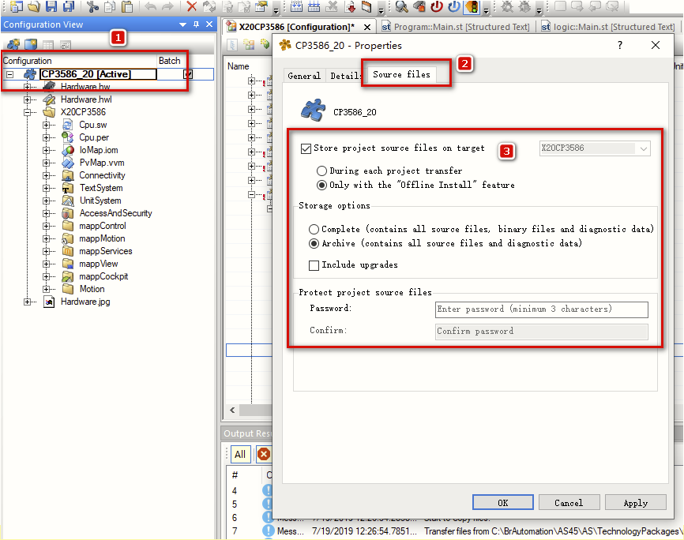
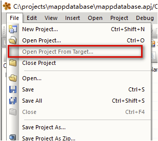
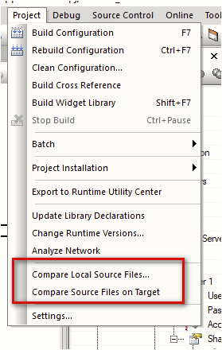
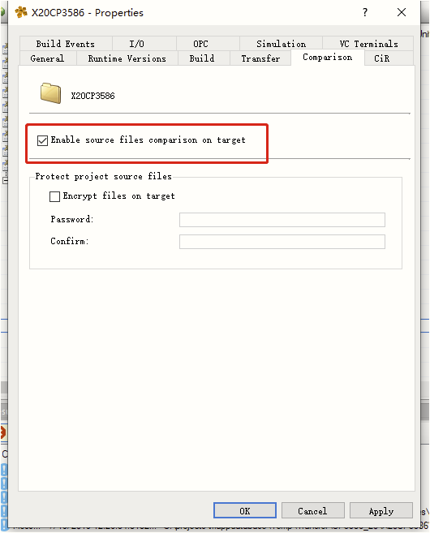

# 024AS如何上传控制器内的工程和进行在线比较
## 问题描述

1. AS 如何上传控制器内的工程？并开启源码在线比较？
2. 如何只开启源码在线比较，不允许程序上传？

## 解决方案

1. 由于控制器默认情况下，不允许程序从控制器中上传，但是有些时候，我们需要此类的应用场景，尤其时多人协作开发时。贝加莱控制器具备程序上传功能，但需要手动开启，需要注意的是，**开启允许后，源码比较自动可用。**

在控制器的 Configuration View 的属性中的 Source files 页签下，开启即可，同时可以进行加密操作。

#### 源码上传：

#### 源码比较：

2. 只开启源码比较，不允许源码上传

关闭解决方案中 1 的功能，只在 Project -> Change Runtime 下的 Comparison 页签中的勾选图中所示即可实现，只允许源码在线比较，但不允许源码上传。

