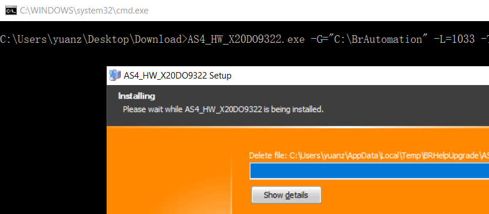

# 025如何通过命令行不依靠AS软件安装升级包
## 问题
- 一般AS软件包的软件更新方式均通过Automation Studio软件的 Tool - Upgrade实现
- 但有些电脑此项服务无法正常执行，会提示报错，因此需要一种方式不依靠AS软件进行软件包更新。

## 解决方式
- 从网站下载并保存所需安装的软件
    - https://www.br-automation.com/en/downloads/#categories=Software-1344987434933/Automation+Studio-1344987435049
- 进入软件包的下载路径
- 创建一个文件，后缀名改名为.bat，使用记事本打开，将以下的信息复制进去
```C
软件名.exe -G="C:\BrAutomation" -L=1033 -T=3.0.70 -V="C:\BrAutomation\AS47" -R
```
- 保存，双击执行此.bat文件即可
- 会提示是否进行安装，确认后即会自动进行安装
- 


- 根据AS软件的实际安装情况，参数应调整
    - -G: AS安装的文件夹路径
    - -V: AS安装路径下指定版本的路径
    - 

- 例子：
- 
- [例子文件下载](FILES/025如何通过命令行不依靠AS软件安装升级包.md/Update.zip)


