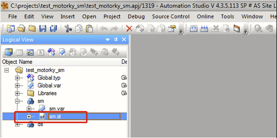
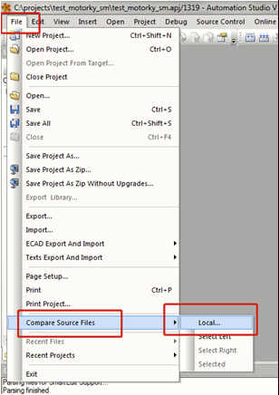
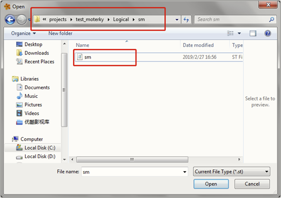
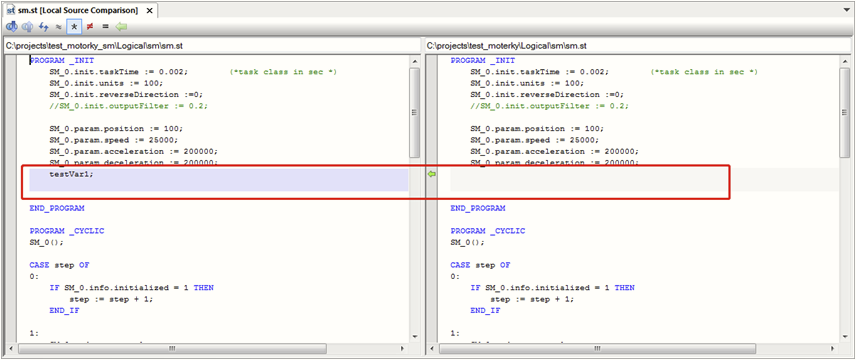
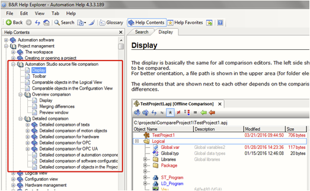

# 026如何使用AS软件比较项目间代码的差异

## 解决方式
- 1.打开一个项目，选中要比较的program的代码文件。如下选中了motorky的例程sm：
    - 
    - 注：该 .st 的文件不能处于被打开的状态
- 2.点击菜单栏：File → Compare Source Files → Local
    - 
- 3.选中本地硬盘上另一个项目中需要被比较的program里的代码文件
    - 
- 4.AS会自动比较这两段代码的异同：
    - 

## 注意事项
- 更多其他功能请参考帮助，帮助路径如下：
- 
- AS版本要求：V4.3及以上

