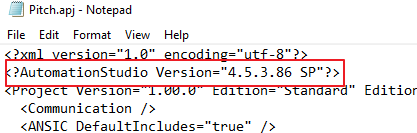
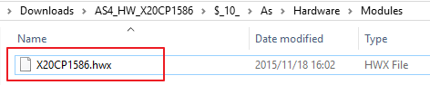
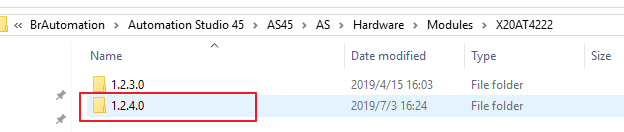

> Tags: #固件版本 #AS版本
- [1 AS版本降级与固件Firmware版本降级](#1%20AS%E7%89%88%E6%9C%AC%E9%99%8D%E7%BA%A7%E4%B8%8E%E5%9B%BA%E4%BB%B6Firmware%E7%89%88%E6%9C%AC%E9%99%8D%E7%BA%A7)
- [2 AS降级](#2%20AS%E9%99%8D%E7%BA%A7)
	- [2.1 方法一：修改.apj文件](#2.1%20%E6%96%B9%E6%B3%95%E4%B8%80%EF%BC%9A%E4%BF%AE%E6%94%B9.apj%E6%96%87%E4%BB%B6)
	- [2.2 方法二：替换.apj文件](#2.2%20%E6%96%B9%E6%B3%95%E4%BA%8C%EF%BC%9A%E6%9B%BF%E6%8D%A2.apj%E6%96%87%E4%BB%B6)
- [3 AS固件Firmware降级](#3%20AS%E5%9B%BA%E4%BB%B6Firmware%E9%99%8D%E7%BA%A7)
	- [3.1 AS版本≤4.3](#3.1%20AS%E7%89%88%E6%9C%AC%E2%89%A44.3)
		- [3.1.1 安全模块固件降级](#3.1.1%20%E5%AE%89%E5%85%A8%E6%A8%A1%E5%9D%97%E5%9B%BA%E4%BB%B6%E9%99%8D%E7%BA%A7)
	- [3.2 AS版本＞4.3](#3.2%20AS%E7%89%88%E6%9C%AC%EF%BC%9E4.3)
		- [3.2.1 通过底层文件修改的方式实现](#3.2.1%20%E9%80%9A%E8%BF%87%E5%BA%95%E5%B1%82%E6%96%87%E4%BB%B6%E4%BF%AE%E6%94%B9%E7%9A%84%E6%96%B9%E5%BC%8F%E5%AE%9E%E7%8E%B0)
			- [3.2.1.1 安全模块处理](#3.2.1.1%20%E5%AE%89%E5%85%A8%E6%A8%A1%E5%9D%97%E5%A4%84%E7%90%86)
			- [3.2.1.2 新固件版本简化操作](#3.2.1.2%20%E6%96%B0%E5%9B%BA%E4%BB%B6%E7%89%88%E6%9C%AC%E7%AE%80%E5%8C%96%E6%93%8D%E4%BD%9C)

# 1 B01.032-AS版本降级与固件Firmware版本降级

- 如何进行AS版本降级与固件Firmware版本降级

# 2 AS降级

- 通过修改AS项目里的.apj文件实现AS版本的降级。
- 两种方法，本质相同。

## 2.1 方法一：修改.apj文件

- 以文本方式打开高版本项目的.apj文件，将AS高版本号修改为低版本号。
    - 
    - 
    - 
- （若未知低版本AS具体版本号，打开低版本AS，菜单栏Help—About Automation Studio查看）
    - 
- 保存后，正常启动项目，就会以低版本AS启动。

## 2.2 方法二：替换.apj文件

- 将本地其它低版本AS项目的.apj文件拷贝至待降级的AS项目根目录下，删除此目录下的高版本.apj文件并将拷贝过来的.apj文件重命名。
    - （这种方式无法保留原高版本项目AS中Project—Settings中的相关设置）
- 注意事项：
    - AS版本降级后，首次打开一般都会弹出各种版本不匹配问题，根据实际情况选择更换或安装相应版本
    - 
- 由于AS不同版本之间，同样配置文件可能存放的目录不一样。
- 比如AS4.2 Configuration View中 关于mapp的配置文件存放在mapp文件夹，更高版本AS取消了mapp文件夹改为mappService文件夹。
- 如果原项目硬件固件有Freeze，建议对其先进行Unfreeze操作，再进行降级操作。（升级也适用）

# 3 AS固件Firmware降级

## 3.1 AS版本≤4.3

- 对于AS4.3之前的版本，只能通过手动替换AS安装目录下文件的方式完成。
- 实现方式：
- 以AS4.2，X20CP1586硬件为例，现固件版本为1.6.0.0
    - 
- **1___.从官网下载低版本1.3.0.0的固件安装文件。将此.exe文件通过解压缩软件提取出来，获得相应文件夹**
    - 
    - 
- **2___.将X20CP1586文件夹中的1文件夹拷贝覆盖掉AS4.2安装目录下的同名文件夹**
    - 原路径：`…\AS4_HW_X20CP1586\$_10_\ As\Firmware\X20CP1586`
    - 目标路径：`…\AS42\ AS\Firmware\X20CP1586`
        - （`\$_10_文件夹名可能会有不同，但格式基本是$_XX_`）
    - 
    - 
- **3___.将Modules文件夹中.hwx文件拷贝覆盖掉AS4.2安装目录下的同名文件**
    - 原路径：`…\AS4_HW_X20CP1586\$_10_\As\Hardware\Modules`
    - 目标路径：`… \AS42 AS\Hardware\Modules`
        - 
    - 
- **4___.AS项目重新打开后，可以看到固件版本提示弹框，进入项目X20CP1586的固件版本降为1.3.0.0**
    - 
    - 上述方法同样适用于硬件固件版本的升级，特别是当AS Upgrade升级框无法正常打开时。

### 3.1.1 安全模块固件降级

- **如果降级的是安全模块的固件，需要额外注意：
    - 相对于普通模块提取文件夹中一般只包含一个名为1的文件夹，安全模块.exe固件通常提取出来会有多个文件夹
        - 
    - **此时要将所有文件夹拷贝覆盖掉AS安装目录下的同名文件夹
    - 安全模块固件比普通模块多出.xosdd文件，同样需要替换。**
      - 原路径：`…\ AS4_HW_X20SO4110\$_23_\As\Hardware\Modules\OSDD`
      - 目标路径：`… \ AS42\AS\Hardware\Modules\OSDD`
    - 
    - 
    - 

## 3.2 AS版本＞4.3

- AS4.3以上版本的Upgrade，允许直接安装低版本的固件，硬件在本地可以安装多套固件版本（之前AS版本只能有一套）。
- 实现方式：以AS4.5，X20CP1586硬件为例
    - **1___.直接菜单栏Tools—Upgrade，选择下载安装1.3.0.0固件版本。（或者选择本地已下载的exe安装包）**
        - 
    - **2___.安装完毕后，AS Physical View硬件树中点击选择X20CP1586的固件版本。所有安装过的固件都可以轻松切换。**
        - 

### 3.2.1 通过底层文件修改的方式实现

- 可以使用之前的方式，操作思路一样，只是目标路径发生了变化。
- 实现方式，以AS4.5，X20CP1586硬件为例
- **1___从官网下载低版本1.3.0.0的固件安装文件。**
    - 将此.exe文件通过解压缩软件提取出来，获得相应文件夹
    - 
    - 
- **2___.在AS4.5安装目录下新建1.3.0.0的文件夹**
    - 新建路径：`…\AS45\AS\Hardware\Modules\X20CP1586`
    - 
    - 
- **3___.在AS4.5安装目录下新建1.3.0.0的文件夹**
    - 新建路径：`…\AS45\AS\Hardware\Modules\X20CP1586`
    - 
- **4___.在1.3.0.0文件夹下新建Firmware文件夹**
    - 新建路径：`…\AS45\AS\Hardware\Modules\X20CP1586\1.3.0.0`
- **5___.将1文件夹拷贝至新建的Firmware文件夹下**
    - 原路径：`…\AS4_HW_X20CP1586\$_10_\As\Firmware\X20CP1586`
    - 目标路径：`…AS45\AS\Hardware\Modules\X20CP1586\1.3.0.0\Firmware`
        - （`\$_10_文件夹名可能会有不同，但格式基本是$_XX_`）
    - 
    - 
- **6___.将X20CP1586.front.png拷贝至1.3.0.0文件夹下**
- 原路径：`…\AS4_HW_X20CP1586\$_10_\As\Hardware\Images`
- 目标路径：`…\AS45\AS\Hardware\Modules\X20CP1586\1.3.0.0`
    - 
    - 
 - **7___.将X20CP1586.hwx拷贝至1.3.0.0文件夹下**
- 原路径：`…\AS4_HW_X20CP1586\$_10_\As\Hardware\Images`
- 目标路径：`…\AS45\AS\Hardware\Modules\X20CP1586\1.3.0.0`
    - 
    - 
- **8___ 完成成上述操作后，在项目中点击下拉固件列表，同样可以看到1.3.0.0的版本选项。**

#### 3.2.1.1 安全模块处理

- **如果降级的是安全模块的固件，需要额外注意：**
    - 相对于普通模块提取文件夹中一般只包含一个名为1的文件夹，安全模块.exe固件通常提取出来会有多个文件夹
    - 
- **此时要将所有文件夹拷贝至AS安装目录下相应文件夹里。安全模块固件比普通模块多出.xosdd文件，同样需要拷贝。**
    - 原路径：`…\ AS4_HW_X20SO4110\$_23_\As\Hardware\Modules\OSDD`
    - 目标路径：`… \ AS45\AS\Hardware\Modules\X20SO4110\1.10.0.6\OSDD`
    - 
    - 
- 注意：以上通过更改AS目录下文件的方式降级固件版本，均未对Help文档进行更新！

#### 3.2.1.2 新固件版本简化操作

- 总部在后来更新的.exe固件里，新加了一个单独显示固件版本的文件夹
    - 
- 路径为：`…\AS4_HW_X20AT4222\$_23_\As\Hardware\Modules\X20AT4222`
    - 
- 里面也包含固件所需的文件，与之前路径下的文件内容一样。这样，在4.3之后的AS版本通过手动拷贝固件文件变得更加便捷，只需要将此文件夹拷贝至AS安装目录下即可。（安全模块也无需额外操作）。比如：
    - 原路径：`…\AS4_HW_X20AT4222\$_23_\As\Hardware\Modules\X20AT4222`
    - 目标路径：`…\AS45\AS\Hardware\Modules\X20AT4222`
    - 
