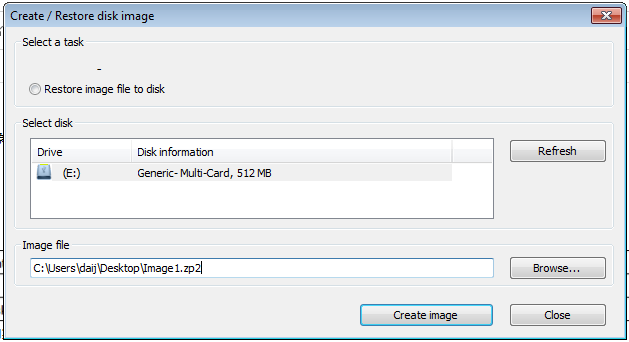
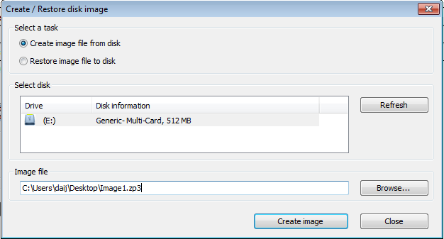

> Tags: #RUC

> 👍推荐阅读 → [002硬盘备份与恢复_使用RUC软件](../C07_工具/002硬盘备份与恢复_使用RUC软件.md)

- [1 B01.035.用RUC生产CF卡小镜像](#_1-b01035%E7%94%A8ruc%E7%94%9F%E4%BA%A7cf%E5%8D%A1%E5%B0%8F%E9%95%9C%E5%83%8F)
- [2 解决方案](#_2-%E8%A7%A3%E5%86%B3%E6%96%B9%E6%A1%88)
- [3 注意事项](#_3-%E6%B3%A8%E6%84%8F%E4%BA%8B%E9%A1%B9)

# 1 B01.035.用RUC生产CF卡小镜像

- 在使用RUC对CF卡进行备份的时候，产生的镜像与CF卡大小是1:1的，所以在拷贝镜像文件或者要把这个镜像文件发给别人的时候会不便。
- 注意：若使用Hypervisor方案，建议使用MariumReflect软件方式生成镜像。具体参考 → [003硬盘备份与恢复_使用MacriumReflect软件](../C07_工具/003硬盘备份与恢复_使用MacriumReflect软件.md)

# 2 解决方案

- 在PVI 4.2及以上新出现了一个镜像文件的格式ZP3。
    - 
- ZP3格式不像ZP或ZP2是1:1镜像，CF卡有多大镜像就多大，而是至产生一个和CF卡内实际用量大小一致的镜像。
- 操作方式就是在Create/Restore disk image中将Image file的后缀名从ZP2改成ZP3即可。
    - 
    - 

# 3 注意事项

- 1、PVI版本必须4.2及以上版本才支持ZP3格式
- 2、恢复镜像时所用的CF大大小不能小于创建镜像是所用的CF卡。
