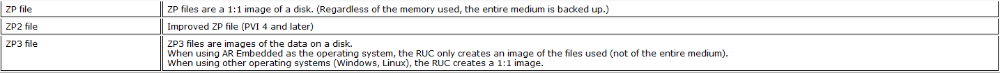

# 用RUC生产CF卡小镜像
## 问题描述
在使用RUC对CF卡进行备份的时候，产生的镜像与CF卡大小是1:1的，所以在拷贝镜像文件或者要把这个镜像文件发给别人的时候会不便。

## 解决方案

在PVI 4.2及以上新出现了一个镜像文件的格式ZP3。

ZP3格式不像ZP或ZP2是1:1镜像，CF卡有多大镜像就多大，而是至产生一个和CF卡内实际用量大小一致的镜像。

操作方式就是在Create/Restore disk image中将Image file的后缀名从ZP2改成ZP3即可。

注意事项：
1、PVI版本必须4.2及以上版本才支持ZP3格式
2、恢复镜像时所用的CF大大小不能小于创建镜像是所用的CF卡。