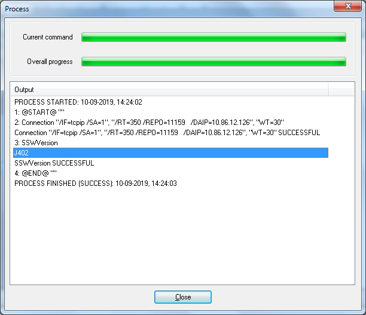
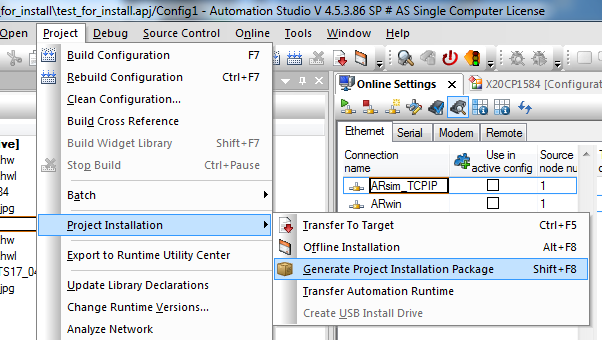
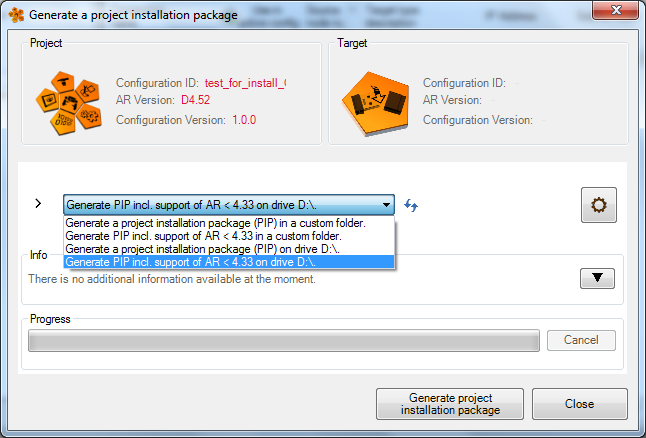
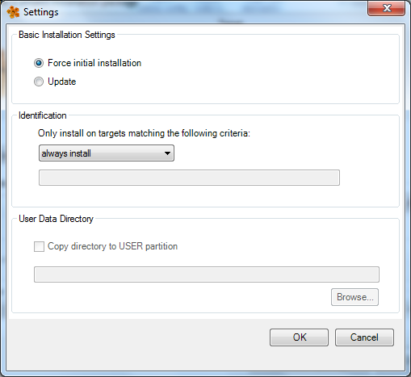
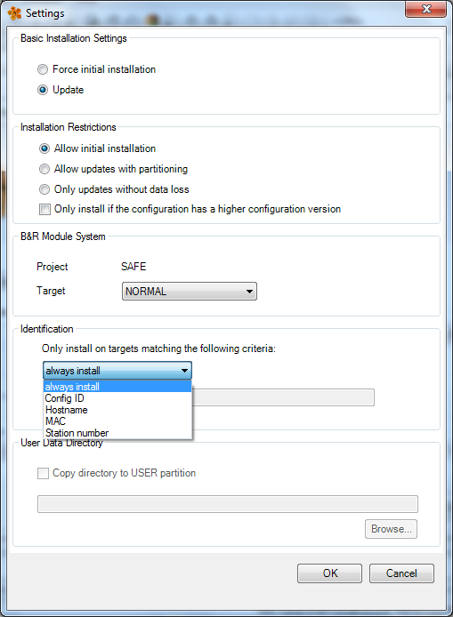
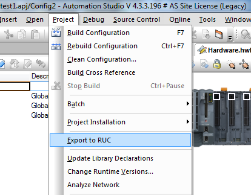
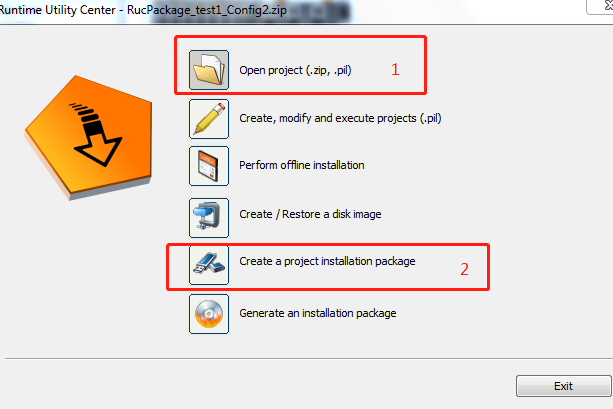
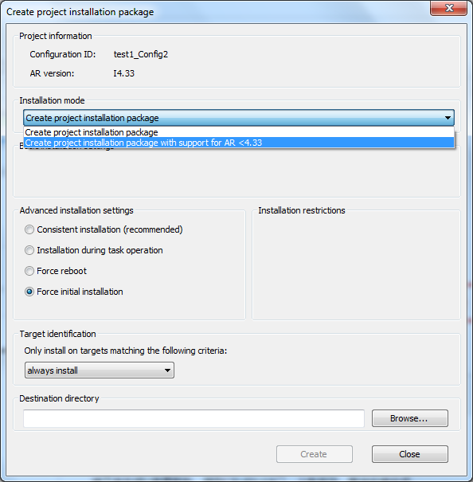
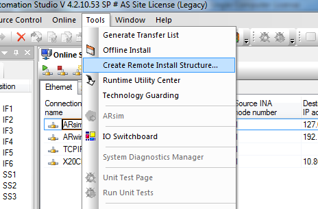
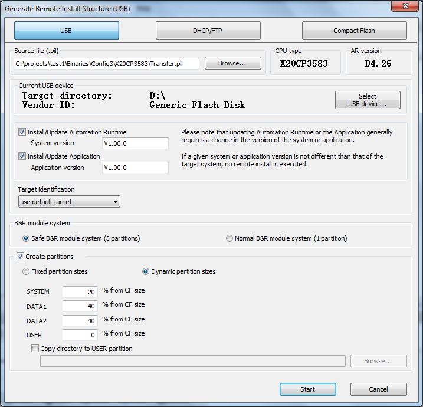

- [1 B01.036.用U盘更新包的方式给CPU烧卡](#_1-b01036%E7%94%A8u%E7%9B%98%E6%9B%B4%E6%96%B0%E5%8C%85%E7%9A%84%E6%96%B9%E5%BC%8F%E7%BB%99cpu%E7%83%A7%E5%8D%A1)
- [2 问题描述](#_2-%E9%97%AE%E9%A2%98%E6%8F%8F%E8%BF%B0)
- [3 原因分析](#_3-%E5%8E%9F%E5%9B%A0%E5%88%86%E6%9E%90)
- [4 解决方案](#_4-%E8%A7%A3%E5%86%B3%E6%96%B9%E6%A1%88)

# 1 B01.036.用U盘更新包的方式给CPU烧卡

- [⭐ 推荐阅读 → 002贝加莱PLC通过U盘更新程序](/C04_现场维运/002贝加莱PLC通过U盘更新程序.md)

# 2 问题描述

- 之前有关于用U盘更新包（PIP）的方式给CPU烧卡的需求
- 例如客户在给数量很多的新CF卡或者新的1382类型CPU安装程序时，比较方便。

# 3 原因分析

- X20系列CPU是带有板载的AR的，所以U盘烧卡是可以实现的。
- 如果没有AS，也可以用RUC看到板载的AR版本。
    - 

# 4 解决方案

- 测试PLC：X20CP1584，X20CP3583 + CF卡（已格式化）
- AS：4.5.3.86，4.3.3.196，4.2.10.53，
- 在4.5中直接使用AS中生成PIP的功能
    - 
- 一般来说板载的AR版本都比较低（例如这里测试的CPU板载AR是J4.02），所以这里要更改选项
    - 
- 在弹出的配置框中勾选Force initial installation
    - 
- 或者勾选允许initial installation；
- 另外Identification里可以更改验证方式，防止误烧写。
    - 
- 如果使用的是4.3或之前的版本，需要使用RUC来生成更新包
- 先生成RUC包
    - 
- 在RUC中打开项目，生成更新包
    - 
- 同样的，mode更改成AR<4.33；下面的选项中勾选强制初始化安装。
    - 
- 之后我又在4.2上做了测试，当然4.2也可以使用RUC来生成；
- 值得一提的是，4.2tools中的Create Remote Install Structure功能也可以直接生成可供烧卡的U盘更新包；
    - 
- 这里并没有像RUC里AR<4.33的选项，所以直接输出到U盘就可以了。
- 另外也支持一些分区的选项。
    - 
